# Latta CS-BOT - Complete System Architecture

## ภาพรวมระบบทั้งหมด (Complete System Overview)

ระบบ Latta CS-BOT แบ่งออกเป็น 4 โปรเจคหลักที่ทำงานร่วมกัน:

| โปรเจค | หน้าที่ | พอร์ตหลัก |
|--------|---------|----------|
| **latta-csbot-database** | ฐานข้อมูลกลาง (Supabase, MongoDB, Redis) | 5432, 27017, 6379 |
| **latta-csbot-llm** | LLM Service (Ollama) | 11434 |
| **latta-csbot-user-v1** | User Chat Services (Frontend + Backend + AI Agent) | 80, 3001, 8765 |
| **latta-csbot-admin** | Admin Panel + RAG Pipeline | 81, 3002, 8001 |

---

## System Architecture Diagram (Mermaid)

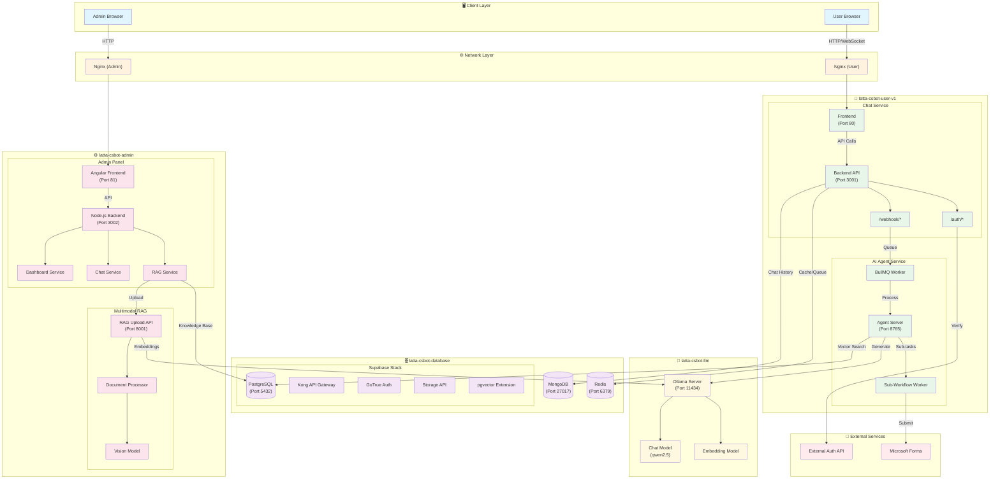

---

## Data Flow Diagrams

### 1. User Authentication Flow

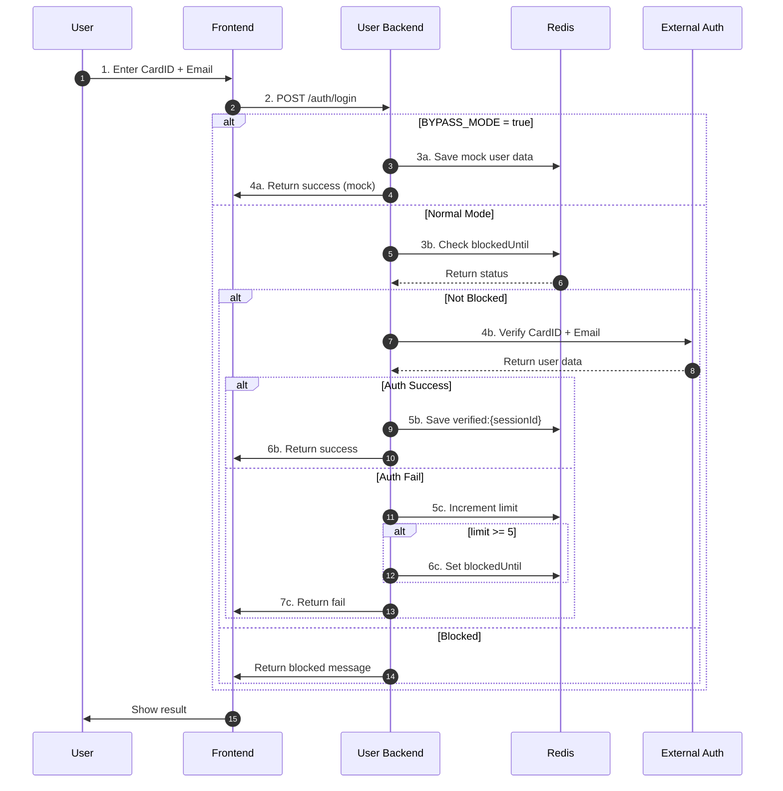

### 2. Chat Message Flow

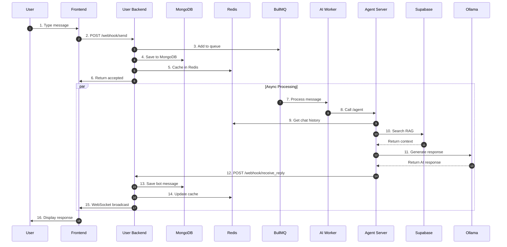

### 3. AI Agent Workflow

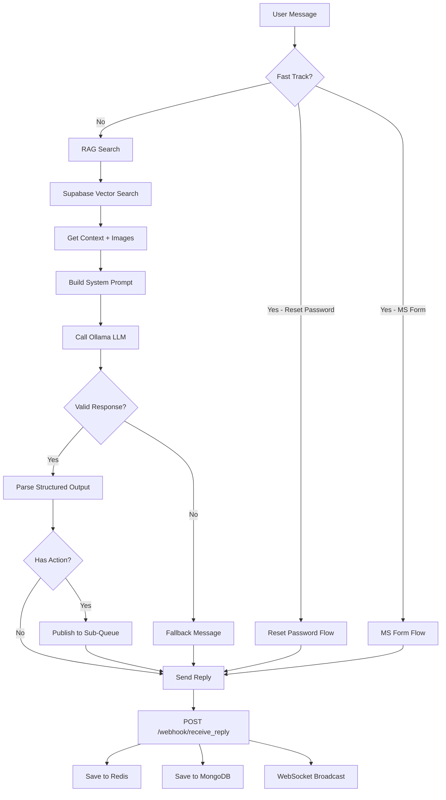

### 4. RAG Document Upload Flow

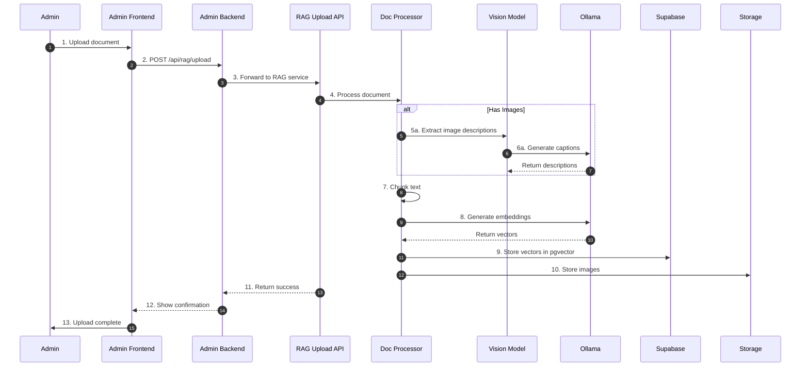

### 5. Admin Dashboard Data Flow

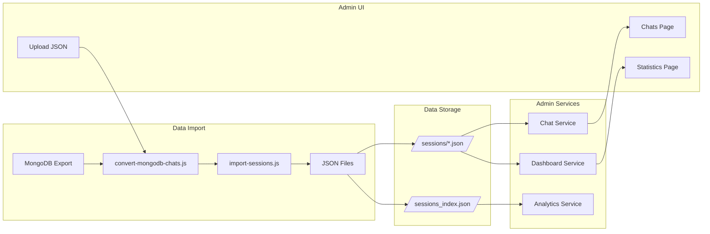

---

## Component Architecture

### latta-csbot-user-v1 Components

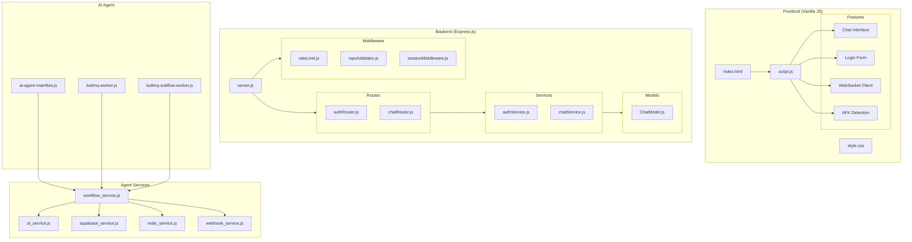

### latta-csbot-admin Components

```mermaid
graph TB
    subgraph AdminFrontend["Admin Frontend (Angular)"]
        App[App Component]
        
        subgraph Pages["Pages"]
            Overview[Overview]
            Chats[Chats]
            Upload[Upload]
            Analytics[Analytics]
        end
        
        subgraph Shared["Shared"]
            Nav[Navigation]
            Charts[Charts]
            Tables[Data Tables]
        end
    end
    
    subgraph AdminBackend["Admin Backend (Node.js)"]
        Server[server_combined.js]
        
        subgraph AdminServices["Services"]
            Dashboard[Dashboard Service]
            Chat[Chat Service]
            RAG[RAG Service]
        end
        
        subgraph Controllers["Controllers"]
            UploadCtrl[uploadController.js]
            ChatCtrl[chatController.js]
            StatsCtrl[statsController.js]
        end
        
        subgraph Models["Models"]
            JsonChat[JsonChatModel.js]
        end
        
        subgraph Utils["Utils"]
            JsonStore[jsonDataStore.js]
            Analytics[analyticsService.js]
        end
    end
    
    subgraph RAGPipeline["Multimodal RAG (Python)"]
        API[FastAPI Server]
        
        subgraph Pipeline["Pipeline"]
            OCR[OCR Processor]
            Chunk[Text Chunker]
            Embed[Embedding Generator]
            Vision[Vision Analyzer]
        end
        
        subgraph Storage["Storage"]
            VectorDB[(pgvector)]
            ImageStore[(S3/Local)]
        end
    end
    
    App --> Pages
    Pages --> Shared
    
    Server --> AdminServices
    AdminServices --> Controllers
    Controllers --> Models
    Models --> Utils
    
    API --> Pipeline
    Pipeline --> Storage
```

### latta-csbot-database Components

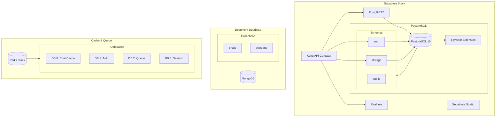

---

## Network Architecture

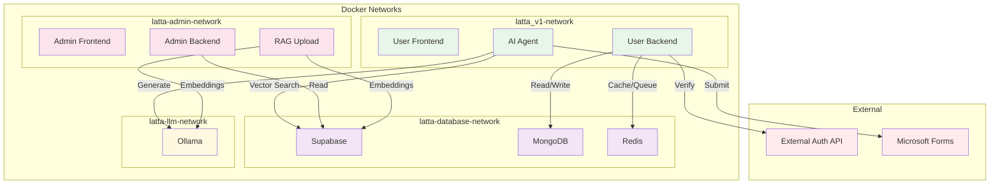

---

## API Integration Map

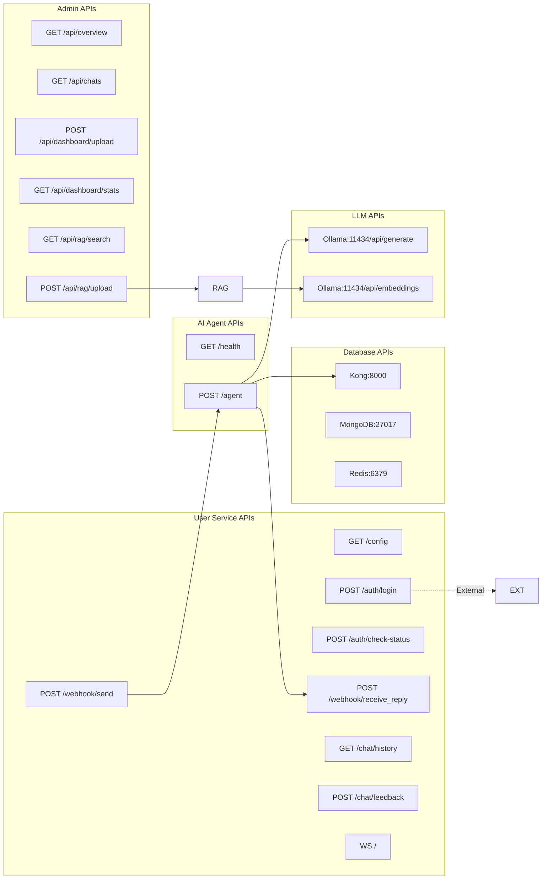

---

## Deployment Architecture

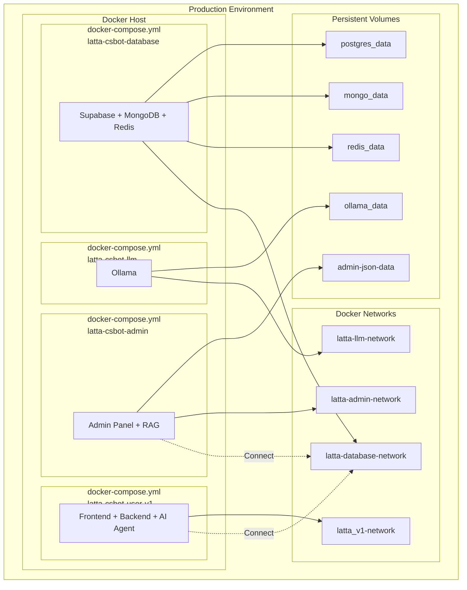

---

## Environment Variable Dependencies

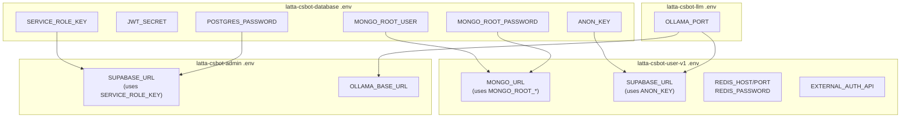

---

## Service Startup Order

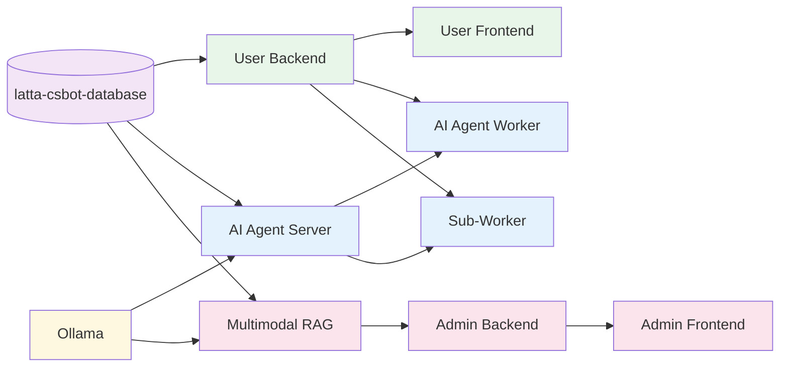

---

## Port Mapping Reference

| Service | Container | Internal Port | External Port | Environment Variable |
|---------|-----------|---------------|---------------|---------------------|
| **Database Layer** |
| Supabase Kong | latta-supabase-kong | 8000 | `${KONG_HTTP_PORT}` | 8000 |
| Supabase Studio | latta-supabase-studio | 3000 | 3000 | - |
| PostgreSQL | latta-supabase-db | 5432 | `${POSTGRES_PORT}` | 5432 |
| MongoDB | latta-mongodb | 27017 | `${MONGO_PORT}` | 27017 |
| Redis | latta-redis | 6379 | `${REDIS_PORT}` | 6379 |
| Redis Insight | - | 8001 | `${REDIS_INSIGHT_PORT}` | 8001 |
| **LLM Layer** |
| Ollama | latta-ollama | 11434 | `${OLLAMA_PORT}` | 11434 |
| **User Services** |
| User Frontend | latta_v1-user-frontend | 80 | `${USER_FRONTEND_PORT}` | 8080 |
| User Backend | latta_v1-user-backend | 3001 | `${USER_BACKEND_PORT}` | 3001 |
| AI Agent Server | latta_v1-ai-agent-server | 8765 | `${AI_AGENT_PORT}` | 8765 |
| **Admin Services** |
| Admin Frontend | latta-admin-frontend | 81 | `${ADMIN_FRONTEND_PORT}` | 81 |
| Admin Backend | latta-admin-backend | 3002 | `${ADMIN_PORT}` | 3002 |
| RAG Upload | latta-multimodal-rag | 8001 | `${RAG_UPLOAD_PORT}` | 8001 |

---

## Version History

| Version | Date | Changes |
|---------|------|---------|
| 1.0.0 | 2026-02 | Initial architecture with 4-project separation |

---

## Authors

- Development Team - Latta CS-BOT Project

## WebSocket: Pros and Cons

### ข้อดี (Pros)

| ข้อดี | รายละเอียด |
|-------|-----------|
| **Real-time** | ส่งข้อความทันทีโดยไม่ต้องรอ request/response |
| **Bidirectional** | สื่อสารสองทิศทางบน connection เดียว |
| **Low Latency** | ไม่ต้องสร้าง connection ใหม่ทุกครั้ง |
| **Efficient** | Header เล็กกว่า HTTP polling |
| **Server Push** | Server ส่งข้อมูลให้ Client ได้โดยตรง |

### ข้อเสีย (Cons)

| ข้อเสีย | รายละเอียด |
|---------|-----------|
| **Complexity** | ต้องจัดการ connection state |
| **Firewall** | บาง firewall บล็อก WebSocket |
| **Proxy Issues** | Nginx/Load balancer ต้อง config พิเศษ |
| **No Caching** | ไม่มี HTTP caching |
| **Debugging** | ยากกว่า HTTP request/response |

### การใช้งานในระบบ

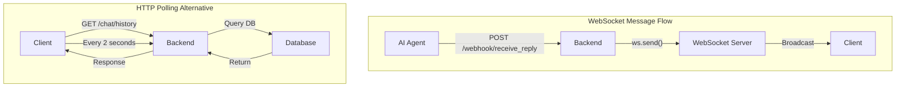

### เปรียบเทียบ

| เกณฑ์ | WebSocket | HTTP Polling | SSE |
|-------|-----------|--------------|-----|
| Latency | ต่ำมาก | สูง (depends on interval) | ต่ำ |
| Server Push | ✅ | ❌ | ✅ |
| Bidirectional | ✅ | ❌ | ❌ |
| Complexity | สูง | ต่ำ | ปานกลาง |
| Browser Support | ดี | ดีมาก | ดี |
| Reconnection | ต้องจัดการเอง | อัตโนมัติ | ต้องจัดการเอง |

### Best Practices

1. **Reconnection Strategy**
```javascript
// Exponential backoff
let reconnectDelay = 1000;
ws.onclose = () => {
    setTimeout(() => connect(), reconnectDelay);
    reconnectDelay = Math.min(reconnectDelay * 2, 30000);
};
```

2. **Heartbeat**
```javascript
// Keep connection alive
setInterval(() => {
    if (ws.readyState === WebSocket.OPEN) {
        ws.send(JSON.stringify({type: 'ping'}));
    }
}, 30000);
```

3. **Graceful Degradation**
```javascript
// Fallback to polling if WebSocket fails
if (!window.WebSocket || wsFailed) {
    startLongPolling();
}
```

---

## License

Internal Use Only
