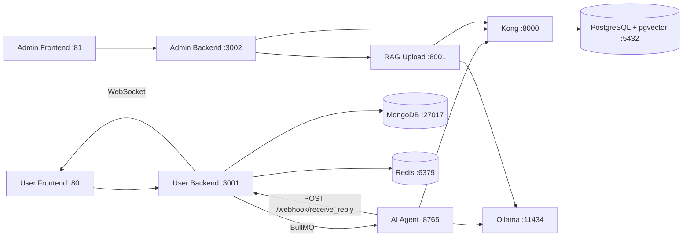

# LATTA-CSBOT

ระบบ AI Customer Service Chatbot แบบโมดูลาร์ รองรับทั้งฝั่งผู้ใช้งาน (User Chat), ฝั่งผู้ดูแล (Admin Dashboard + RAG Upload), และแพลตฟอร์มข้อมูล/AI ครบชุดใน Docker Compose เดียว

เอกสารนี้เรียบเรียงใหม่โดยอิงจาก:
- `sa.md` (System Analysis)
- `sd.md` (System Design)
- `ARCHITECTURE.md` (Complete System Architecture)

## ภาพรวมระบบ

โปรเจกต์ประกอบด้วย 4 ส่วนหลัก:

| โมดูล | โฟลเดอร์ | หน้าที่ |
|---|---|---|
| User Services | `latta-csbot-user-v1` | หน้าแชทผู้ใช้, backend แชท, AI agent |
| Admin Services | `latta-csbot-admin` | หน้า admin, backend dashboard, RAG upload |
| Data Platform | `latta-csbot-database` | Supabase stack, PostgreSQL, MongoDB, Redis |
| LLM Runtime | `ollama` (service ใน compose) | รัน model สำหรับ chat/embedding/vision |

## หลักการเชื่อมต่อสำคัญ

- Frontend คุยกับ Backend ของตัวเองโดยตรงผ่าน nginx
- Backend คุยกับ Supabase/PostgreSQL ผ่าน Kong (`http://kong:8000`)
- AI Agent ประมวลผลงานแบบ async ผ่าน BullMQ (Redis)
- AI Agent ส่งคำตอบกลับ User Backend ผ่าน `POST /webhook/receive_reply`
- User Backend push คำตอบกลับหน้าเว็บผ่าน WebSocket

## Architecture (ย่อ)



## Technology Stack

| Layer | Technology |
|---|---|
| User Frontend | HTML, Bootstrap, Vanilla JS, nginx |
| Admin Frontend | Angular |
| Backend Services | Node.js + Express |
| AI/RAG Pipeline | Python + FastAPI |
| Queue/Cache | Redis + BullMQ |
| Database | PostgreSQL (pgvector), MongoDB |
| API Gateway | Kong |
| LLM Runtime | Ollama |

## Ports และ Service URLs

ค่า default จาก root `.env.example` และ compose:

| Service | URL/Port |
|---|---|
| User Frontend | `http://localhost:80` |
| User Backend | `http://localhost:3001` |
| AI Agent | `http://localhost:8765` |
| Admin Frontend | `http://localhost:81` |
| Admin Backend | `http://localhost:3002` |
| RAG Upload API | `http://localhost:8001` |
| Supabase/Kong API | `http://localhost:8000` |
| Supabase Studio | `http://localhost:3000` |
| PostgreSQL | `localhost:5432` |
| MongoDB | `localhost:27017` |
| Redis | `localhost:6379` |
| Redis Insight | `http://localhost:8002` |
| Ollama | `http://localhost:11434` |

## Quick Start (แนะนำ)

1) สร้างไฟล์ environment:

```bash
cp .env.example .env
```

2) แก้ค่าที่จำเป็นใน `.env`:
- `POSTGRES_PASSWORD`
- `JWT_SECRET`
- `ANON_KEY`
- `SERVICE_ROLE_KEY`
- `REDIS_PASSWORD`
- `MONGO_ROOT_PASSWORD`

3) รันระบบ:

```bash
docker compose up -d
```

4) ตรวจสอบสถานะ:

```bash
docker compose ps
```

## Chat Flow (สำคัญ)

1. ผู้ใช้ส่งข้อความไป `POST /webhook/send`
2. User Backend บันทึกข้อความ + ส่งงานเข้า BullMQ
3. AI Agent worker ประมวลผล (RAG + LLM)
4. AI Agent ส่งคำตอบกลับ `POST /webhook/receive_reply`
5. User Backend ส่งคำตอบให้หน้าเว็บผ่าน WebSocket

## โครงสร้างโฟลเดอร์

```text
.
├── docker-compose.yml
├── docker-compose.dev.yml
├── .env.example
├── README.md
├── sa.md
├── sd.md
├── ARCHITECTURE.md
├── latta-csbot-user-v1/
├── latta-csbot-admin/
└── latta-csbot-database/
```

## คำสั่งที่ใช้บ่อย

```bash
# start/stop
docker compose up -d
docker compose down

# rebuild เฉพาะบริการ
docker compose build --no-cache user-backend
docker compose up -d user-backend

# logs
docker compose logs -f user-backend
docker compose logs -f ai-agent
docker compose logs -f admin-backend
```

## Troubleshooting

### 1) `host not found in upstream "backend"`

สาเหตุ: upstream ใน nginx ไม่ตรง service name จริง  
แนวทาง: ใช้ `user-backend:3001` ในฝั่ง user frontend config (ไม่ใช่ `backend:3000`)

### 2) Subflow ไม่ตอบกลับหน้าแชท

เช็คค่า `.env`:
- `API_BASE=http://user-backend:3001`
- `REPLY_WEBHOOK_URL=http://user-backend:3001/webhook/receive_reply`

และดู log ของ `ai-agent` + `user-backend` พร้อมกัน

### 3) พอร์ตชนกัน

แก้ค่าใน `.env` แล้วรันใหม่:

```bash
docker compose down
docker compose up -d
```

## เอกสารอ้างอิง

- [System Analysis](sa.md)
- [System Design](sd.md)
- [Architecture](ARCHITECTURE.md)
- [Admin README](latta-csbot-admin/README.md)
- [User Architecture](latta-csbot-user-v1/ARCHITECTURE.md)
- [Database Design](latta-csbot-database/DESIGN.md)

## หมายเหตุ

- README นี้เน้น onboarding และการใช้งานจริงที่ระดับ root project
- รายละเอียดเชิงลึก (sequence diagrams, data models, requirement matrix) ให้อ้างอิงที่ `sa.md`, `sd.md`, `ARCHITECTURE.md`
# LATTA-CSBOT - Modular Architecture

ระบบ Chatbot สำหรับงานบริการลูกค้า แบ่งออกเป็น 4 ส่วนหลัก

## Architecture Overview

**ความสัมพันธ์ที่ถูกต้อง:** Frontend → Backend โดยตรง (ไม่ผ่าน Kong), Kong ใช้สำหรับ Backend → Database เท่านั้น

```
┌─────────────────────────────────────────────────────────────────────────┐
│                         LATTA-CSBOT SYSTEM                              │
├─────────────────────────────────────────────────────────────────────────┤
│                                                                         │
│  ┌─────────────────────────┐    ┌─────────────────────────┐             │
│  │  📦 latta-csbot-admin   │    │  📦 latta-csbot-user    │             │
│  │                         │    │                         │             │
│  │  • Admin Frontend (81)  │    │  • User Frontend (80)   │             │
│  │  • Admin Backend (3002) │    │  • User Backend (3000)  │             │
│  │       ↓ Proxy           │    │       ↓ BullMQ  ↓ Redis │             │
│  │  • RAG Pipeline (8001)  │    │  • AI Agent    Redis    │             │
│  │       │                 │    │    (8765)      (6379)   │             │
│  │       │                 │    │       │                 │             │
│  └───────┼─────────────────┘    └───────┼─────────────────┘             │
│          │                    │          │                               │
│          │                    │          │                               │
│          │                    │          │                               │
│          │                    │          │                               │
│          ▼                    │          ▼                               │
│  ┌─────────────────┐          │  ┌─────────────────┐                     │
│  │ 📦 latta        │◄─────────┘  │ 📦 latta        │                     │
│  │  -csbot-llm     │ HTTP Ext    │  -csbot-db      │                     │
│  │                 │             │                 │                     │
│  │  Ollama (11434) │             │  Kong API (8000)│                     │
│  └─────────────────┘             │       │         │                     │
│                                  │       ▼         │                     │
│                                  │  ┌─────────┐    │                     │
│                                  │  │PostgreSQL     │                     │
│                                  │  │MongoDB         │                     │
│                                  │  │Supabase Storage│                     │
│                                  │  └─────────┘    │                     │
│                                  └─────────────────┘                     │
│                                                                         │
└─────────────────────────────────────────────────────────────────────────┘

หมายเหตุ: 
- Frontend (Port 80/81) → Backend (Port 3000/3002) โดยตรงผ่าน nginx
- Kong (Port 8000) ใช้สำหรับ Backend → Supabase/PostgreSQL เท่านั้น
- Ollama (Port 11434) อยู่ใน latta-csbot-llm (แยก project) 
- AI Agent และ RAG เชื่อมต่อ Ollama ผ่าน External URL (เช่น host.docker.internal:11434)
```

## Technology Stack / สแต็คเทคโนโลยี

### Core Technologies

| Layer | Technology | Version | Purpose |
|-------|------------|---------|---------|
| **Frontend (Admin)** | Angular | 15+ | Admin Dashboard SPA |
| **Frontend (User)** | HTML5 + Bootstrap 5 | 5.x | Webchat Interface |
| **Backend (All)** | Node.js + Express | 20 LTS | REST API Servers |
| **AI/RAG Services** | Python + FastAPI | 3.11 | AI Agent & Document Processing |

### Database & Storage

| Component | Technology | Purpose |
|-----------|------------|---------|
| **Vector Database** | PostgreSQL + pgvector | Document embeddings & similarity search |
| **Document Database** | MongoDB | Chat history, session logs |
| **Cache & Queue** | Redis (Redis Stack) | Sessions, BullMQ job queue |
| **File Storage** | Supabase Storage | PDF, DOCX, XLSX uploads |
| **API Gateway** | Kong | Routing, authentication, rate limiting |

### AI/ML Stack

| Component | Technology | Details |
|-----------|------------|---------|
| **LLM Server** | Ollama | Local inference engine |
| **Chat Models** | Qwen3 / Gemma3 | Thai-English conversational AI |
| **Embeddings** | Qwen3-Embedding | 0.6B params, 1024 dimensions |
| **Vision Models** | Qwen3-VL / Gemma3 | Image understanding for documents |
| **OCR** | Docling + PyMuPDF | PDF text & image extraction |
| **RAG Framework** | Custom (LangChain-inspired) | Document retrieval pipeline |

### Infrastructure

| Component | Technology | Purpose |
|-----------|------------|---------|
| **Containerization** | Docker + Docker Compose | Service isolation & deployment |
| **Message Queue** | BullMQ + RabbitMQ | Background job processing |
| **Reverse Proxy** | Nginx | Static files & load balancing |
| **GPU Support** | NVIDIA Container Toolkit | GPU-accelerated LLM inference |

---

## Quick Start

### 1. เริ่มต้นทั้งหมดในคำสั่งเดียว

```bash
# สร้าง environment files ทั้งหมด
cp latta-csbot-database/.env.example latta-csbot-database/.env
cp latta-csbot-admin/.env.example latta-csbot-admin/.env
cp latta-csbot-user-v1/.env.example latta-csbot-user-v1/.env
# แก้ไขค่าในแต่ละไฟล์ .env ให้ตรงกัน (เฉพาะส่วน Secrets และ Ports)

# เริ่มต้นทั้งหมด (docker-compose.yml หลักอยู่ที่ root)
docker compose up -d
```

### 2. เริ่มต้นแยกส่วน

```bash
# 1. เริ่ม Database ก่อน (ต้องทำก่อนเสมอ)
cd latta-csbot-database
cp .env.example .env
# แก้ไข .env ตามต้องการ
docker compose up -d

# 2. เริ่ม Admin Panel
cd ../latta-csbot-admin
cp .env.example .env
# แก้ไข .env ให้ตรงกับ database
docker compose up -d

# 3. เริ่ม LLM Services (Ollama)
cd ../latta-csbot_llm
cp .env.example .env
# แก้ไข .env ให้ตรงกับ Ollama configuration
docker compose up -d

# 4. เริ่ม User Services
cd ../latta-csbot-user-v1
cp .env.example .env
# แก้ไข .env ให้ OLLAMA_BASE_URL ชี้ไปยัง latta-csbot-llm
docker compose up -d
```

## Service URLs

| Service | URL | Description |
|---------|-----|-------------|
| **Supabase Studio** | http://localhost:3000 | Database Management UI |
| **Supabase API** | http://localhost:8000 | REST/GraphQL API |
| **Supabase Storage** | http://localhost:5000 | Object Storage (ผ่าน Kong) |
| **MongoDB** | localhost:27017 | Document Database |
| **Admin Panel** | http://localhost:81 | Admin Dashboard |
| **Admin Backend** | http://localhost:3002 | Admin API |
| **RAG Upload** | http://localhost:8001 | File Upload API |
| **User Chat** | http://localhost | Webchat UI |
| **User Backend** | http://localhost:3000 | Chat API |
| **AI Agent** | http://localhost:8765 | AI Workflow API - รับจาก User Backend (BullMQ) ไม่ใช่จาก Frontend โดยตรง |
| **Ollama** | http://localhost:11434 | LLM Server |
| **Redis** | localhost:6379 | Cache & Queue |
| **Redis Insight** | http://localhost:8002 | Redis Management UI |
| **RabbitMQ Mgmt** | http://localhost:15672 | Queue Management UI |

## Component Details

### 1. latta-csbot-database
ฐานข้อมูลและ Infrastructure หลัก
- **Supabase**: PostgreSQL + Kong API Gateway + Auth + Storage
- **MongoDB**: Document database สำหรับ chat history

[อ่านเพิ่มเติม](latta-csbot-database/README.md)

### 2. latta-csbot-admin
ระบบจัดการสำหรับ Admin
- **Admin Backend**: Node.js API สำหรับ dashboard
- **Admin Frontend**: Angular web application
- **RAG Upload**: Python service สำหรับจัดการเอกสารและ embeddings

[อ่านเพิ่มเติม](latta-csbot-admin/README.md)

### 3. latta-csbot-user-v1
ระบบสำหรับ End Users
- **Frontend**: Webchat interface (HTML/JS/nginx) - Port 80
- **Backend**: Node.js API สำหรับจัดการแชท - Port 3000
- **AI Agent**: Node.js/Express workflow processor - Port 8765
- **Redis**: Cache และ Queue management - Port 6379

**การสื่อสารภายใน (Internal Flow):**
```
Frontend ──WebSocket──▶ Backend ──BullMQ──▶ AI Agent
  ▲                                              │
  └──────── POST /webhook/receive_reply ─────────┘
```
- Backend ส่งคำถามไป AI Agent ผ่าน **BullMQ Queue**
- AI Agent ประมวลผลเสร็จส่งคำตอบกลับผ่าน **Webhook `POST /webhook/receive_reply`**
- Backend ส่งคำตอบให้ Frontend ผ่าน **WebSocket** แบบ Real-time

### 4. latta-csbot-llm
AI/ML Services แยกออกมาเพื่อจัดการ GPU resources ได้อิสระ
- **Ollama**: LLM inference server - Port 11434
- AI Agent และ RAG Pipeline เชื่อมต่อผ่าน External URL (host.docker.internal:11434)


## Network Architecture

**ความสัมพันธ์ที่ถูกต้อง:**
- **Frontend (Port 80/81)** → **Backend (Port 3000/3002)** โดยตรงผ่าน nginx (ไม่ผ่าน Kong)
- **Kong (Port 8000)** ใช้สำหรับ **Backend → Database (PostgreSQL, Supabase Storage)** เท่านั้น
- **MongoDB (Port 27017)** เชื่อมต่อโดยตรง ไม่ผ่าน Kong
- **AI Agent → Backend** ผ่าน **Webhook `/webhook/receive_reply`** (HTTP POST)

```
┌─────────────────────────────────────────────────────────────────────────┐
│  ┌─────────────────────────┐    ┌─────────────────────────┐             │
│  │  📦 latta-csbot-admin   │    │  📦 latta-csbot-user    │             │
│  │  latta-admin-network    │    │  latta-user-network     │             │
│  │                         │    │                         │             │
│  │  • Admin FE (81)        │    │  • User Frontend (80)   │             │
│  │       ↓ HTTP/api        │    │       ↓ HTTP/api        │             │
│  │  • Admin BE (3002)      │    │  • User Backend (3000)  │             │
│  │       ↓ HTTP Proxy      │    │       ↓ BullMQ  ↓ Redis │             │
│  │  • RAG Pipeline (8001)  │    │  • AI Agent    (6379)   │             │
│  │       │                 │    │    (8765)               │             │
│  │       │                 │    │       │                 │             │
│  └───────┼─────────────────┘    └───────┼─────────────────┘             │
│          │                              │                               │
│          │                              │                               │
│          ▼                              ▼                               │
│  ┌─────────────────┐          ┌─────────────────┐                       │
│  │ 📦 latta        │◄─────────│ 📦 latta        │                       │
│  │  -csbot-llm     │ HTTP Ext │  -csbot-db      │                       │
│  │                 │          │                 │                       │
│  │  Ollama (11434) │          │  Kong (8000)    │                       │
│  └─────────────────┘          │       │         │                       │
│                               │       ▼         │                       │
│                               │  PostgreSQL     │                       │
│                               │  MongoDB        │                       │
│                               │  Supabase Strg  │                       │
│                               └─────────────────┘                       │
│                                                                         │
│  เส้นเชื่อมต่อ:                                                          │
│  • RAG ────────────► Ollama (HTTP Ext)                                  │
│  • AI Agent ───────► Ollama (HTTP Ext)                                  │
│  • AI Agent ───────► Kong (HTTP API)                                    │
│  • RAG ────────────► Kong (Supabase)                                    │
│  • Admin BE ───────► Kong (Supabase)                                    │
│  • User BE ────────► MongoDB (Mongoose)                                 │
│  • Admin BE ───────► MongoDB (Import)                                   │
└─────────────────────────────────────────────────────────────────────────┘

หมายเหตุ:
- Frontend → Backend: โดยตรงผ่าน nginx (ไม่ผ่าน Kong)
- Backend → Kong: สำหรับ PostgreSQL และ Supabase Storage เท่านั้น
- MongoDB: เชื่อมต่อโดยตรง (ไม่ผ่าน Kong)
- AI Agent → Ollama: ผ่าน External URL (host.docker.internal:11434)
- RAG Pipeline → Ollama: ผ่าน External URL (host.docker.internal:11434)
```

## Environment Variables ที่สำคัญ

ต้องให้ตรงกันทั้ง 4 ส่วน:

```env
# Database Secrets (latta-csbot-database/.env)
POSTGRES_PASSWORD=your-super-secret-password
JWT_SECRET=your-super-secret-jwt-token
ANON_KEY=your-anon-key
SERVICE_ROLE_KEY=your-service-role-key

# MongoDB (latta-csbot-database/.env)
MONGO_ROOT_PASSWORD=your-mongo-password

# Redis & RabbitMQ (latta-csbot-user-v1/.env)
REDIS_PASSWORD=your-redis-password
RABBITMQ_USER=guest
RABBITMQ_PASSWORD=guest

# Supabase Connection (latta-csbot-admin/.env และ latta-csbot-user-v1/.env)
SUPABASE_URL=http://kong:8000
SUPABASE_KEY=your-service-role-key
SUPABASE_PUBLIC_URL=http://localhost:8000
```

## Troubleshooting

### ปัญหา: `kong` ไม่สามารถ resolve ได้
**แก้ไข**: ตรวจสอบว่า services ทั้งหมดอยู่ใน network `latta-database-network`

### ปัญหา: Database connection refused
**แก้ไข**: 
1. ตรวจสอบว่า `latta-csbot-database` รันก่อน
2. ตรวจสอบ environment variables ให้ตรงกัน
3. รอให้ database services พร้อม (healthcheck ผ่าน)

### ปัญหา: Port ถูกใช้งานแล้ว
**แก้ไข**: แก้ไข port ในไฟล์ `.env` ของแต่ละส่วน

```env
# ตัวอย่าง: เปลี่ยน port ของ user frontend
USER_FRONTEND_PORT=8080
```

## Maintenance

### Backup Database

```bash
# Backup PostgreSQL
docker exec latta-supabase-db pg_dump -U postgres postgres > backup.sql

# Backup MongoDB
docker exec latta-mongodb mongodump --out /backup

# Backup Redis
docker exec latta-redis redis-cli BGSAVE
```

### Update Services

```bash
# Pull latest images
docker compose pull

# Restart with updates
docker compose up -d
```

### Clean Up

```bash
# ลบทุกอย่าง (ระวัง: ข้อมูลจะหาย!)
docker compose down -v --remove-orphans
```

## License

MIT License
# customer-service-ai-chatbot

