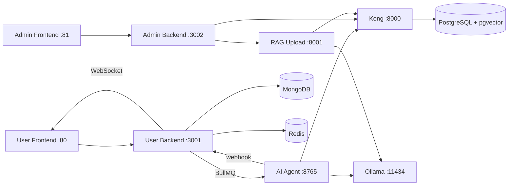

# LATTA-CSBOT

ระบบ AI Customer Service Chatbot แบบโมดูลาร์ ทำงานบน Docker Compose ชุดเดียว
รองรับทั้งฝั่งผู้ใช้ (Webchat) และฝั่งผู้ดูแล (Admin Dashboard + RAG Upload)

---

## สถาปัตยกรรมภาพรวม



| โมดูล | โฟลเดอร์ | หน้าที่ |
|---|---|---|
| User Services | `latta-csbot-user-v1/` | หน้าแชท, backend, AI Agent |
| Admin Services | `latta-csbot-admin/` | Dashboard, backend, RAG upload |
| Data Platform | `latta-csbot-database/` | Supabase, PostgreSQL, MongoDB, Redis |
| LLM Runtime | Ollama (service ใน compose) | รัน model chat / embedding / vision |

---

## เส้นทางข้อมูลหลัก

1. ผู้ใช้ส่งข้อความ → `POST /webhook/send`
2. User Backend บันทึกลง MongoDB แล้วส่งงานเข้า BullMQ
3. AI Agent ดึงบริบทจาก RAG (pgvector) แล้วสร้างคำตอบผ่าน Ollama
4. AI Agent ส่งคำตอบกลับ → `POST /webhook/receive_reply`
5. User Backend ส่งคำตอบถึงผู้ใช้ผ่าน WebSocket

---

## Tech Stack

| Layer | เทคโนโลยี |
|---|---|
| User Frontend | HTML + Bootstrap + Vanilla JS + nginx |
| Admin Frontend | Angular |
| Backend | Node.js + Express |
| AI / RAG | Python + FastAPI, LangChain-inspired pipeline |
| LLM | Ollama (Qwen3, Gemma3, Qwen3-Embedding, Qwen3-VL) |
| Queue / Cache | Redis + BullMQ |
| Database | PostgreSQL (pgvector), MongoDB |
| API Gateway | Kong |
| Container | Docker + Docker Compose |

---

## Ports

| Service | Port | หมายเหตุ |
|---|---|---|
| User Frontend | 80 | nginx reverse proxy |
| User Backend | 3001 | Express API + WebSocket |
| AI Agent | 8765 | รับงานจาก BullMQ |
| Admin Frontend | 81 | Angular via nginx |
| Admin Backend | 3002 | Express API |
| RAG Upload API | 8001 | FastAPI |
| Kong (Supabase API) | 8000 | backend ↔ PostgreSQL |
| Supabase Studio | 3000 | UI จัดการฐานข้อมูล |
| PostgreSQL | 5432 | |
| MongoDB | 27017 | |
| Redis | 6379 | |
| Redis Insight | 8002 | UI จัดการ Redis |
| Ollama | 11434 | LLM inference |

---

## Quick Start

```bash
# 1. สร้าง .env จากตัวอย่าง
cp .env.example .env

# 2. แก้ค่าที่จำเป็น
#    POSTGRES_PASSWORD, JWT_SECRET, ANON_KEY, SERVICE_ROLE_KEY,
#    REDIS_PASSWORD, MONGO_ROOT_PASSWORD

# 3. รันทั้งระบบ
docker compose up -d

# 4. ตรวจสถานะ
docker compose ps
```

---

## คำสั่งที่ใช้บ่อย

```bash
docker compose up -d              # เปิดทั้งหมด
docker compose down               # ปิดทั้งหมด
docker compose logs -f ai-agent   # ดู log เฉพาะ service

# rebuild เฉพาะ service
docker compose build --no-cache user-backend
docker compose up -d user-backend
```

---

## Environment Variables สำคัญ

```env
# Secrets (ต้องตรงกันทั้งระบบ)
POSTGRES_PASSWORD=...
JWT_SECRET=...
ANON_KEY=...
SERVICE_ROLE_KEY=...
MONGO_ROOT_PASSWORD=...
REDIS_PASSWORD=...

# การเชื่อมต่อระหว่าง container
API_BASE=http://user-backend:3001
REPLY_WEBHOOK_URL=http://user-backend:3001/webhook/receive_reply
SUPABASE_URL=http://kong:8000
```

---

## โครงสร้างโฟลเดอร์

```
.
├── docker-compose.yml          # compose หลัก
├── docker-compose.dev.yml      # override สำหรับ dev
├── .env.example                # ตัวอย่าง environment
├── latta-csbot-user-v1/        # User frontend + backend + AI agent
├── latta-csbot-admin/          # Admin frontend + backend + RAG upload
├── latta-csbot-database/       # Supabase stack + MongoDB
├── sa.md                       # System Analysis
├── sd.md                       # System Design
└── ARCHITECTURE.md             # Architecture เชิงลึก
```

---

## Troubleshooting

**nginx: host not found in upstream**
→ ตรวจว่า `nginx.conf` ใช้ชื่อ service ตรงกับ compose เช่น `user-backend:3001`

**Subflow ไม่ตอบกลับหน้าแชท**
→ ตรวจ `.env` ว่า `API_BASE=http://user-backend:3001`

**Port ชนกัน**
→ แก้ค่า port ใน `.env` แล้วรัน `docker compose down && docker compose up -d`

**Kong resolve ไม่ได้**
→ ตรวจว่า service อยู่ใน network `latta-database-network`

**Database connection refused**
→ รอ healthcheck ผ่านก่อน และตรวจ credentials ให้ตรงกัน

---

## Backup

```bash
# PostgreSQL
docker exec latta-supabase-db pg_dump -U postgres postgres > backup.sql

# MongoDB
docker exec latta-mongodb mongodump --out /backup

# Redis
docker exec latta-redis redis-cli BGSAVE
```

---

## เอกสารอ้างอิง

- [System Analysis](sa.md)
- [System Design](sd.md)
- [Architecture](ARCHITECTURE.md)

---

MIT License
