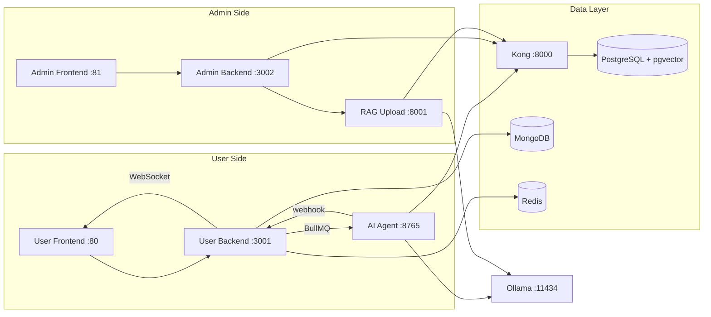
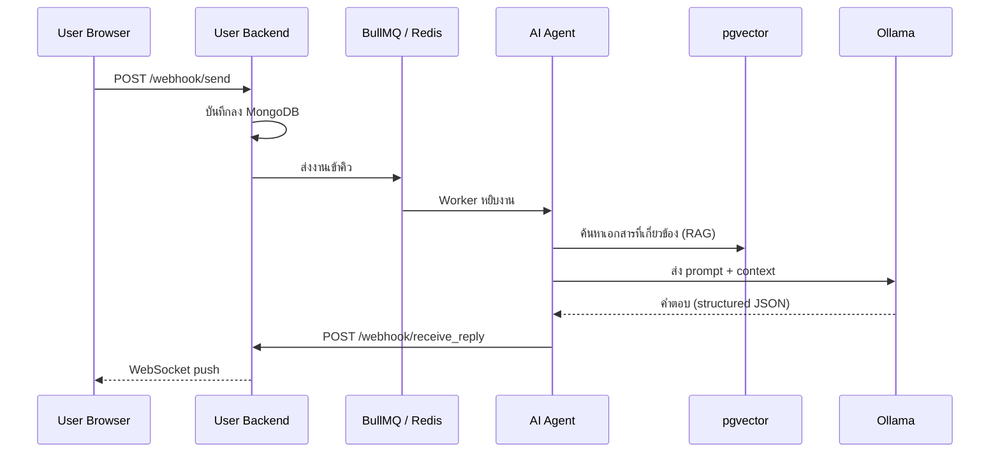

# LATTA-CSBOT

ระบบ AI Customer Service Chatbot สำหรับองค์กร ออกแบบแบบโมดูลาร์ รันทั้งหมดผ่าน Docker Compose ชุดเดียว
ผู้ใช้สนทนาผ่านหน้าเว็บแชท ระบบจะดึงความรู้จากฐานข้อมูลเอกสาร (RAG) มาประกอบกับ LLM แล้วตอบกลับแบบ real-time
ฝั่งผู้ดูแลมี Dashboard สำหรับจัดการเอกสาร อัปโหลดไฟล์ และดูสถิติ

---

## สถาปัตยกรรมภาพรวม



| โมดูล | โฟลเดอร์ | หน้าที่ |
|---|---|---|
| User Services | `latta-csbot-user-v1/` | หน้าแชทสำหรับผู้ใช้ทั่วไป, backend จัดการสนทนา, AI Agent ประมวลผลคำตอบ |
| Admin Services | `latta-csbot-admin/` | Dashboard สำหรับผู้ดูแล, backend จัดการข้อมูล, RAG upload อัปโหลดเอกสาร |
| Data Platform | `latta-csbot-database/` | Supabase stack (PostgreSQL + Kong + Auth + Storage), MongoDB, Redis |
| LLM Runtime | Ollama (service ใน compose) | รัน AI model สำหรับ chat, embedding, tagging, vision |

---

## แต่ละ Service ทำอะไร

**User Frontend** (port 80) -- หน้าเว็บแชทที่ผู้ใช้เห็น สร้างจาก HTML + Bootstrap + Vanilla JS เสิร์ฟผ่าน nginx ซึ่งทำหน้าที่เป็น reverse proxy ส่ง API request ไปหา User Backend โดยตรง

**User Backend** (port 3001) -- Express API ที่รับข้อความจากหน้าเว็บ บันทึกประวัติลง MongoDB ส่งงานเข้าคิว BullMQ ให้ AI Agent ประมวลผล และเมื่อได้คำตอบกลับมาทาง webhook จะ push ไปหาผู้ใช้ผ่าน WebSocket

**AI Agent** (port 8765) -- หัวใจของระบบ AI รับงานจาก BullMQ แล้วทำ 3 ขั้นตอน: ดึงเอกสารที่เกี่ยวข้องจาก pgvector (RAG), ประกอบ prompt ส่งให้ Ollama สร้างคำตอบ, แล้วส่งคำตอบกลับ User Backend ผ่าน webhook

**Admin Frontend** (port 81) -- Angular SPA สำหรับผู้ดูแลระบบ ใช้ดู dashboard สถิติ จัดการเอกสาร และอัปโหลดไฟล์

**Admin Backend** (port 3002) -- Express API สำหรับ Admin Frontend เชื่อมต่อ PostgreSQL ผ่าน Kong และ forward งานอัปโหลดไปยัง RAG Upload

**RAG Upload** (port 8001) -- Python FastAPI service ที่รับไฟล์ (PDF, DOCX, XLSX) แปลงเป็นข้อความ ตัดเป็น chunk สร้าง embedding vector แล้วเก็บลง PostgreSQL (pgvector) เพื่อให้ AI Agent ค้นหาได้

**PostgreSQL + pgvector** (port 5432) -- ฐานข้อมูลหลักเก็บข้อมูลผู้ใช้ เอกสาร และ embedding vector สำหรับ similarity search

**MongoDB** (port 27017) -- เก็บประวัติสนทนาและ session log

**Redis** (port 6379) -- ใช้เป็นทั้ง cache, session store และ message queue (BullMQ) สำหรับส่งงานระหว่าง User Backend กับ AI Agent

**Kong** (port 8000) -- API Gateway ของ Supabase ใช้สำหรับการเชื่อมต่อจาก backend ไปยัง PostgreSQL เท่านั้น (frontend ไม่ผ่าน Kong)

**Ollama** (port 11434) -- LLM inference server รัน AI model ทุกตัวในระบบ ทั้ง chat, embedding, tagging และ vision

---

## เส้นทางข้อมูล (Chat Flow)



1. **ผู้ใช้ส่งข้อความ** → `POST /webhook/send` ไปที่ User Backend
2. **User Backend บันทึก + ส่งคิว** → เก็บประวัติลง MongoDB แล้วส่งงานเข้า BullMQ (Redis) เพื่อให้ AI ประมวลผลแบบ async โดยไม่ block การตอบ HTTP
3. **AI Agent ดึงบริบท + สร้างคำตอบ** → ค้นเอกสารจาก pgvector (RAG) ได้สูงสุด 15 ชิ้น แล้วประกอบ prompt ส่ง Ollama ให้สร้างคำตอบเป็น structured JSON
4. **AI Agent ส่งคำตอบกลับ** → `POST /webhook/receive_reply` กลับไปที่ User Backend ผ่าน HTTP webhook
5. **User Backend push ให้ผู้ใช้** → ส่งคำตอบผ่าน WebSocket แบบ real-time

ทำไมออกแบบแบบนี้: ใช้ async queue เพราะ LLM ใช้เวลาคิดนาน (2-30 วินาที) ถ้ารอแบบ synchronous จะ timeout, ใช้ webhook กลับเพราะ AI Agent อาจทำงานหลาย worker พร้อมกัน, ใช้ WebSocket เพื่อให้ผู้ใช้ได้รับคำตอบทันทีโดยไม่ต้อง polling

---

## AI Model Configuration

ระบบใช้ Ollama รัน AI model 4 บทบาท แต่ละบทบาทมีความต้องการต่างกัน:

| ตัวแปรใน `.env` | บทบาท | ลักษณะงาน | ความต้องการ context |
|---|---|---|---|
| `OLLAMA_CHAT_MODEL` | ตอบแชท | รับ system prompt ยาว + RAG 15 เอกสาร + ประวัติสนทนา + JSON schema → สร้างคำตอบ | สูงมาก (>= 60,000 tokens) |
| `OLLAMA_EMBED_MODEL` | สร้าง vector | แปลงข้อความสั้นเป็น embedding vector สำหรับค้นหา | ต่ำ |
| `OLLAMA_TAGGING_MODEL` | จัดหมวดหมู่ | วิเคราะห์เนื้อหาเอกสารสั้น ๆ เพื่อติด tag | ต่ำ |
| `OLLAMA_VISION_MODEL` | อ่านรูปภาพ | วิเคราะห์รูปในเอกสาร เช่น ตาราง แผนผัง | ต่ำ |

### ทำไม Chat Model ต้อง context ใหญ่

โค้ดใน `ai_service.js` ตั้งค่า `numCtx: 60000` เพราะทุกครั้งที่ตอบแชท prompt ประกอบจาก 4 ส่วน:

| ส่วนของ prompt | ขนาดโดยประมาณ |
|---|---|
| System prompt (กฎ, ตัวอย่าง, รูปแบบ JSON) | ~2,000-3,000 tokens |
| RAG context (15 เอกสารที่เกี่ยวข้อง) | ~5,000-20,000 tokens |
| ประวัติสนทนาของ session | สะสมเพิ่มทุกข้อความ |
| JSON schema instructions | ~500-1,000 tokens |

รวมแล้วอาจถึง 30,000-60,000 tokens ต่อ request

### ทำไม `gemma3:4b-cloud` ใช้เป็น Chat Model ไม่ได้

`gemma3:4b-cloud` เป็นโมเดลขนาด 4B parameters ที่มี context window เล็ก (~8K-32K tokens) เมื่อ prompt รวมแล้วเกินขีดจำกัด จะได้ error ทันที:

```
"prompt too long; exceeded max context length by 2922 tokens"
```

และยิ่งสนทนาต่อ history จะยาวขึ้น error จะรุนแรงขึ้น:

```
"prompt too long; exceeded max context length by 18930 tokens"
```

แต่ `gemma3:4b-cloud` **ใช้เป็น Tagging/Vision ได้ปกติ** เพราะงานเหล่านั้น prompt สั้นมาก ไม่มี RAG context ไม่มี chat history

### โมเดลที่ใช้เป็น Chat Model ได้

โมเดลเหล่านี้มี context window >= 60,000 tokens, เก่ง structured JSON output, และรองรับภาษาไทย:

| โมเดล | ขนาด | จุดเด่น |
|---|---|---|
| `gpt-oss:20b-cloud` | 20B | context ใหญ่พอ, เก่ง JSON, สมดุลระหว่างความเร็วกับความแม่นยำ |
| `qwen3-next:80b-cloud` | 80B | แม่นยำที่สุด, เก่งภาษาไทยมาก แต่ช้ากว่าและใช้ทรัพยากรสูง |
| `deepseek-v3.5:14b` | 14B | context >= 64K, ดีกับ code/JSON, ตอบเร็ว |
| `nemotron-3-nano:30b-cloud` | 30B | เก่งในการทำตามคำสั่งซับซ้อน |
| `ministral-3:3b-cloud` | 3B | เบาที่สุด, cloud version มี context พอสำหรับงานนี้ |

### ตั้งค่าใน `.env`

```env
OLLAMA_CHAT_MODEL=gpt-oss:20b-cloud        # ต้อง context >= 60K
OLLAMA_EMBED_MODEL=qwen3-embedding:0.6b     # สร้าง vector 1024 มิติ
OLLAMA_TAGGING_MODEL=gemma3:4b-cloud        # งานสั้น ใช้โมเดลเล็กได้
OLLAMA_VISION_MODEL=gemma3:4b-cloud         # อ่านรูป ใช้โมเดลเล็กได้
```

---

## Tech Stack

| Layer | เทคโนโลยี | เหตุผล |
|---|---|---|
| User Frontend | HTML + Bootstrap + Vanilla JS + nginx | เบา โหลดเร็ว ไม่ต้อง build framework |
| Admin Frontend | Angular | SPA ที่เหมาะกับ dashboard ซับซ้อน |
| Backend | Node.js + Express | ecosystem ใหญ่, async I/O ดี, ทีมคุ้นเคย |
| AI / RAG Pipeline | Python + FastAPI | library ML/NLP พร้อมใช้ (LangChain, Docling, PyMuPDF) |
| LLM Runtime | Ollama | รัน model ใน local ได้, รองรับ GPU, API เรียบง่าย |
| Queue / Cache | Redis + BullMQ | queue ที่เสถียร, รองรับ retry และ concurrency |
| Vector Database | PostgreSQL + pgvector | similarity search ในตัว ไม่ต้องเพิ่ม service |
| Document Database | MongoDB | schema ยืดหยุ่นสำหรับ chat history ที่โครงสร้างไม่แน่นอน |
| API Gateway | Kong | มาพร้อม Supabase, จัดการ auth และ routing |
| Container | Docker + Docker Compose | ทุก service รันเหมือนกันทุกเครื่อง |

---

## Ports

| Service | Port | หมายเหตุ |
|---|---|---|
| User Frontend | 80 | nginx reverse proxy |
| User Backend | 3001 | Express API + WebSocket |
| AI Agent | 8765 | รับงานจาก BullMQ |
| Admin Frontend | 81 | Angular via nginx |
| Admin Backend | 3002 | Express API |
| RAG Upload API | 8001 | FastAPI |
| Kong (Supabase API) | 8000 | backend ↔ PostgreSQL |
| Supabase Studio | 3000 | UI จัดการฐานข้อมูล |
| PostgreSQL | 5432 | |
| MongoDB | 27017 | |
| Redis | 6379 | |
| Redis Insight | 8002 | UI จัดการ Redis |
| Ollama | 11434 | LLM inference |

---

## Quick Start

```bash
# 1. สร้าง .env จากตัวอย่าง
cp .env.example .env

# 2. แก้ค่า secrets ให้ตรงกันทั้งระบบ
#    POSTGRES_PASSWORD, JWT_SECRET, ANON_KEY, SERVICE_ROLE_KEY,
#    REDIS_PASSWORD, MONGO_ROOT_PASSWORD

# 3. รันทั้งระบบ (compose จะสร้าง network และ volume ให้อัตโนมัติ)
docker compose up -d

# 4. ตรวจสถานะ (ทุก service ต้องเป็น healthy)
docker compose ps
```

หลังรันเสร็จ:
- เปิดหน้าแชท: `http://localhost`
- เปิด Admin: `http://localhost:81`
- เปิด Supabase Studio: `http://localhost:3000`

---

## Environment Variables สำคัญ

### Secrets (ต้องตรงกันทั้งระบบ)

```env
POSTGRES_PASSWORD=...          # รหัสผ่าน PostgreSQL
JWT_SECRET=...                 # ใช้ sign JWT token ของ Supabase
ANON_KEY=...                   # public key สำหรับ Supabase client
SERVICE_ROLE_KEY=...           # key สิทธิ์สูงสำหรับ backend → Supabase
MONGO_ROOT_PASSWORD=...        # รหัสผ่าน MongoDB
REDIS_PASSWORD=...             # รหัสผ่าน Redis
```

### การเชื่อมต่อระหว่าง container

```env
API_BASE=http://user-backend:3001                              # AI Agent → User Backend
REPLY_WEBHOOK_URL=http://user-backend:3001/webhook/receive_reply  # webhook ส่งคำตอบกลับ
SUPABASE_URL=http://kong:8000                                  # backend → Supabase ผ่าน Kong
```

### Ollama

```env
OLLAMA_BASE_URL=http://ollama:11434    # URL ของ Ollama server
OLLAMA_CHAT_MODEL=gpt-oss:20b-cloud   # โมเดลตอบแชท (ต้อง context >= 60K)
OLLAMA_EMBED_MODEL=qwen3-embedding:0.6b  # โมเดลสร้าง embedding vector
OLLAMA_TAGGING_MODEL=gemma3:4b-cloud  # โมเดลจัดหมวดหมู่เอกสาร
OLLAMA_VISION_MODEL=gemma3:4b-cloud   # โมเดลอ่านรูปภาพ
OLLAMA_TIMEOUT_MS=300000               # timeout 5 นาที (LLM อาจตอบช้า)
```

---

## คำสั่งที่ใช้บ่อย

```bash
docker compose up -d              # เปิดทั้งหมด
docker compose down               # ปิดทั้งหมด
docker compose logs -f ai-agent   # ดู log เฉพาะ service

# rebuild เฉพาะ service
docker compose build --no-cache user-backend
docker compose up -d user-backend
```

---

## โครงสร้างโฟลเดอร์

```
.
├── docker-compose.yml          # compose หลัก
├── docker-compose.dev.yml      # override สำหรับ dev
├── .env.example                # ตัวอย่าง environment
├── latta-csbot-user-v1/        # User frontend + backend + AI agent
├── latta-csbot-admin/          # Admin frontend + backend + RAG upload
├── latta-csbot-database/       # Supabase stack + MongoDB
├── sa.md                       # System Analysis
├── sd.md                       # System Design
└── ARCHITECTURE.md             # Architecture เชิงลึก
```

---

## Troubleshooting

**nginx: host not found in upstream**
→ ตรวจว่า `nginx.conf` ใช้ชื่อ service ตรงกับ compose เช่น `user-backend:3001`

**Subflow ไม่ตอบกลับหน้าแชท**
→ ตรวจ `.env` ว่า `API_BASE=http://user-backend:3001`

**prompt too long; exceeded max context length**
→ โมเดลที่ตั้งเป็น `OLLAMA_CHAT_MODEL` มี context window เล็กเกินไป เปลี่ยนเป็นโมเดลที่รองรับ >= 60K tokens (ดูตารางในหัวข้อ AI Model Configuration)

**Port ชนกัน**
→ แก้ค่า port ใน `.env` แล้วรัน `docker compose down && docker compose up -d`

**Kong resolve ไม่ได้**
→ ตรวจว่า service อยู่ใน network `latta-database-network`

**Database connection refused**
→ รอ healthcheck ผ่านก่อน และตรวจ credentials ให้ตรงกัน

---

## Backup

```bash
# PostgreSQL
docker exec latta-supabase-db pg_dump -U postgres postgres > backup.sql

# MongoDB
docker exec latta-mongodb mongodump --out /backup

# Redis
docker exec latta-redis redis-cli BGSAVE
```

---

## โครงสร้างไฟล์ละเอียด

### latta-csbot-user-v1/

```
latta-csbot-user-v1/
├── backend/
│   ├── server.js                          # Express entry point + WebSocket setup
│   └── src/
│       ├── config/
│       │   ├── db.js                      # เชื่อมต่อ MongoDB, Redis, BullMQ
│       │   └── envValidator.js            # ตรวจ env vars ที่จำเป็น
│       ├── middlewares/
│       │   ├── sessionMiddleware.js       # ตรวจ session จาก Redis ก่อนเข้า API
│       │   ├── inputValidator.js          # ป้องกัน injection (NoSQL, XSS)
│       │   └── rateLimit.js               # จำกัดจำนวน request ต่อนาที
│       ├── models/
│       │   └── ChatModel.js               # MongoDB schema สำหรับข้อความแชท
│       ├── routes/
│       │   ├── authRouter.js              # POST /auth/check-status, /auth/login
│       │   └── chatRouter.js              # POST /webhook/send, /webhook/receive_reply, etc.
│       ├── services/
│       │   ├── authService.js             # ตรวจ session, login, block หลัง 5 ครั้ง
│       │   └── chatService.js             # บันทึกข้อความ, ส่งคิว, ดึงประวัติ
│       └── utils/
│           ├── validators.js              # ฟังก์ชัน validate input
│           └── helpers.js                 # utility ทั่วไป
│
├── latta-csbot_ai-agent/
│   ├── ai-agent.js                        # Express server + BullMQ workers รวมกัน
│   ├── mainflow/app/
│   │   ├── models/
│   │   │   └── models.js                  # Zod schema สำหรับ structured response
│   │   └── services/
│   │       ├── workflow_service.js         # orchestrator หลัก (RAG → LLM → webhook)
│   │       ├── ai_service.js              # LangChain + Ollama (chat, embedding, structured)
│   │       ├── supabase_service.js         # vector similarity search จาก pgvector
│   │       ├── redis_service.js            # อ่าน/เขียนประวัติสนทนาใน Redis
│   │       ├── webhook_service.js          # ส่งคำตอบกลับ User Backend
│   │       ├── bullmq_service.js           # จัดการคิว (add, publish, close)
│   │       ├── fasttrack_service.js        # ตรวจจับ pattern ลัด (reset pwd, ms form)
│   │       └── prompt.js                   # สร้าง system prompt สำหรับ LLM
│   └── subflow/
│       ├── msform-worker.js               # Worker สร้างลิงก์ MS Form + ส่งกลับ
│       └── reset-worker.js                # Worker รีเซ็ตรหัสผ่าน + ส่งอีเมล
│
└── frontend/
    ├── script.js                          # JavaScript หน้าแชท
    └── lib/bootstrap/                     # Bootstrap CSS/JS
```

### latta-csbot-admin/

```
latta-csbot-admin/
├── backend/
│   ├── server_combined.js                 # Express entry point รวม 3 service
│   └── src/
│       ├── chat_service/                  # จัดการ chat logs
│       │   ├── chat_service.js            # router setup
│       │   ├── routes/chatRoutes.js       # CRUD routes สำหรับ chat
│       │   ├── controllers/chatController.js  # logic: get, delete, import, export
│       │   └── models/ChatModel.js        # MongoDB schema
│       ├── dashboard_service/             # สถิติและ analytics
│       │   ├── dashboard_service.js       # router setup
│       │   ├── routes/dashboardRoutes.js  # routes: overview, wordfreq, trends, etc.
│       │   ├── controllers/
│       │   │   ├── dashboardController.js # logic: overview, wordfreq, refresh
│       │   │   ├── uploadController.js    # อัปโหลด chats.json
│       │   │   └── exportController.js    # export JSON storage
│       │   └── analytics/
│       │       ├── analyticsService.js    # คำนวณ trends, peak hours, top questions
│       │       └── cacheManager.js        # จัดการ cache ไฟล์สถิติ
│       ├── rag_service/                   # จัดการไฟล์เอกสาร
│       │   ├── rag_service.js             # router + proxy ไป Python service
│       │   └── file_display/
│       │       ├── routes/fileDisplayRoutes.js
│       │       └── controllers/fileDisplayController.js  # list, delete, view files
│       └── utils/
│           ├── jsonDataStore.js           # อ่าน/เขียน JSON file storage
│           └── ragUtils.js                # utility สำหรับ RAG
│
├── upload_file/                           # Python FastAPI -- RAG pipeline
│   ├── upload_file_service.py             # FastAPI app (port 8001)
│   ├── routes/upload_file_Routes.py       # POST /upload, /upload/multiple
│   ├── controllers/upload_controller.py   # รับไฟล์ + เรียก pipeline
│   ├── services/ingestion_service.py      # ประมวลผล PDF แบบ dual extraction
│   └── pipeline/
│       ├── extractor.py                   # แยกข้อความจาก PDF/DOCX/XLSX/PPTX/IMG
│       ├── vision_analyzer.py             # OCR + Ollama vision วิเคราะห์รูป
│       ├── text_splitter.py               # ตัดข้อความเป็น chunk
│       ├── embedder.py                    # สร้าง embedding vector ผ่าน Ollama
│       ├── context_stitcher.py            # รวม native text + OCR text
│       ├── image_filter.py                # กรองรูปคุณภาพต่ำออก
│       └── storage.py                     # เก็บ chunks + metadata ลง Supabase
│
└── frontend/                              # Angular SPA
    └── src/app/
        ├── app.routes.ts                  # / → dashboard, /chats, /files
        ├── services/
        │   ├── api.ts                     # HTTP client wrapper
        │   └── data.ts                    # state management ด้วย Angular signals
        ├── pages/
        │   ├── dashboard/dashboard.ts     # หน้า dashboard สถิติ
        │   ├── chat-logs/chat-logs.ts     # หน้าดู chat logs
        │   └── files/files.ts             # หน้าจัดการไฟล์
        └── components/
            └── sidebar/sidebar.ts         # sidebar navigation
```

### latta-csbot-database/

```
latta-csbot-database/
└── volumes/
    ├── api/
    │   └── kong.yml                       # Kong API Gateway routes ทั้งหมด
    ├── db/
    │   ├── roles.sql                      # ตั้งรหัสผ่าน database roles
    │   ├── jwt.sql                        # ตั้งค่า JWT secret
    │   ├── realtime.sql                   # สร้าง _realtime schema
    │   ├── webhooks.sql                   # สร้าง webhook functions + pg_net
    │   ├── logs.sql                       # สร้าง _analytics schema
    │   ├── pooler.sql                     # สร้าง _supavisor schema
    │   └── _supabase.sql                  # สร้าง _supabase database
    ├── functions/
    │   ├── main/index.ts                  # Edge function router (JWT verify + dispatch)
    │   └── hello/index.ts                 # ตัวอย่าง edge function
    ├── logs/
    │   └── vector.yml                     # Vector log aggregation config
    └── pooler/
        └── pooler.exs                     # Supavisor connection pooler config
```

---

## API Reference

### User Backend (port 3001)

| Method | Path | Auth | Request Body | Response | หมายเหตุ |
|---|---|---|---|---|---|
| GET | `/config` | ไม่ | - | `{ timeout, urls }` | ส่งค่า config ให้ frontend |
| POST | `/auth/check-status` | ไม่ | `{ sessionId }` | `{ status: 'verified'/'unverified' }` | ตรวจว่า session ยืนยันตัวตนแล้วหรือยัง |
| POST | `/auth/login` | ไม่ | `{ sessionId, CardID, Email }` | `{ status: 'success'/'fail'/'blocked' }` | login ด้วยเลขบัตร + อีเมล, block หลัง 5 ครั้ง |
| POST | `/webhook/send` | session | `{ text, sessionId }` | `{ status: 'queued' }` | ผู้ใช้ส่งข้อความ → บันทึก + ส่งคิว BullMQ |
| POST | `/webhook/receive_reply` | ไม่ (internal) | `{ sessionId, replyText, image_urls? }` | `{ status: 'reply_received' }` | AI Agent ส่งคำตอบกลับ → push WebSocket |
| GET | `/chat/history/:sessionId` | session | - | `[{ msgId, sender, text, time, feedback }]` | ดึงประวัติสนทนา (Redis cache → MongoDB fallback) |
| POST | `/chat/feedback` | session | `{ sessionId, msgId, action }` | `{ status: 'success' }` | บันทึก like/dislike ของข้อความ |
| POST | `/api/worker-error` | ไม่ (internal) | `{ sessionId, errorMessage }` | `{ status: 'Error received.' }` | Worker แจ้ง error → ส่งให้ frontend ผ่าน WebSocket |

### Admin Backend (port 3002)

**Chat Logs**

| Method | Path | Auth | หมายเหตุ |
|---|---|---|---|
| GET | `/api/chats` | ไม่ | ดึง chat ทั้งหมด (pagination + filter) |
| GET | `/api/chats/:id` | ไม่ | ดึง chat เดี่ยว |
| DELETE | `/api/chats/:id` | ไม่ | ลบ chat เดี่ยว |
| POST | `/api/chats/bulk-delete` | ไม่ | ลบหลายรายการ |
| POST | `/api/chats/import` | ไม่ | import จาก JSON |
| GET | `/api/chats/export` | ไม่ | export เป็น JSON |

**Dashboard & Analytics**

| Method | Path | Auth | หมายเหตุ |
|---|---|---|---|
| GET | `/api/overview` | ไม่ | สถิติภาพรวม |
| GET | `/api/wordfreq` | ไม่ | ความถี่คำ |
| POST | `/api/refresh-stats` | ไม่ | refresh cache ทั้งหมด |
| GET | `/api/analytics/trends` | ไม่ | แนวโน้ม session |
| GET | `/api/analytics/peak-hours` | ไม่ | ช่วงเวลาใช้งานสูงสุด |
| GET | `/api/analytics/top-questions` | ไม่ | คำถามที่ถามบ่อย |
| GET | `/api/analytics/users` | ไม่ | สถิติผู้ใช้ |

**RAG Files**

| Method | Path | Auth | หมายเหตุ |
|---|---|---|---|
| GET | `/api/files` | ไม่ | รายการไฟล์ทั้งหมด |
| GET | `/api/files/stats` | ไม่ | สถิติไฟล์ |
| DELETE | `/api/files/:id` | ไม่ | ลบไฟล์ + chunks + embeddings |
| POST | `/api/files/bulk-delete` | ไม่ | ลบหลายไฟล์ |
| POST | `/api/upload` | ไม่ | อัปโหลดไฟล์ (proxy ไป Python service) |

### RAG Upload API (port 8001 -- Python FastAPI)

| Method | Path | หมายเหตุ |
|---|---|---|
| POST | `/upload` | อัปโหลดไฟล์เดี่ยว → extract → chunk → embed → store |
| POST | `/upload/multiple` | อัปโหลดหลายไฟล์พร้อมกัน |
| GET | `/health` | health check |

---

## ฟังก์ชันสำคัญ

### Authentication

| ฟังก์ชัน | ไฟล์ | หน้าที่ |
|---|---|---|
| `getVerificationStatus(sessionId)` | `backend/src/services/authService.js` | ตรวจว่า session ยืนยันตัวตนแล้วหรือยัง (จาก Redis) |
| `performLogin(sessionId, CardID, Email)` | `backend/src/services/authService.js` | login + นับจำนวนครั้ง + block หลังผิด 5 ครั้ง |

### Chat

| ฟังก์ชัน | ไฟล์ | หน้าที่ |
|---|---|---|
| `handleUserMessage(payload, chatQueue)` | `backend/src/services/chatService.js` | บันทึกข้อความลง MongoDB + Redis แล้วส่งเข้าคิว BullMQ |
| `handleBotReply(payload, wsSender)` | `backend/src/services/chatService.js` | บันทึกคำตอบ bot แล้วส่งผ่าน WebSocket |
| `getChatHistory(sessionId)` | `backend/src/services/chatService.js` | ดึงประวัติจาก Redis (cache) ถ้าไม่มีดึงจาก MongoDB |
| `recordFeedback(sessionId, msgId, action)` | `backend/src/services/chatService.js` | บันทึก like/dislike ลง MongoDB + Redis |

### AI Workflow

| ฟังก์ชัน | ไฟล์ | หน้าที่ |
|---|---|---|
| `processChatWorkflow(sessionId, userText)` | `ai-agent/mainflow/app/services/workflow_service.js` | orchestrator หลัก: fast track → RAG → LLM → action → webhook |
| `checkFastTrack(userText, history)` | `ai-agent/mainflow/app/services/fasttrack_service.js` | ตรวจจับ pattern ลัด (reset password, ms form) |
| `getSystemPrompt(user_text, history, rag_info)` | `ai-agent/mainflow/app/services/prompt.js` | สร้าง system prompt ยาวสำหรับ LLM |

### LLM (LangChain + Ollama)

| ฟังก์ชัน | ไฟล์ | หน้าที่ |
|---|---|---|
| `getEmbedding(text)` | `ai-agent/mainflow/app/services/ai_service.js` | สร้าง embedding vector จากข้อความ |
| `generateChatCompletion(messages)` | `ai-agent/mainflow/app/services/ai_service.js` | สร้างคำตอบแบบ free-text |
| `generateStructuredResponse(messages, schema)` | `ai-agent/mainflow/app/services/ai_service.js` | สร้างคำตอบเป็น structured JSON ตาม Zod schema + self-correction |

### RAG Search (JavaScript)

| ฟังก์ชัน | ไฟล์ | หน้าที่ |
|---|---|---|
| `searchKnowledgeBase(query, topK)` | `ai-agent/mainflow/app/services/supabase_service.js` | ค้นหาเอกสารด้วย vector similarity (default topK=15) |

### RAG Pipeline (Python)

| ฟังก์ชัน | ไฟล์ | หน้าที่ |
|---|---|---|
| `extract_pages_from_bytes()` | `upload_file/pipeline/extractor.py` | แยกข้อความจากไฟล์ (PDF, DOCX, XLSX, PPTX, IMG) |
| `process_pdf_dual_extraction()` | `upload_file/services/ingestion_service.py` | pipeline หลัก: extract → OCR → chunk → embed → store |
| `split_text_recursive()` | `upload_file/pipeline/text_splitter.py` | ตัดข้อความยาวเป็น chunks |
| `get_embeddings_batch()` | `upload_file/pipeline/embedder.py` | สร้าง embedding vector เป็นชุด |
| `stitch_texts()` | `upload_file/pipeline/context_stitcher.py` | รวม native text + OCR text เข้าด้วยกัน |
| `store_documents_batch()` | `upload_file/pipeline/storage.py` | เก็บ chunks + embeddings ลง Supabase |

### Queue Management

| ฟังก์ชัน | ไฟล์ | หน้าที่ |
|---|---|---|
| `addToQueue(queueType, sessionId, payload)` | `ai-agent/mainflow/app/services/bullmq_service.js` | ส่งงานเข้าคิวที่ระบุ |
| `publishToQueue(sessionId, action)` | `ai-agent/mainflow/app/services/bullmq_service.js` | ส่ง action (ms_form / reset_password) เข้าคิวที่ตรงกัน |

### Subflow Workers

| ฟังก์ชัน | ไฟล์ | หน้าที่ |
|---|---|---|
| `processResetPasswordJob(job)` | `ai-agent/subflow/reset-worker.js` | รีเซ็ตรหัสผ่าน + ส่งยืนยัน + cooldown 5 นาที |
| `processMsFormJob(job)` | `ai-agent/subflow/msform-worker.js` | สร้างลิงก์ MS Form + ส่งให้ผู้ใช้ + cooldown 5 นาที |

### Middleware

| ฟังก์ชัน | ไฟล์ | หน้าที่ |
|---|---|---|
| `verifySession` | `backend/src/middlewares/sessionMiddleware.js` | ตรวจ session จาก Redis, ต่อ expiry, แนบ user data |
| `injectionGuard` | `backend/src/middlewares/inputValidator.js` | ตรวจจับ NoSQL injection, XSS, JavaScript protocol |
| `generalLimiter` | `backend/src/middlewares/rateLimit.js` | จำกัด 500 req / 5 นาที |
| `authLimiter` | `backend/src/middlewares/rateLimit.js` | จำกัด 5 ครั้ง / 5 นาที (เฉพาะ auth) |
| `chatLimiter` | `backend/src/middlewares/rateLimit.js` | จำกัด 60 ข้อความ / นาที |

---

## Docker Services ทั้งหมด

### Application Services

| Service | Build/Image | Port | Depends On | หมายเหตุ |
|---|---|---|---|---|
| `user-frontend` | `docker/frontend.Dockerfile` | 80 | user-backend | nginx reverse proxy |
| `user-backend` | `docker/backend.Dockerfile` | 3001 | mongodb, redis | Express + WebSocket |
| `ai-agent` | `docker/ai-agent.Dockerfile` | 8765 | redis, ollama | BullMQ workers + Express |
| `admin-frontend` | `docker/admin-frontend.Dockerfile` | 81 | admin-backend | Angular via nginx |
| `admin-backend` | `docker/admin-backend.Dockerfile` | 3002 | mongodb, db, kong | Express (3 services รวม) |
| `multimodal-rag-upload` | `docker/rag-upload.Dockerfile` | 8001 | db, kong, ollama | Python FastAPI pipeline |

### Supabase Stack

| Service | Image | Port | หมายเหตุ |
|---|---|---|---|
| `studio` | `supabase/studio` | 3000 | UI จัดการ database |
| `kong` | `kong` | 8000, 8443 | API Gateway (routing + auth) |
| `auth` | `supabase/gotrue` | 9999 | Authentication (GoTrue) |
| `rest` | `postgrest/postgrest` | 3000 | REST API auto-generated จาก schema |
| `realtime` | `supabase/realtime` | 4000 | WebSocket subscriptions |
| `storage` | `supabase/storage-api` | 5000 | Object storage (PDF, รูปภาพ) |
| `imgproxy` | `darthsim/imgproxy` | 5001 | Image resizing/optimization |
| `meta` | `supabase/postgres-meta` | 8080 | PostgreSQL metadata API |
| `functions` | `supabase/edge-runtime` | 9000 | Deno edge functions |
| `analytics` | `supabase/logflare` | 4000 | Log analytics |
| `db` | `supabase/postgres` | 5432 | PostgreSQL + pgvector |
| `vector` | `timberio/vector` | 9001 | Log aggregation |
| `supavisor` | `supabase/supavisor` | 6543 | Connection pooler |

### Data Services

| Service | Image | Port | หมายเหตุ |
|---|---|---|---|
| `mongodb` | `mongo:7` | 27017 | Chat history + session logs |
| `redis` | `redis/redis-stack-server` | 6379, 8002 | Cache + BullMQ queue + Redis Insight UI |

### LLM

| Service | Image | Port | หมายเหตุ |
|---|---|---|---|
| `ollama` | `ollama/ollama` | 11434 | LLM inference (GPU support) |

---

## เอกสารอ้างอิง

- [System Analysis](sa.md) -- วิเคราะห์ความต้องการระบบ
- [System Design](sd.md) -- ออกแบบระบบเชิงเทคนิค
- [Architecture](ARCHITECTURE.md) -- สถาปัตยกรรมเชิงลึก พร้อม sequence diagram

---

MIT License
