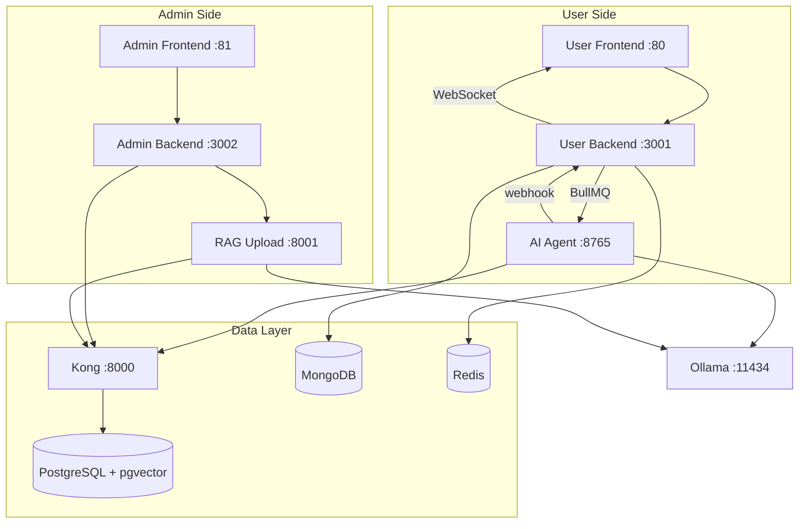
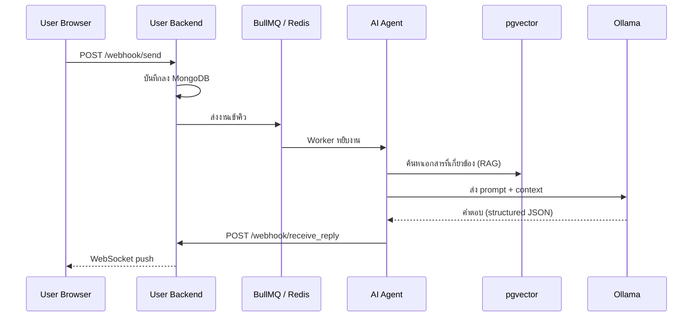
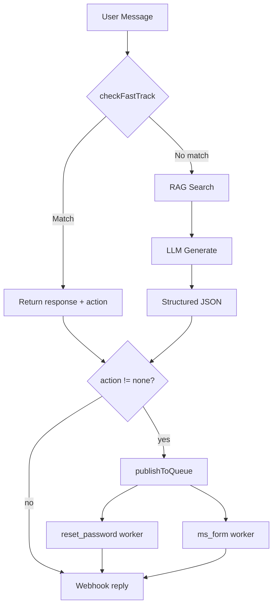

# latte-CSBOT

ระบบ AI Customer Service Chatbot สำหรับองค์กร ออกแบบแบบโมดูลาร์ รันทั้งหมดผ่าน Docker Compose ชุดเดียว
ผู้ใช้สนทนาผ่านหน้าเว็บแชท ระบบจะดึงความรู้จากฐานข้อมูลเอกสาร (RAG) มาประกอบกับ LLM แล้วตอบกลับแบบ real-time
ฝั่งผู้ดูแลมี Dashboard สำหรับจัดการเอกสาร อัปโหลดไฟล์ และดูสถิติ

---

## สารบัญ

- [สถาปัตยกรรมภาพรวม](#สถาปัตยกรรมภาพรวม)
- [แต่ละ Service ทำอะไร](#แต่ละ-service-ทำอะไร)
- [เส้นทางข้อมูล (Chat Flow)](#เส้นทางข้อมูล-chat-flow)
- [การยืนยันตัวตน (Auth Flow)](#การยืนยันตัวตน-auth-flow)
- [Fast Track และ Subflow](#fast-track-และ-subflow)
- [AI Model Configuration](#ai-model-configuration)
- [RAG Pipeline รายละเอียด](#rag-pipeline-รายละเอียด)
- [Tech Stack](#tech-stack)
- [Quick Start](#quick-start)
- [Environment Variables สำคัญ](#environment-variables-สำคัญ)
- [Security](#security)
- [การทดสอบเบื้องต้น (Smoke Test)](#การทดสอบเบื้องต้น-smoke-test)
- [ข้อจำกัดและ Known Issues](#ข้อจำกัดและ-known-issues)
- [Troubleshooting](#troubleshooting)
- [API Reference](#api-reference)
- [เอกสารอ้างอิง](#เอกสารอ้างอิง)

---

## สถาปัตยกรรมภาพรวม



| โมดูล | โฟลเดอร์ | หน้าที่ |
|---|---|---|
| User Services | `latte-csbot-user-v1/` | หน้าแชทสำหรับผู้ใช้ทั่วไป, backend จัดการสนทนา, AI Agent ประมวลผลคำตอบ |
| Admin Services | `latte-csbot-admin/` | Dashboard สำหรับผู้ดูแล, backend จัดการข้อมูล, RAG upload อัปโหลดเอกสาร |
| Data Platform | `latte-csbot-database/` | Supabase stack (PostgreSQL + Kong + Auth + Storage), MongoDB, Redis |
| LLM Runtime | Ollama (service ใน compose) | รัน AI model สำหรับ chat, embedding, tagging, vision |

---

## แต่ละ Service ทำอะไร

**User Frontend** (port 80) -- หน้าเว็บแชทที่ผู้ใช้เห็น สร้างจาก HTML + Bootstrap + Vanilla JS เสิร์ฟผ่าน nginx ซึ่งทำหน้าที่เป็น reverse proxy ส่ง API request ไปหา User Backend โดยตรง

**User Backend** (port 3001) -- Express API ที่รับข้อความจากหน้าเว็บ บันทึกประวัติลง MongoDB ส่งงานเข้าคิว BullMQ ให้ AI Agent ประมวลผล และเมื่อได้คำตอบกลับมาทาง webhook จะ push ไปหาผู้ใช้ผ่าน WebSocket

**AI Agent** (port 8765) -- หัวใจของระบบ AI รับงานจาก BullMQ แล้วทำ 3 ขั้นตอน: ดึงเอกสารที่เกี่ยวข้องจาก pgvector (RAG), ประกอบ prompt ส่งให้ Ollama สร้างคำตอบ, แล้วส่งคำตอบกลับ User Backend ผ่าน webhook

**Admin Frontend** (port 81) -- Angular SPA สำหรับผู้ดูแลระบบ ใช้ดู dashboard สถิติ จัดการเอกสาร และอัปโหลดไฟล์

**Admin Backend** (port 3002) -- Express API สำหรับ Admin Frontend เชื่อมต่อ PostgreSQL ผ่าน Kong และ forward งานอัปโหลดไปยัง RAG Upload

**RAG Upload** (port 8001) -- Python FastAPI service ที่รับไฟล์ (PDF, DOCX, XLSX, PPTX, รูปภาพ) แปลงเป็นข้อความด้วย Docling/PyMuPDF/vision OCR ตัดเป็น chunk สร้าง embedding vector แล้วเก็บลง PostgreSQL (pgvector) เพื่อให้ AI Agent ค้นหาได้

**PostgreSQL + pgvector** (port 5432) -- ฐานข้อมูลหลักเก็บข้อมูลผู้ใช้ เอกสาร และ embedding vector สำหรับ similarity search

**MongoDB** (port 27017) -- เก็บประวัติสนทนาและ session log

**Redis** (port 6379) -- ใช้เป็นทั้ง cache, session store และ message queue (BullMQ) สำหรับส่งงานระหว่าง User Backend กับ AI Agent

**Kong** (port 8000) -- API Gateway ของ Supabase ใช้สำหรับการเชื่อมต่อจาก backend ไปยัง PostgreSQL เท่านั้น (frontend ไม่ผ่าน Kong)

**Ollama** (port 11434) -- LLM inference server รัน AI model ทุกตัวในระบบ ทั้ง chat, embedding, tagging และ vision

---

## เส้นทางข้อมูล (Chat Flow)



1. **ผู้ใช้ส่งข้อความ** → `POST /webhook/send` ไปที่ User Backend
2. **User Backend บันทึก + ส่งคิว** → เก็บประวัติลง MongoDB แล้วส่งงานเข้า BullMQ (Redis) เพื่อให้ AI ประมวลผลแบบ async โดยไม่ block การตอบ HTTP
3. **AI Agent ดึงบริบท + สร้างคำตอบ** → ค้นเอกสารจาก pgvector (RAG) ได้สูงสุด 15 ชิ้น แล้วประกอบ prompt ส่ง Ollama ให้สร้างคำตอบเป็น structured JSON
4. **AI Agent ส่งคำตอบกลับ** → `POST /webhook/receive_reply` กลับไปที่ User Backend ผ่าน HTTP webhook
5. **User Backend push ให้ผู้ใช้** → ส่งคำตอบผ่าน WebSocket แบบ real-time

ทำไมออกแบบแบบนี้: ใช้ async queue เพราะ LLM ใช้เวลาคิดนาน (2-30 วินาที) ถ้ารอแบบ synchronous จะ timeout, ใช้ webhook กลับเพราะ AI Agent อาจทำงานหลาย worker พร้อมกัน, ใช้ WebSocket เพื่อให้ผู้ใช้ได้รับคำตอบทันทีโดยไม่ต้อง polling

---

## การยืนยันตัวตน (Auth Flow)

ผู้ใช้ต้อง login ก่อนใช้งานแชท โดยกรอก **เลขบัตร** และ **อีเมล** ผ่าน `POST /auth/login`

| ขั้นตอน | รายละเอียด |
|---|---|
| Login | Backend ตรวจสอบ credentials (หรือ bypass ถ้า `AUTH_BYPASS_MODE=true`) |
| Session | เก็บใน Redis DB3 (`verified:{sessionId}`) TTL = 24 ชม. (86400 วินาที) |
| Refresh | Session ถูก refresh ทุกครั้งที่มี activity (verifySession middleware เรียก `expire`) |
| Block | หลัง login ผิด 5 ครั้ง → block เป็นเวลา 5 นาที (300000 ms) |

**ตัวแปรใน `.env`:** `MAX_LOGIN_ATTEMPTS`, `BLOCK_DURATION_MS`, `REDIS_SESSION_TTL`

**Session และ WebSocket:**
- **Session TTL:** 24 ชม. (86400 วินาที), refresh on activity
- **WebSocket:** เชื่อมต่อ `/ws`, ส่ง `{ type: 'init', sessionId }` ตอนเปิด
- **Reconnect:** หลุดแล้ว reconnect อัตโนมัติหลัง 5 วินาที (`WS_RECONNECT_DELAY_MS`)

---

## Fast Track และ Subflow

AI Agent ตรวจสอบ **Fast Track** ก่อน — ถ้า match จะไม่ผ่าน RAG/LLM เลย:



| Fast Track | เงื่อนไข | Action | Worker |
|---|---|---|---|
| **Reset Password** | AI เคยถามเรื่อง reset และผู้ใช้ยืนยัน (ใช่, ตกลง, ทำเลย) | `reset_password` | รีเซ็ตรหัสผ่าน + ส่งอีเมล |
| **MS Form** | คำขอฟอร์มตรงๆ ("ขอกรอกฟอร์ม", "ขอลิงก์ฟอร์ม") หรือผู้ใช้ยืนยันหลัง AI ถาม | `ms_form` | สร้างลิงก์ MS Form |

**Cooldown:** แต่ละ action มี cooldown 5 นาที (300 วินาที) ต่ออีเมล เพื่อป้องกัน spam

**ลำดับการตรวจสอบ:** Reset Password → MS Form

---

## AI Model Configuration

ระบบใช้ Ollama รัน AI model 4 บทบาท แต่ละบทบาทมีความต้องการต่างกัน:

| ตัวแปรใน `.env` | บทบาท | ลักษณะงาน | ความต้องการ context |
|---|---|---|---|
| `OLLAMA_CHAT_MODEL` | ตอบแชท | รับ system prompt ยาว + RAG 15 เอกสาร + ประวัติสนทนา + JSON schema → สร้างคำตอบ | สูงมาก (>= 60,000 tokens) |
| `OLLAMA_EMBED_MODEL` | สร้าง vector | แปลงข้อความสั้นเป็น embedding vector สำหรับค้นหา (RAG pipeline + AI Agent ใช้ร่วมกัน) | ต่ำ |
| `OLLAMA_TAGGING_MODEL` | จัดหมวดหมู่ | วิเคราะห์เนื้อหาเอกสารสั้น ๆ เพื่อติด tag ตอนอัปโหลด | ต่ำ |
| `OLLAMA_VISION_MODEL` | อ่านรูปภาพ | วิเคราะห์รูปในเอกสาร เช่น ตาราง แผนผัง (OCR) | ต่ำ |

**หมายเหตุ RAG:** Embedding model ต้องสร้าง vector ขนาดเดียวกับที่เก็บใน pgvector (เช่น `qwen3-embedding:0.6b` → 1024 มิติ) ถ้าเปลี่ยนโมเดลต้อง re-embed เอกสารทั้งหมด

### RAG Pipeline รายละเอียด

| พารามิเตอร์ | ค่า default | ตัวแปร `.env` | คำอธิบาย |
|---|---|---|---|
| Chunk size | 1024 ตัวอักษร | `CHUNK_SIZE` | ขนาดสูงสุดของแต่ละ chunk |
| Chunk overlap | 200 ตัวอักษร | `CHUNK_OVERLAP` | จำนวนตัวอักษรที่ทับซ้อนระหว่าง chunks |
| Top K | 15 | - | จำนวน chunks ที่ค้นหาได้ต่อคำถาม (ใน `searchKnowledgeBase`) |

**ขั้นตอนอัปโหลด:** Extract → OCR (vision) → Stitch → Split → Embed → Store

**หมายเหตุ:** ต้องอัปโหลดเอกสารผ่าน Admin (`http://localhost:81` → Files) ก่อน แชทถึงจะตอบจาก RAG ได้

### ทำไม Chat Model ต้อง context ใหญ่

โค้ดใน `ai_service.js` ตั้งค่า `numCtx: 60000` เพราะทุกครั้งที่ตอบแชท prompt ประกอบจาก 4 ส่วน:

| ส่วนของ prompt | ขนาดโดยประมาณ |
|---|---|
| System prompt (กฎ, ตัวอย่าง, รูปแบบ JSON) | ~2,000-3,000 tokens |
| RAG context (15 เอกสารที่เกี่ยวข้อง) | ~5,000-20,000 tokens |
| ประวัติสนทนาของ session | สะสมเพิ่มทุกข้อความ |
| JSON schema instructions | ~500-1,000 tokens |

รวมแล้วอาจถึง 30,000-60,000 tokens ต่อ request

### ทำไม `gemma3:4b-cloud` ใช้เป็น Chat Model ไม่ได้

`gemma3:4b-cloud` เป็นโมเดลขนาด 4B parameters ที่มี context window เล็ก (~8K-32K tokens) เมื่อ prompt รวมแล้วเกินขีดจำกัด จะได้ error ทันที:

```
"prompt too long; exceeded max context length by 2922 tokens"
```

และยิ่งสนทนาต่อ history จะยาวขึ้น error จะรุนแรงขึ้น:

```
"prompt too long; exceeded max context length by 18930 tokens"
```

แต่ `gemma3:4b-cloud` **ใช้เป็น Tagging/Vision ได้ปกติ** เพราะงานเหล่านั้น prompt สั้นมาก ไม่มี RAG context ไม่มี chat history

### โมเดลที่ใช้เป็น Chat Model ได้

โมเดลเหล่านี้มี context window >= 60,000 tokens, เก่ง structured JSON output, และรองรับภาษาไทย

**ความต้องการของ Chat Model:**
- Context window >= 60,000 tokens (โค้ดตั้ง `numCtx: 60000`)
- สร้าง structured JSON ได้ตาม schema (ใช้ prompt + `format: "json"` ไม่ใช่ tool calling)
- รองรับภาษาไทย (สำหรับตอบคำถามลูกค้า)
- **ไม่จำเป็นต้องรองรับ tools/function calling** — ระบบใช้ prompt engineering + JSON schema validation

**ประเภทโมเดล:**
- **Local** = รันบน Ollama ในเครื่อง/container (เช่น `gpt-oss:20b`) — ต้องมี GPU/VRAM ตามตาราง
- **Cloud** = เรียก API ภายนอก (เช่น `gpt-oss:20b-cloud`) — ต้อง `ollama signin` และใช้ได้เมื่อมีเครือข่าย

| โมเดล | ขนาด | ประเภท | จุดเด่น |
|---|---|---|---|
| `gpt-oss:20b` | 20B | Local | รันบน Ollama ได้ปกติ, context ใหญ่พอ, เก่ง JSON |
| `gpt-oss:20b-cloud` | 20B | Cloud | context ใหญ่พอ, เก่ง JSON, สมดุลระหว่างความเร็วกับความแม่นยำ |
| `qwen3-next:80b-cloud` | 80B | Cloud | แม่นยำที่สุด, เก่งภาษาไทยมาก แต่ช้ากว่าและใช้ทรัพยากรสูง |
| `deepseek-r1:14b` | 14B | Local | context 128K, ดีกับ code/JSON, ตอบเร็ว |
| `nemotron-3-nano:30b-cloud` | 30B | Cloud | เก่งในการทำตามคำสั่งซับซ้อน |
| `ministral-3:3b` | 3B | Local | context 256K, เบาที่สุด, รันบน Ollama ได้ |
| `ministral-3:3b-cloud` | 3B | Cloud | context 256K, เบาที่สุด, เรียกผ่าน Cloud API |

### VRAM ขั้นต่ำและโมเดลแนะนำ

| โมเดล | ขนาด | Context | VRAM ขั้นต่ำ | ประเภท | จุดเด่น |
|---|---|---|---|---|---|
| `ministral-3:3b` | 3B | 256K | ~4 GB | Local | เบาที่สุด, รันได้บน GPU 8GB |
| `ministral-3:3b-cloud` | 3B | 256K | - | Cloud | เบาที่สุด, เรียกผ่าน Cloud API |
| `gpt-oss:20b` | 20B | 60K+ | ~16-24 GB | Local | context ใหญ่พอ, เก่ง JSON |
| `gpt-oss:20b-cloud` | 20B | 60K+ | - | Cloud | สมดุลความเร็ว-ความแม่นยำ |
| `deepseek-r1:14b` | 14B | 128K | ~10-12 GB | Local | ดีกับ code/JSON, ตอบเร็ว |
| `qwen3-next:80b-cloud` | 80B | 60K+ | - | Cloud | แม่นยำที่สุด, เก่งภาษาไทย |
| `nemotron-3-nano:30b-cloud` | 30B | 60K+ | - | Cloud | เก่งทำตามคำสั่งซับซ้อน |
| `llama3.1:8b` | 8B | 128K | ~6-8 GB | Local | เร็ว, รองรับภาษาไทย (Llama 3.3 ไม่มี 8B) |
| `llama3.3:70b` | 70B | 128K | ~48 GB | Local | ใกล้ GPT-4 |
| `qwen2.5:7b` | 7B | 32K | ~6 GB | Local | หลายภาษา, เก่ง code |
| `qwen2.5:14b` | 14B | 32K | ~10 GB | Local | สมดุลคุณภาพ-ความเร็ว |
| `qwen2.5:32b` | 32B | 32K | ~20 GB | Local | แม่นยำขึ้น |
| `mistral:7b` | 7B | 32K | ~6 GB | Local | เร็วมาก (~24 tok/s) |
| `phi4:14b` | 14B | 16K | ~12 GB | Local | เก่ง creative writing |
| `gemma2:9b` | 9B | 8K | ~8 GB | Local | reasoning ดี (context เล็ก) |
| `deepseek-r1:8b` | 8B | 128K | ~8 GB | Local | reasoning ใกล้ GPT-4 |
| `supachai/openthaigpt-1.0.0-chat` | 7B | 4K | ~6 GB | Local | ภาษาไทยโดยเฉพาะ, community model (context เล็ก) |

หมายเหตุ: ตัวเลข VRAM เป็นค่าประมาณสำหรับ Q4/Q4_K_M; context 60K อาจใช้ KV cache เพิ่ม ~2-5 GB; โมเดลที่ context < 60K อาจใช้ไม่ได้ (ดู "ทำไม Chat Model ต้อง context ใหญ่"); ตรวจสอบโมเดลที่มีจริงที่ [ollama.com/library](https://ollama.com/library)

### ทำไม ministral-3:3b และ ministral-3:3b-cloud ใช้ได้ทั้งคู่

- โมเดลเดียวกัน แค่ช่องทางต่างกัน: Local (Ollama) vs Cloud API
- Context window ~256,000 tokens (256K) มากกว่า 60K ที่ระบบต้องการ
- โมเดล 3B แต่มี context ใหญ่ จึงเหมาะกับ prompt ยาวและ structured JSON

### โมเดลที่ไม่ควรใช้เป็น Chat Model

- **`qwen3:0.6b`** — context window เล็ก (~2K-8K), โค้ดตั้ง `numCtx: 60000` ทำให้เกิดปัญหา: โมเดลเล็กทำ structured JSON ได้ไม่ดี, อาจ timeout หรือ `fetch failed`, Ollama อาจ unload โมเดลบ่อย
- **`gemma3:4b-cloud`** — context window เล็กเกินไป (ดูหัวข้อ "ทำไม gemma3:4b-cloud ใช้เป็น Chat Model ไม่ได้" ด้านบน)

### โครงสร้าง Output ที่ Chat Model ต้องสร้าง

ระบบใช้ `generateStructuredResponse()` ใน `ai_service.js` บังคับให้โมเดลตอบเป็น JSON ตาม schema นี้:

| ฟิลด์ | ประเภท | คำอธิบาย |
|---|---|---|
| `answers` | string[] | รายการคำตอบแยกตามหัวข้อ |
| `question` | string | คำถามปิดท้าย (ถ้ามี) |
| `action` | string | `none` / `reset_password` / `ms_form` — ระบบอ่านค่านี้แล้วส่งไป worker ที่ตรงกัน (`reset_password` = ลิงก์ reset รหัสผ่าน, `ms_form` = แบบฟอร์ม Microsoft) |
| `thinking_process` | string \| null | เหตุผลการคิด (ถ้ามี) |
| `image_urls` | string[] | URL รูปภาพ (ถ้ามี) |

**การทำงาน:** ระบบส่ง schema เป็นข้อความใน prompt + ใช้ `format: "json"` ของ Ollama เพื่อบังคับ output เป็น JSON ไม่ได้ใช้ tool/function calling ของโมเดล

### ตั้งค่าใน `.env`

```env
OLLAMA_CHAT_MODEL=gpt-oss:20b-cloud        # ต้อง context >= 60K
OLLAMA_EMBED_MODEL=qwen3-embedding:0.6b     # สร้าง vector 1024 มิติ
OLLAMA_TAGGING_MODEL=gemma3:4b-cloud        # งานสั้น ใช้โมเดลเล็กได้
OLLAMA_VISION_MODEL=gemma3:4b-cloud         # อ่านรูป ใช้โมเดลเล็กได้
```

**คำสั่ง pull โมเดล (Local):** `ollama pull <model>` เช่น `ollama pull gpt-oss:20b` หรือ `ollama pull ministral-3:3b`

---

## Tech Stack

| Layer | เทคโนโลยี | เหตุผล |
|---|---|---|
| User Frontend | HTML + Bootstrap + Vanilla JS + nginx | เบา โหลดเร็ว ไม่ต้อง build framework |
| Admin Frontend | Angular | SPA ที่เหมาะกับ dashboard ซับซ้อน |
| Backend | Node.js + Express | ecosystem ใหญ่, async I/O ดี, ทีมคุ้นเคย |
| AI / RAG Pipeline | Python + FastAPI | library ML/NLP พร้อมใช้ (LangChain, Docling, PyMuPDF) |
| LLM Runtime | Ollama | รัน model ใน local ได้, รองรับ GPU, API เรียบง่าย |
| Queue / Cache | Redis + BullMQ | queue ที่เสถียร, รองรับ retry และ concurrency |
| Vector Database | PostgreSQL + pgvector | similarity search ในตัว ไม่ต้องเพิ่ม service |
| Document Database | MongoDB | schema ยืดหยุ่นสำหรับ chat history ที่โครงสร้างไม่แน่นอน |
| API Gateway | Kong | มาพร้อม Supabase, จัดการ auth และ routing |
| Container | Docker + Docker Compose | ทุก service รันเหมือนกันทุกเครื่อง |

---

## Ports

| Service | Port | หมายเหตุ |
|---|---|---|
| User Frontend | 80 | nginx reverse proxy |
| User Backend | 3001 | Express API + WebSocket |
| AI Agent | 8765 | รับงานจาก BullMQ |
| Admin Frontend | 81 | Angular via nginx |
| Admin Backend | 3002 | Express API |
| RAG Upload API | 8001 | FastAPI |
| Kong (Supabase API) | 8000 | backend ↔ PostgreSQL |
| Supabase Studio | 3000 | UI จัดการฐานข้อมูล |
| PostgreSQL | 5432 | |
| MongoDB | 27017 | |
| Redis | 6379 | |
| Redis Insight | 8002 | UI จัดการ Redis |
| Ollama | 11434 | LLM inference |

---

## Quick Start

**Prerequisites:** Docker + Docker Compose, NVIDIA GPU (ถ้าใช้ Local models) หรือเครือข่ายสำหรับ Cloud models

```bash
# 1. สร้าง .env จากตัวอย่าง
cp .env.example .env

# 2. แก้ค่า secrets ให้ตรงกันทั้งระบบ
#    POSTGRES_PASSWORD, JWT_SECRET, ANON_KEY, SERVICE_ROLE_KEY,
#    REDIS_PASSWORD, MONGO_ROOT_PASSWORD

# 3. (ถ้าใช้ Cloud models) ลงชื่อเข้าใช้ Ollama: ollama signin

# 4. รันทั้งระบบ (compose จะสร้าง network และ volume ให้อัตโนมัติ)
docker compose up -d

# 5. (ถ้าใช้ Local models) pull โมเดลก่อนใช้งานครั้งแรก
#    docker exec -it ollama ollama pull gpt-oss:20b
#    docker exec -it ollama ollama pull qwen3-embedding:0.6b
#    docker exec -it ollama ollama pull gemma3:4b-cloud

# 6. ตรวจสถานะ (ทุก service ต้องเป็น healthy)
docker compose ps
```

หลังรันเสร็จ:
- เปิดหน้าแชท: `http://localhost`
- เปิด Admin: `http://localhost:81`
- เปิด Supabase Studio: `http://localhost:3000`

---

## การทดสอบเบื้องต้น (Smoke Test)

1. **ตรวจสอบ services:** `docker compose ps` — ทุกตัวต้องเป็น healthy
2. **หน้าแชท:** เปิด `http://localhost` → login (หรือ bypass ถ้า `AUTH_BYPASS_MODE=true`) → ส่งข้อความทดสอบ
3. **ตัวอย่างคำถาม:** "สวัสดี", "ลืมรหัสผ่าน", "ขอแบบฟอร์มแจ้งปัญหา"
4. **Admin:** เปิด `http://localhost:81` → Files → อัปโหลดไฟล์ PDF ทดสอบ → ดูรายการไฟล์

---

## Environment Variables สำคัญ

### Secrets (ต้องตรงกันทั้งระบบ)

```env
POSTGRES_PASSWORD=...          # รหัสผ่าน PostgreSQL
JWT_SECRET=...                 # ใช้ sign JWT token ของ Supabase
ANON_KEY=...                   # public key สำหรับ Supabase client
SERVICE_ROLE_KEY=...           # key สิทธิ์สูงสำหรับ backend → Supabase
MONGO_ROOT_PASSWORD=...        # รหัสผ่าน MongoDB
REDIS_PASSWORD=...             # รหัสผ่าน Redis
```

### การเชื่อมต่อระหว่าง container

```env
API_BASE=http://user-backend:3001                              # AI Agent → User Backend
REPLY_WEBHOOK_URL=http://user-backend:3001/webhook/receive_reply  # webhook ส่งคำตอบกลับ
SUPABASE_URL=http://kong:8000                                  # backend → Supabase ผ่าน Kong
```

### Ollama

```env
OLLAMA_BASE_URL=http://ollama:11434    # URL ของ Ollama server
OLLAMA_CHAT_MODEL=gpt-oss:20b-cloud   # โมเดลตอบแชท (ต้อง context >= 60K)
OLLAMA_EMBED_MODEL=qwen3-embedding:0.6b  # โมเดลสร้าง embedding vector
OLLAMA_TAGGING_MODEL=gemma3:4b-cloud  # โมเดลจัดหมวดหมู่เอกสาร
OLLAMA_VISION_MODEL=gemma3:4b-cloud   # โมเดลอ่านรูปภาพ
OLLAMA_TIMEOUT_MS=300000               # timeout 5 นาที (LLM อาจตอบช้า)
```

---

## Security

- **Secrets:** ห้าม commit `.env` (มีใน `.gitignore`) — ใช้ `.env.example` เป็น template
- **Rate limiting:**
  | ประเภท | ขีดจำกัด | ตัวแปร |
  |---|---:|---|
  | ทั่วไป | 500 req / 5 นาที | `RATE_LIMIT_WINDOW_MS`, `RATE_LIMIT_MAX_REQUESTS` |
  | Auth | 5 ครั้ง / 5 นาที (นับเฉพาะ failed) | `MAX_LOGIN_ATTEMPTS`, `BLOCK_DURATION_MS` |
  | Chat | 60 ข้อความ / นาที | `CHAT_RATE_LIMIT_WINDOW_MS`, `CHAT_RATE_LIMIT_MAX` |
- **Injection:** `injectionGuard` ตรวจจับ NoSQL injection, XSS, `javascript:` protocol

---

## คำสั่งที่ใช้บ่อย

```bash
docker compose up -d              # เปิดทั้งหมด
docker compose down               # ปิดทั้งหมด
docker compose logs -f ai-agent   # ดู log เฉพาะ service

# rebuild เฉพาะ service
docker compose build --no-cache user-backend
docker compose up -d user-backend
```

---

## โครงสร้างโฟลเดอร์

```
.
├── docker-compose.yml          # compose หลัก
├── docker-compose.dev.yml      # override สำหรับ dev
├── .env.example                # ตัวอย่าง environment
├── latte-csbot-user-v1/        # User frontend + backend + AI agent
├── latte-csbot-admin/          # Admin frontend + backend + RAG upload
├── latte-csbot-database/       # Supabase stack + MongoDB
├── sa.md                       # System Analysis
├── sd.md                       # System Design
└── ARCHITECTURE.md             # Architecture เชิงลึก
```

---

## ข้อจำกัดและ Known Issues

- โมเดล context < 60K ใช้เป็น Chat Model ไม่ได้ (ดูหัวข้อ "ทำไม Chat Model ต้อง context ใหญ่")
- เปลี่ยน embedding model ต้อง re-embed เอกสารทั้งหมด (RAG pipeline ใช้ embedding ขนาดเดียวกับที่เก็บใน pgvector)
- `AUTH_BYPASS_MODE=true` ใช้สำหรับ dev เท่านั้น — production ควรปิด

---

## Troubleshooting

**nginx: host not found in upstream**
→ ตรวจว่า `nginx.conf` ใช้ชื่อ service ตรงกับ compose เช่น `user-backend:3001`

**Subflow ไม่ตอบกลับหน้าแชท**
→ ตรวจ `.env` ว่า `API_BASE=http://user-backend:3001`

**prompt too long; exceeded max context length**
→ โมเดลที่ตั้งเป็น `OLLAMA_CHAT_MODEL` มี context window เล็กเกินไป เปลี่ยนเป็นโมเดลที่รองรับ >= 60K tokens (ดูตารางในหัวข้อ AI Model Configuration)

**Structured Generation Error: fetch failed / timeout**
→ ตรวจว่าใช้โมเดลที่รองรับ context >= 60K และไม่ใช่โมเดลเล็กเช่น `qwen3:0.6b` (ดูหัวข้อ "โมเดลที่ไม่ควรใช้เป็น Chat Model") ตรวจ `OLLAMA_BASE_URL` ว่าเชื่อมต่อได้ และดู log ของ Ollama ว่ามี OOM หรือ crash หรือไม่

**Port ชนกัน**
→ แก้ค่า port ใน `.env` แล้วรัน `docker compose down && docker compose up -d`

**Kong resolve ไม่ได้**
→ ตรวจว่า service อยู่ใน network `latte-database-network`

**Database connection refused**
→ รอ healthcheck ผ่านก่อน และตรวจ credentials ให้ตรงกัน

**`password authentication failed for user "authenticator"` / latte-supabase-rest unhealthy**
→ รหัสผ่านใน PostgreSQL ไม่ตรงกับ `.env` (มักเกิดเมื่อ volume เดิมยังอยู่หลังเปลี่ยนรหัสผ่าน)

**วิธีแก้:**
```bash
# วิธี 1: รีเซ็ตฐานข้อมูล (ข้อมูลจะหาย)
docker compose down -v
docker volume rm latte-csbot-unified_db_data 2>$null
cp .env.example .env
./latte-csbot-database/utils/generate-keys.sh   # ต้องมี openssl (Git Bash/WSL)
docker compose up -d

# วิธี 2: Sync รหัสผ่าน (ใช้ Git Bash หรือ WSL)
./latte-csbot-database/utils/db-passwd.sh
docker compose up -d --force-recreate rest storage
```

**`Role "supabase_admin" does not exist` / latte-supabase-db unhealthy**
→ โปรเจกต์นี้มี `00-initial-schema.sql` แล้ว ตรวจสอบว่า volume เก่าถูกลบแล้วเริ่มใหม่ (ดูวิธีแก้ด้านล่าง)

**`must be owner of function uid` / latte-supabase-auth crash loop**
→ Auth schema มีฟังก์ชัน `auth.uid()` ที่ถูกสร้างโดย role อื่น (มักเกิดจาก volume เดิมหรือ init ไม่สมบูรณ์)

**`no schema has been selected to create in` / latte-supabase-realtime crash loop**
→ Realtime ไม่พบ schema `_realtime` หรือ search_path ไม่ถูกต้อง (มักเกิดจาก volume เดิม)

**วิธีแก้ทั้ง Auth และ Realtime:** รีเซ็ตฐานข้อมูลแบบเต็ม (ข้อมูลจะหายทั้งหมด)
```bash
docker compose down -v
docker volume rm latte-csbot-unified_db_data 2>$null
# ถ้าใช้ docker-compose.dev.yml: docker compose -f docker-compose.yml -f docker-compose.dev.yml down -v
./latte-csbot-database/reset.sh -y   # หรือรัน reset.sh แล้วกด y
docker compose up -d
```

**โมเดลไม่มีใน Ollama / model not found**
→ ตรวจรายชื่อโมเดลที่มีจริงที่ [ollama.com/library](https://ollama.com/library) บางโมเดลอาจใช้ชื่อต่างจากเอกสาร (เช่น `llama3.3:70b` อาจไม่มี ใช้ `llama3.1:70b` แทน)

**Cloud model ไม่ทำงาน / 401 Unauthorized**
→ รัน `ollama signin` ในเครื่องที่รัน Ollama (หรือ `docker exec -it ollama ollama signin` ถ้า Ollama อยู่ใน container)

---

## Backup

```bash
# PostgreSQL
docker exec latte-supabase-db pg_dump -U postgres postgres > backup.sql

# MongoDB
docker exec latte-mongodb mongodump --out /backup

# Redis
docker exec latte-redis redis-cli BGSAVE
```

---

## โครงสร้างไฟล์ละเอียด

### latte-csbot-user-v1/

```
latte-csbot-user-v1/
├── backend/
│   ├── server.js                          # Express entry point + WebSocket setup
│   └── src/
│       ├── config/
│       │   ├── db.js                      # เชื่อมต่อ MongoDB, Redis, BullMQ
│       │   └── envValidator.js            # ตรวจ env vars ที่จำเป็น
│       ├── middlewares/
│       │   ├── sessionMiddleware.js       # ตรวจ session จาก Redis ก่อนเข้า API
│       │   ├── inputValidator.js          # ป้องกัน injection (NoSQL, XSS)
│       │   └── rateLimit.js               # จำกัดจำนวน request ต่อนาที
│       ├── models/
│       │   └── ChatModel.js               # MongoDB schema สำหรับข้อความแชท
│       ├── routes/
│       │   ├── authRouter.js              # POST /auth/check-status, /auth/login
│       │   └── chatRouter.js              # POST /webhook/send, /webhook/receive_reply, etc.
│       ├── services/
│       │   ├── authService.js             # ตรวจ session, login, block หลัง 5 ครั้ง
│       │   └── chatService.js             # บันทึกข้อความ, ส่งคิว, ดึงประวัติ
│       └── utils/
│           ├── validators.js              # ฟังก์ชัน validate input
│           └── helpers.js                 # utility ทั่วไป
│
├── latte-csbot_ai-agent/
│   ├── ai-agent.js                        # Express server + BullMQ workers รวมกัน
│   ├── mainflow/app/
│   │   ├── models/
│   │   │   └── models.js                  # Zod schema สำหรับ structured response
│   │   └── services/
│   │       ├── workflow_service.js         # orchestrator หลัก (RAG → LLM → webhook)
│   │       ├── ai_service.js              # LangChain + Ollama (chat, embedding, structured)
│   │       ├── supabase_service.js         # vector similarity search จาก pgvector
│   │       ├── redis_service.js            # อ่าน/เขียนประวัติสนทนาใน Redis
│   │       ├── webhook_service.js          # ส่งคำตอบกลับ User Backend
│   │       ├── bullmq_service.js           # จัดการคิว (add, publish, close)
│   │       ├── fasttrack_service.js        # ตรวจจับ pattern ลัด (reset pwd, ms form)
│   │       └── prompt.js                   # สร้าง system prompt สำหรับ LLM
│   └── subflow/
│       ├── msform-worker.js               # Worker สร้างลิงก์ MS Form + ส่งกลับ
│       └── reset-worker.js                # Worker รีเซ็ตรหัสผ่าน + ส่งอีเมล
│
└── frontend/
    ├── script.js                          # JavaScript หน้าแชท
    └── lib/bootstrap/                     # Bootstrap CSS/JS
```

### latte-csbot-admin/

```
latte-csbot-admin/
├── backend/
│   ├── server_combined.js                 # Express entry point รวม 3 service
│   └── src/
│       ├── chat_service/                  # จัดการ chat logs
│       │   ├── chat_service.js            # router setup
│       │   ├── routes/chatRoutes.js       # CRUD routes สำหรับ chat
│       │   ├── controllers/chatController.js  # logic: get, delete, import, export
│       │   └── models/ChatModel.js        # MongoDB schema
│       ├── dashboard_service/             # สถิติและ analytics
│       │   ├── dashboard_service.js       # router setup
│       │   ├── routes/dashboardRoutes.js  # routes: overview, wordfreq, trends, etc.
│       │   ├── controllers/
│       │   │   ├── dashboardController.js # logic: overview, wordfreq, refresh
│       │   │   ├── uploadController.js    # อัปโหลด chats.json
│       │   │   └── exportController.js    # export JSON storage
│       │   └── analytics/
│       │       ├── analyticsService.js    # คำนวณ trends, peak hours, top questions
│       │       └── cacheManager.js        # จัดการ cache ไฟล์สถิติ
│       ├── rag_service/                   # จัดการไฟล์เอกสาร
│       │   ├── rag_service.js             # router + proxy ไป Python service
│       │   └── file_display/
│       │       ├── routes/fileDisplayRoutes.js
│       │       └── controllers/fileDisplayController.js  # list, delete, view files
│       └── utils/
│           ├── jsonDataStore.js           # อ่าน/เขียน JSON file storage
│           └── ragUtils.js                # utility สำหรับ RAG
│
├── upload_file/                           # Python FastAPI -- RAG pipeline
│   ├── upload_file_service.py             # FastAPI app (port 8001)
│   ├── routes/upload_file_Routes.py       # POST /upload, /upload/multiple
│   ├── controllers/upload_controller.py   # รับไฟล์ + เรียก pipeline
│   ├── services/ingestion_service.py      # ประมวลผล PDF แบบ dual extraction
│   └── pipeline/
│       ├── extractor.py                   # แยกข้อความจาก PDF/DOCX/XLSX/PPTX/IMG
│       ├── vision_analyzer.py             # OCR + Ollama vision วิเคราะห์รูป
│       ├── text_splitter.py               # ตัดข้อความเป็น chunk
│       ├── embedder.py                    # สร้าง embedding vector ผ่าน Ollama
│       ├── context_stitcher.py            # รวม native text + OCR text
│       ├── image_filter.py                # กรองรูปคุณภาพต่ำออก
│       └── storage.py                     # เก็บ chunks + metadata ลง Supabase
│
└── frontend/                              # Angular SPA
    └── src/app/
        ├── app.routes.ts                  # / → dashboard, /chats, /files
        ├── services/
        │   ├── api.ts                     # HTTP client wrapper
        │   └── data.ts                    # state management ด้วย Angular signals
        ├── pages/
        │   ├── dashboard/dashboard.ts     # หน้า dashboard สถิติ
        │   ├── chat-logs/chat-logs.ts     # หน้าดู chat logs
        │   └── files/files.ts             # หน้าจัดการไฟล์
        └── components/
            └── sidebar/sidebar.ts         # sidebar navigation
```

### latte-csbot-database/

```
latte-csbot-database/
└── volumes/
    ├── api/
    │   └── kong.yml                       # Kong API Gateway routes ทั้งหมด
    ├── db/
    │   ├── roles.sql                      # ตั้งรหัสผ่าน database roles
    │   ├── jwt.sql                        # ตั้งค่า JWT secret
    │   ├── realtime.sql                   # สร้าง _realtime schema
    │   ├── webhooks.sql                   # สร้าง webhook functions + pg_net
    │   ├── logs.sql                       # สร้าง _analytics schema
    │   ├── pooler.sql                     # สร้าง _supavisor schema
    │   ├── _supabase.sql                  # สร้าง _supabase database
    │   └── init-scripts/                   # SQL scripts สำหรับ RAG schema (database_lc.sql)
    │       └── V1__latte_rag_schema.sql   # Schema สำหรับ RAG (files, documents, document_chunks)
    ├── functions/
    │   ├── main/index.ts                  # Edge function router (JWT verify + dispatch)
    │   └── hello/index.ts                 # ตัวอย่าง edge function
    ├── logs/
    │   └── vector.yml                     # Vector log aggregation config
    └── pooler/
        └── pooler.exs                     # Supavisor connection pooler config
```

---

## Database Initialization

### ปัญหาของต้นแบบ supabase-docker

ต้นแบบ `supabase-docker` มีปัญหาหลายอย่างที่ทำให้ startup ไม่สำเร็จ:

| # | ปัญหา | ผลกระทบ |
|---|--------|---------|
| 1 | **Shell variable ไม่ทำงาน** | SQL files ใช้ `\set pguser \`echo "$POSTGRES_USER"\`` ซึ่งไม่ทำงานกับ Docker volume mounts |
| 2 | **ขาด schemas จำเป็น** | `_realtime`, `_supabase` database ไม่ถูกสร้าง → Realtime, Analytics crash |
| 3 | **ขาด tables สำหรับ Logflare** | `sources` และ `system_metrics` tables ไม่มี → Analytics crash |

### วิธีแก้: ใช้ Flyway

โปรเจกต์นี้ใช้ **db-init** (PostgreSQL client) สำหรับ custom database initialization แทน Flyway:

```yaml
# docker-compose.yml
db-init:
  image: postgres:15.8-alpine
  depends_on:
    supavisor:
      condition: service_healthy
  environment:
    POSTGRES_HOST: ${POSTGRES_HOST}
    POSTGRES_PORT: ${POSTGRES_PORT}
    POSTGRES_DB: ${POSTGRES_DB}
    POSTGRES_USER: supabase_admin
    POSTGRES_PASSWORD: ${POSTGRES_PASSWORD}
  volumes:
    - ./latte-csbot-database/volumes/db/init-scripts/database_lc.sql:/database_lc.sql:ro
  command: >
    sh -c "
      echo 'Waiting for database to be ready...' &&
      until PGPASSWORD=$$POSTGRES_PASSWORD psql -h $$POSTGRES_HOST -U $$POSTGRES_USER -d $$POSTGRES_DB -c 'SELECT 1' > /dev/null 2>&1; do
        echo 'Database is unavailable - sleeping';
        sleep 2;
      done;
      echo 'Database is ready! Running RAG schema initialization...';
      PGPASSWORD=$$POSTGRES_PASSWORD psql -h $$POSTGRES_HOST -U $$POSTGRES_USER -d $$POSTGRES_DB -f /database_lc.sql;
      echo 'Database initialization completed!'
    "
```

**ข้อดีของ db-init:**
- ✅ รันหลังจาก Supabase services ทั้งหมดพร้อมแล้ว
- ✅ ใช้ native PostgreSQL client ที่มี password correctly
- ✅ เรียบง่าย ไม่ต้องตั้งค่า JDBC
- ✅ รอจน database ready ก่อนรัน SQL

### ลำดับการเริ่มต้น Services

| # | Service | รอ |
|---|---------|-----|
| 1 | `vector` | - |
| 2 | `db` | vector (healthy) |
| 3 | `analytics` | db (healthy) |
| 4 | `studio` | analytics (healthy) |
| 5 | `kong` | analytics (healthy) |
| 6 | `auth` | db + analytics (healthy) |
| 7 | `rest` | db + analytics (healthy) |
| 8 | `realtime` | db + analytics (healthy) |
| 9 | `meta` | db + analytics (healthy) |
| 10 | `storage` | db + rest + imgproxy |
| 11 | `imgproxy` | - |
| 12 | `functions` | analytics (healthy) |
| 13 | `supavisor` | db + analytics (healthy) |
| **14** | **`db-init`** | **supavisor (healthy)** |

### RAG Schema (database_lc.sql)

db-init รัน SQL script `database_lc.sql` ซึ่งสร้าง:

**Extensions:**
- `uuid-ossp` - UUID generation
- `vector` - Vector embeddings

**Tables:**
| Table | Description |
|-------|-------------|
| `public.files` | เก็บไฟล์อัพโหลด |
| `public.documents` | เก็บ metadata ของเอกสาร |
| `public.document_chunks` | เก็บ embeddings (vector) |

**Storage Buckets:**
- `file_rag` - ไฟล์เอกสาร
- `image_rag` - ไฟล์ภาพ

**Functions:**
- `match_documents()` - Semantic search สำหรับ RAG

---

## API Reference

### User Backend (port 3001)

| Method | Path | Auth | Request Body | Response | หมายเหตุ |
|---|---|---|---|---|---|
| GET | `/config` | ไม่ | - | `{ timeout, urls }` | ส่งค่า config ให้ frontend |
| POST | `/auth/check-status` | ไม่ | `{ sessionId }` | `{ status: 'verified'/'unverified' }` | ตรวจว่า session ยืนยันตัวตนแล้วหรือยัง |
| POST | `/auth/login` | ไม่ | `{ sessionId, CardID, Email }` | `{ status: 'success'/'fail'/'blocked' }` | login ด้วยเลขบัตร + อีเมล, block หลัง 5 ครั้ง |
| POST | `/webhook/send` | session | `{ text, sessionId }` | `{ status: 'queued' }` | ผู้ใช้ส่งข้อความ → บันทึก + ส่งคิว BullMQ |
| POST | `/webhook/receive_reply` | ไม่ (internal) | `{ sessionId, replyText, image_urls? }` | `{ status: 'reply_received' }` | AI Agent ส่งคำตอบกลับ → push WebSocket |
| GET | `/chat/history/:sessionId` | session | - | `[{ msgId, sender, text, time, feedback }]` | ดึงประวัติสนทนา (Redis cache → MongoDB fallback) |
| POST | `/chat/feedback` | session | `{ sessionId, msgId, action }` | `{ status: 'success' }` | บันทึก like/dislike ของข้อความ |
| POST | `/api/worker-error` | ไม่ (internal) | `{ sessionId, errorMessage }` | `{ status: 'Error received.' }` | Worker แจ้ง error → ส่งให้ frontend ผ่าน WebSocket |

### Admin Backend (port 3002)

**Chat Logs**

| Method | Path | Auth | หมายเหตุ |
|---|---|---|---|
| GET | `/api/chats` | ไม่ | ดึง chat ทั้งหมด (pagination + filter) |
| GET | `/api/chats/:id` | ไม่ | ดึง chat เดี่ยว |
| DELETE | `/api/chats/:id` | ไม่ | ลบ chat เดี่ยว |
| POST | `/api/chats/bulk-delete` | ไม่ | ลบหลายรายการ |
| POST | `/api/chats/import` | ไม่ | import จาก JSON |
| GET | `/api/chats/export` | ไม่ | export เป็น JSON |

**Dashboard & Analytics**

| Method | Path | Auth | หมายเหตุ |
|---|---|---|---|
| GET | `/api/overview` | ไม่ | สถิติภาพรวม |
| GET | `/api/wordfreq` | ไม่ | ความถี่คำ |
| POST | `/api/refresh-stats` | ไม่ | refresh cache ทั้งหมด |
| GET | `/api/analytics/trends` | ไม่ | แนวโน้ม session |
| GET | `/api/analytics/peak-hours` | ไม่ | ช่วงเวลาใช้งานสูงสุด |
| GET | `/api/analytics/top-questions` | ไม่ | คำถามที่ถามบ่อย |
| GET | `/api/analytics/users` | ไม่ | สถิติผู้ใช้ |

**RAG Files**

| Method | Path | Auth | หมายเหตุ |
|---|---|---|---|
| GET | `/api/files` | ไม่ | รายการไฟล์ทั้งหมด |
| GET | `/api/files/stats` | ไม่ | สถิติไฟล์ |
| DELETE | `/api/files/:id` | ไม่ | ลบไฟล์ + chunks + embeddings |
| POST | `/api/files/bulk-delete` | ไม่ | ลบหลายไฟล์ |
| POST | `/api/upload` | ไม่ | อัปโหลดไฟล์ (proxy ไป Python service) |

### RAG Upload API (port 8001 -- Python FastAPI)

| Method | Path | หมายเหตุ |
|---|---|---|
| POST | `/upload` | อัปโหลดไฟล์เดี่ยว → extract → chunk → embed → store |
| POST | `/upload/multiple` | อัปโหลดหลายไฟล์พร้อมกัน |
| GET | `/health` | health check |

### AI Agent (port 8765 -- Node.js Express + BullMQ)

**Express Server Endpoints**

| Method | Path | Auth | Request Body | Response | หมายเหตุ |
|---|---|---|---|---|---|
| GET | `/health` | ไม่ | - | `{ status, timestamp }` | Health check |
| POST | `/agent` | ไม่ | `{ sessionId, text }` | `{ status: 'processing', sessionId }` | รับข้อความ → ประมวลผลใน background |

**BullMQ Workers (Queue Processing)**

| Worker | Queue Name | Env Variable | หน้าที่ |
|---|---|---|---|
| Main Worker | `ai-agent-queue` | `AI_AGENT_QUEUE_NAME` | ประมวลผลแชทหลัก (RAG + LLM) → ส่งคำตอบผ่าน webhook |
| MS Form Worker | `ms_form` | `MS_FORM_QUEUE_NAME` | สร้างลิงก์แบบฟอร์ม MS Forms → ส่งให้ผู้ใช้ |
| Reset Password Worker | `reset_password` | `RESET_PASSWORD_QUEUE_NAME` | รีเซ็ตรหัสผ่าน → ส่งลิงก์ยืนยันทางอีเมล |

**Queue Job Data Structure**

```javascript
// Main Worker (ai-agent-queue)
{
  sessionId: "xxx",
  text: "ข้อความจากผู้ใช้"
}

// MS Form Worker (ms_form)
{
  sessionId: "xxx"
}

// Reset Password Worker (reset_password)
{
  sessionId: "xxx"
}
```

**Environment Variables**

| Variable | Default | หมายเหตุ |
|---|---|---|
| `AI_AGENT_PORT` | 8765 | Port ของ Express server |
| `AI_AGENT_QUEUE_NAME` | ai-agent-queue | ชื่อ queue หลัก |
| `MS_FORM_QUEUE_NAME` | ms_form | ชื่อ queue สำหรับ MS Forms |
| `RESET_PASSWORD_QUEUE_NAME` | reset_password | ชื่อ queue สำหรับรีเซ็ตรหัสผ่าน |
| `AGENT_WEBHOOK_URL` | - | URL ที่ Main Worker จะ forward งานไป |
| `API_BASE` | - | URL ของ User Backend (สำหรับ webhook reply) |
| `REDIS_HOST` | - | Redis host |
| `REDIS_PORT` | 6379 | Redis port |
| `REDIS_PASSWORD` | - | Redis password |
| `REDIS_QUEUE_DB` | 2 | Redis DB สำหรับ queue |
| `REDIS_VERIFY_DB` | 3 | Redis DB สำหรับข้อมูลผู้ใช้ที่ยืนยันแล้ว |
| `REDIS_COOLDOWN_DB` | 4 | Redis DB สำหรับ spam prevention |

**Flow การทำงาน**

```
User → User Backend (/webhook/send) → BullMQ Queue (ai-agent-queue) 
                                                        ↓
                                            Main Worker ประมวลผล
                                                        ↓
                                            (RAG → LLM → Generate Reply)
                                                        ↓
                                            Webhook → User Backend 
                                                        ↓
                                            WebSocket → Frontend
```

**Spam Prevention**

- MS Form Worker: ใช้ cooldown 5 นาที หลังส่ง link
- Reset Password Worker: ใช้ cooldown 5 นาที หลังส่งลิงก์ reset

---

## ฟังก์ชันสำคัญ

### Authentication

| ฟังก์ชัน | ไฟล์ | หน้าที่ |
|---|---|---|
| `getVerificationStatus(sessionId)` | `backend/src/services/authService.js` | ตรวจว่า session ยืนยันตัวตนแล้วหรือยัง (จาก Redis) |
| `performLogin(sessionId, CardID, Email)` | `backend/src/services/authService.js` | login + นับจำนวนครั้ง + block หลังผิด 5 ครั้ง |

### Chat

| ฟังก์ชัน | ไฟล์ | หน้าที่ |
|---|---|---|
| `handleUserMessage(payload, chatQueue)` | `backend/src/services/chatService.js` | บันทึกข้อความลง MongoDB + Redis แล้วส่งเข้าคิว BullMQ |
| `handleBotReply(payload, wsSender)` | `backend/src/services/chatService.js` | บันทึกคำตอบ bot แล้วส่งผ่าน WebSocket |
| `getChatHistory(sessionId)` | `backend/src/services/chatService.js` | ดึงประวัติจาก Redis (cache) ถ้าไม่มีดึงจาก MongoDB |
| `recordFeedback(sessionId, msgId, action)` | `backend/src/services/chatService.js` | บันทึก like/dislike ลง MongoDB + Redis |

### AI Workflow

| ฟังก์ชัน | ไฟล์ | หน้าที่ |
|---|---|---|
| `processChatWorkflow(sessionId, userText)` | `ai-agent/mainflow/app/services/workflow_service.js` | orchestrator หลัก: fast track → RAG → LLM → action → webhook |
| `checkFastTrack(userText, history)` | `ai-agent/mainflow/app/services/fasttrack_service.js` | ตรวจจับ pattern ลัด (reset password, ms form) |
| `getSystemPrompt(user_text, history, rag_info)` | `ai-agent/mainflow/app/services/prompt.js` | สร้าง system prompt ยาวสำหรับ LLM |

### LLM (LangChain + Ollama)

| ฟังก์ชัน | ไฟล์ | หน้าที่ |
|---|---|---|
| `getEmbedding(text)` | `ai-agent/mainflow/app/services/ai_service.js` | สร้าง embedding vector จากข้อความ |
| `generateChatCompletion(messages)` | `ai-agent/mainflow/app/services/ai_service.js` | สร้างคำตอบแบบ free-text |
| `generateStructuredResponse(messages, schema)` | `ai-agent/mainflow/app/services/ai_service.js` | สร้างคำตอบเป็น structured JSON ตาม Zod schema + self-correction |

### RAG Search (JavaScript)

| ฟังก์ชัน | ไฟล์ | หน้าที่ |
|---|---|---|
| `searchKnowledgeBase(query, topK)` | `ai-agent/mainflow/app/services/supabase_service.js` | ค้นหาเอกสารด้วย vector similarity (default topK=15) |

### RAG Pipeline (Python)

| ฟังก์ชัน | ไฟล์ | หน้าที่ |
|---|---|---|
| `extract_pages_from_bytes()` | `upload_file/pipeline/extractor.py` | แยกข้อความจากไฟล์ (PDF, DOCX, XLSX, PPTX, IMG) |
| `process_pdf_dual_extraction()` | `upload_file/services/ingestion_service.py` | pipeline หลัก: extract → OCR → chunk → embed → store |
| `split_text_recursive()` | `upload_file/pipeline/text_splitter.py` | ตัดข้อความยาวเป็น chunks |
| `get_embeddings_batch()` | `upload_file/pipeline/embedder.py` | สร้าง embedding vector เป็นชุด |
| `stitch_texts()` | `upload_file/pipeline/context_stitcher.py` | รวม native text + OCR text เข้าด้วยกัน |
| `store_documents_batch()` | `upload_file/pipeline/storage.py` | เก็บ chunks + embeddings ลง Supabase |

### Queue Management

| ฟังก์ชัน | ไฟล์ | หน้าที่ |
|---|---|---|
| `addToQueue(queueType, sessionId, payload)` | `ai-agent/mainflow/app/services/bullmq_service.js` | ส่งงานเข้าคิวที่ระบุ |
| `publishToQueue(sessionId, action)` | `ai-agent/mainflow/app/services/bullmq_service.js` | ส่ง action (ms_form / reset_password) เข้าคิวที่ตรงกัน |

### Subflow Workers

| ฟังก์ชัน | ไฟล์ | หน้าที่ |
|---|---|---|
| `processResetPasswordJob(job)` | `ai-agent/subflow/reset-worker.js` | รีเซ็ตรหัสผ่าน + ส่งยืนยัน + cooldown 5 นาที |
| `processMsFormJob(job)` | `ai-agent/subflow/msform-worker.js` | สร้างลิงก์ MS Form + ส่งให้ผู้ใช้ + cooldown 5 นาที |

### Middleware

| ฟังก์ชัน | ไฟล์ | หน้าที่ |
|---|---|---|
| `verifySession` | `backend/src/middlewares/sessionMiddleware.js` | ตรวจ session จาก Redis, ต่อ expiry, แนบ user data |
| `injectionGuard` | `backend/src/middlewares/inputValidator.js` | ตรวจจับ NoSQL injection, XSS, JavaScript protocol |
| `generalLimiter` | `backend/src/middlewares/rateLimit.js` | จำกัด 500 req / 5 นาที |
| `authLimiter` | `backend/src/middlewares/rateLimit.js` | จำกัด 5 ครั้ง / 5 นาที (เฉพาะ auth) |
| `chatLimiter` | `backend/src/middlewares/rateLimit.js` | จำกัด 60 ข้อความ / นาที |

---

## Docker Services ทั้งหมด

### Application Services

| Service | Build/Image | Port | Depends On | หมายเหตุ |
|---|---|---|---|---|
| `user-frontend` | `docker/frontend.Dockerfile` | 80 | user-backend | nginx reverse proxy |
| `user-backend` | `docker/backend.Dockerfile` | 3001 | mongodb, redis | Express + WebSocket |
| `ai-agent` | `docker/ai-agent.Dockerfile` | 8765 | redis, ollama | BullMQ workers + Express |
| `admin-frontend` | `docker/admin-frontend.Dockerfile` | 81 | admin-backend | Angular via nginx |
| `admin-backend` | `docker/admin-backend.Dockerfile` | 3002 | mongodb, db, kong | Express (3 services รวม) |
| `multimodal-rag-upload` | `docker/rag-upload.Dockerfile` | 8001 | db, kong, ollama | Python FastAPI pipeline |

### Supabase Stack

| Service | Image | Port | หมายเหตุ |
|---|---|---|---|
| `studio` | `supabase/studio` | 3000 | UI จัดการ database |
| `kong` | `kong` | 8000, 8443 | API Gateway (routing + auth) |
| `auth` | `supabase/gotrue` | 9999 | Authentication (GoTrue) |
| `rest` | `postgrest/postgrest` | 3000 | REST API auto-generated จาก schema |
| `realtime` | `supabase/realtime` | 4000 | WebSocket subscriptions |
| `storage` | `supabase/storage-api` | 5000 | Object storage (PDF, รูปภาพ) |
| `imgproxy` | `darthsim/imgproxy` | 5001 | Image resizing/optimization |
| `meta` | `supabase/postgres-meta` | 8080 | PostgreSQL metadata API |
| `functions` | `supabase/edge-runtime` | 9000 | Deno edge functions |
| `analytics` | `supabase/logflare` | 4000 | Log analytics |
| `db` | `supabase/postgres` | 5432 | PostgreSQL + pgvector |
| `vector` | `timberio/vector` | 9001 | Log aggregation |
| `supavisor` | `supabase/supavisor` | 6543 | Connection pooler |

### Data Services

| Service | Image | Port | หมายเหตุ |
|---|---|---|---|
| `mongodb` | `mongo:7` | 27017 | Chat history + session logs |
| `redis` | `redis/redis-stack-server` | 6379, 8002 | Cache + BullMQ queue + Redis Insight UI |

### LLM

| Service | Image | Port | หมายเหตุ |
|---|---|---|---|
| `ollama` | `ollama/ollama` | 11434 | LLM inference (GPU support) |

---

## เอกสารอ้างอิง

- [System Analysis](sa.md) -- วิเคราะห์ความต้องการระบบ
- [System Design](sd.md) -- ออกแบบระบบเชิงเทคนิค
- [Architecture](ARCHITECTURE.md) -- สถาปัตยกรรมเชิงลึก พร้อม sequence diagram

---

MIT License
