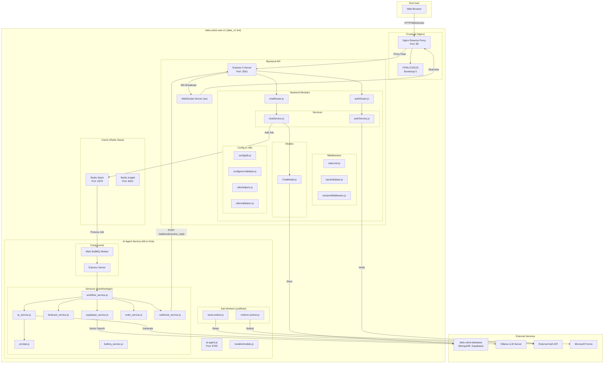
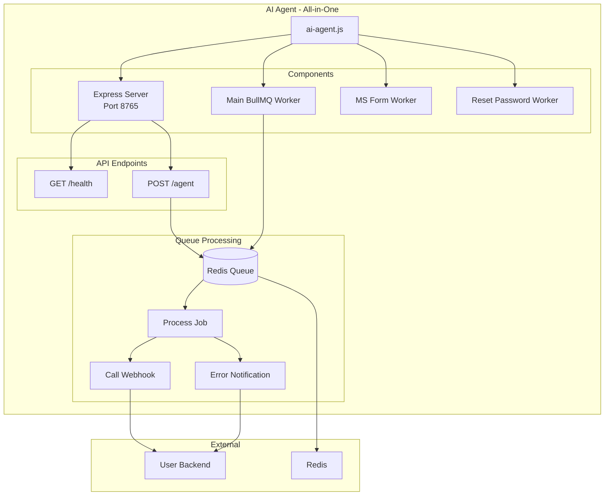

# latta-csbot-user-v1 - System Architecture

## Overview

User-facing chat application with real-time messaging, AI-powered responses (RAG + LLM), and external authentication. Deployed as **4 Docker containers** with Nginx reverse proxy.

## Architecture Diagram



## Service Components

| Component | Technology | Port | Container | Purpose |
|-----------|------------|------|-----------|---------|
| Frontend | Nginx + HTML/CSS/JS + Bootstrap 5 | 80 | `latta_v1-user-frontend` | Reverse proxy + static files |
| Backend | Node.js + Express 5 | 3001 | `latta_v1-user-backend` | API + WebSocket server |
| AI Agent | Node.js + Express + BullMQ | 8765 | `latta_v1-ai-agent` | AI workflow orchestration |
| Redis | Redis Stack | 6379/8001 | `latta_v1-redis` | Cache + Queue + Sessions |

## Module Structure

```
latta-csbot-user-v1/
├── backend/
│   ├── server.js                    # Express 5 entry point
│   └── src/
│       ├── config/
│       │   ├── db.js                # MongoDB + Redis connections
│       │   └── envValidator.js      # Environment variable validation
│       ├── routes/
│       │   ├── authRouter.js        # Authentication routes
│       │   └── chatRouter.js        # Chat + webhook routes
│       ├── services/
│       │   ├── authService.js       # Auth business logic
│       │   └── chatService.js       # Chat business logic
│       ├── models/
│       │   └── ChatModel.js         # Mongoose chat schema
│       ├── middlewares/
│       │   ├── rateLimit.js         # Express rate limiter
│       │   ├── inputValidator.js    # Zod input validation
│       │   └── sessionMiddleware.js # Session verification
│       └── utils/
│           ├── helpers.js           # Utility functions
│           └── validators.js        # Shared validation
│
├── frontend/
│   ├── index.html                   # Main chat UI
│   ├── style.css                    # Custom styles
│   ├── script.js                    # Application logic
│   └── lib/
│       └── bootstrap/               # Bootstrap 5 assets
│
├── latta-csbot_ai-agent/
│   ├── ai-agent.js                  # All-in-one entry point
│   ├── mainflow/app/
│   │   ├── services/
│   │   │   ├── workflow_service.js  # Core AI workflow
│   │   │   ├── ai_service.js        # LLM interaction
│   │   │   ├── fasttrack_service.js # Fast-track detection
│   │   │   ├── prompt.js            # Prompt engineering
│   │   │   ├── supabase_service.js  # RAG vector search
│   │   │   ├── redis_service.js     # Redis operations
│   │   │   ├── webhook_service.js   # Reply webhook
│   │   │   └── bullmq_service.js    # Queue service
│   │   └── models/
│   │       └── models.js            # Zod schemas
│   └── subflow/
│       ├── msform-worker.js         # MS Forms worker
│       └── reset-worker.js          # Password reset worker
│
├── docker/
│   ├── backend.Dockerfile           # Node.js 20 Alpine
│   ├── frontend.Dockerfile          # Nginx Alpine
│   ├── ai-agent.Dockerfile          # Node.js 20 Alpine
│   ├── ai-agent-python.Dockerfile   # Python alternative
│   ├── nginx.conf                   # Nginx reverse proxy config
│   └── nginx-ssl.conf               # Nginx SSL config
│
├── docker-compose.yml               # Service orchestration
├── package.json                     # Shared Node.js dependencies
├── .env                             # Environment configuration
└── .dockerignore                    # Docker build exclusions
```

## AI Agent Architecture (ai-agent.js)



### ai-agent.js Features

| Feature | Description |
|---------|-------------|
| **Unified Entry** | รวม Server + Workers ในไฟล์เดียว |
| **Auto Start** | เริ่มทั้งหมดพร้อมกัน |
| **Graceful Shutdown** | ปิด Workers และ Connections อย่างถูกต้อง |
| **Error Handling** | แจ้ง error กลับ backend อัตโนมัติ |
| **Configurable** | ผ่าน environment variables |

## Key Features

### 1. Real-time Chat
- WebSocket for instant message delivery
- AFK detection and auto-logout (configurable timeout)
- Message history with Redis caching (hot) + MongoDB (cold)

### 2. AI-Powered Responses
- RAG (Retrieval-Augmented Generation) via Supabase vector search
- Fast-track actions (reset password, MS form submission)
- Structured output with Zod validation
- Configurable LLM model via Ollama

### 3. Authentication
- External auth API integration
- Auth bypass mode for development
- Session management with Redis (TTL-based)
- Rate limiting and brute-force protection (5 attempts → 5min block)

### 4. Security (OWASP Compliant)
- Helmet security headers (CSP, HSTS, X-Content-Type-Options)
- CORS with configurable allowed origins
- Input validation (Zod schemas)
- Rate limiting (general, auth, chat tiers)
- Request logging (Morgan)
- Nginx reverse proxy with SSL support

## Network

- **Network**: `latta_v1-network` (internal bridge)
- **External**: Connects to `latta-database-network` (shared with latta-csbot-database)

## API Endpoints

### Authentication
```
POST /auth/login          # User login (CardID + Email)
POST /auth/check-status   # Check session verification status
```

### Chat
```
POST /webhook/send           # Send user message → Queue → AI
POST /webhook/receive_reply  # Receive bot reply (internal, from AI Agent)
GET  /chat/history           # Get chat history (Redis → MongoDB fallback)
POST /chat/feedback          # Submit like/dislike feedback
```

### Configuration
```
GET /config                  # Frontend configuration (API_BASE, timeouts)
```

### WebSocket
```
WS /                         # Real-time bidirectional connection
```

### AI Agent
```
GET  /health                 # Health check
POST /agent                  # Process chat message (RAG + LLM)
```

## Redis Database Layout

| DB Index | Purpose | Key Pattern |
|----------|---------|-------------|
| 0 | Chat history cache | `chat_history:{sessionId}` |
| 1 | BullMQ queues | BullMQ internal keys |
| 2 | AI memory | Agent memory keys |
| 3 | Auth verification | `{sessionId}` hash |
| 4 | Cooldown tracking | Cooldown keys |

## Environment Variables

```bash
# Service Ports
USER_FRONTEND_PORT=80
USER_BACKEND_PORT=3001
AI_AGENT_PORT=8765
REDIS_PORT=6379
REDIS_INSIGHT_PORT=8002

# Node
NODE_ENV=production

# Database (from latta-csbot-database)
MONGO_ROOT_USER=root
MONGO_ROOT_PASSWORD=secret
MONGO_DB=chatbot

# Redis
REDIS_HOST=redis
REDIS_PASSWORD=secret
REDIS_CHAT_DB=0
REDIS_QUEUE_DB=1
REDIS_MEMORY_DB=2
REDIS_VERIFY_DB=3
REDIS_COOLDOWN_DB=4
REDIS_SESSION_TTL=86400
CHAT_TTL_SECONDS=600

# Supabase (from latta-csbot-database)
SUPABASE_URL=http://kong:8000
SUPABASE_PUBLIC_URL=http://localhost:8000
SUPABASE_KEY=...

# Ollama
OLLAMA_BASE_URL=http://ollama:11434
OLLAMA_CHAT_MODEL=gpt-oss:20b-cloud
OLLAMA_EMBED_MODEL=qwen3-embedding:0.6b

# AI Agent
AGENT_WEBHOOK_URL=http://ai-agent:8765/agent
API_BASE=http://backend:3001
REPLY_WEBHOOK_URL=http://backend:3001/webhook/receive_reply
AI_AGENT_KEEP_ALIVE=30m

# BullMQ Queue Names
AI_AGENT_QUEUE_NAME=ai-agent-queue
MS_FORM_QUEUE_NAME=ms_form
RESET_PASSWORD_QUEUE_NAME=reset_password

# Security
ALLOWED_ORIGINS=http://localhost:3001,http://localhost
AUTH_BYPASS_MODE=false
MAX_LOGIN_ATTEMPTS=5
BLOCK_DURATION_MS=300000
RATE_LIMIT_WINDOW_MS=300000
RATE_LIMIT_MAX_REQUESTS=500

# External Services
EXTERNAL_AUTH_API=https://auth.example.com/api
MS_FORMS_REPORT_URL=https://forms.office.com/...
```
