# latta-csbot-user-v1 - Data Flow

## Overview

Complete data flows for user authentication, chat messaging, AI processing, and feedback handling.

## Flow Diagrams

### 1. User Authentication Flow

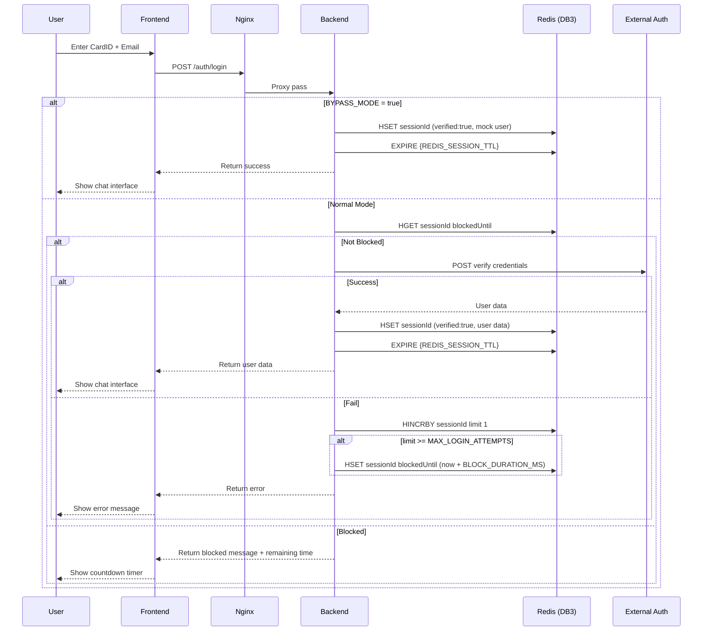

### 2. Chat Message Flow (Complete)

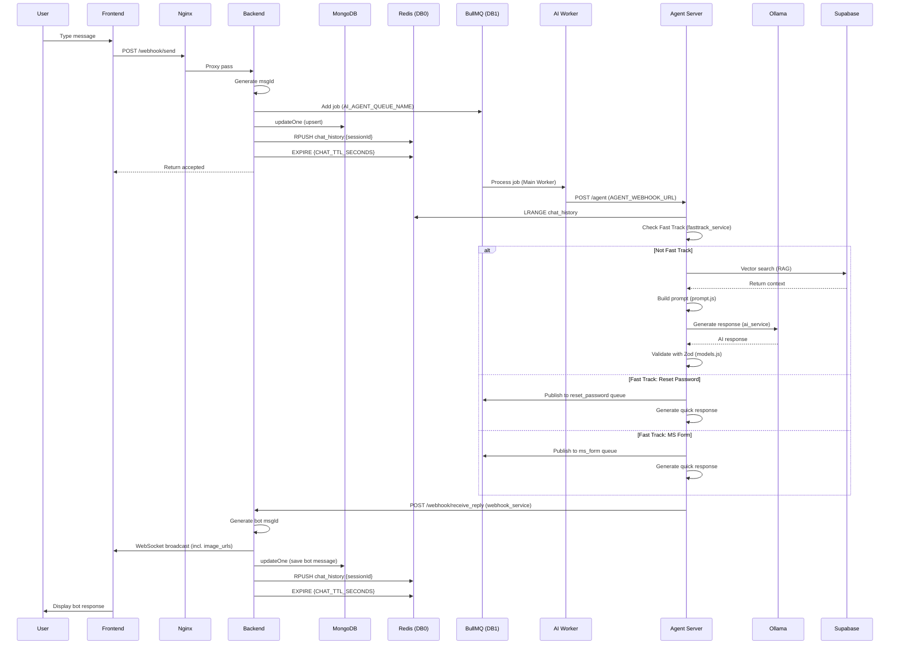

### 3. AI Agent Workflow Detail

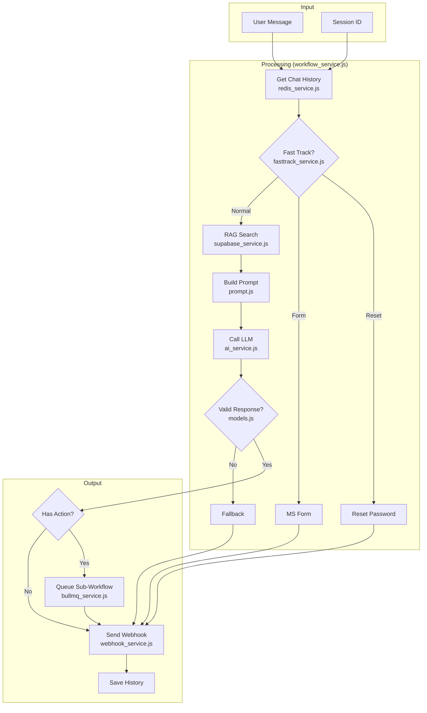

### 4. AI Agent - All-in-One Flow (ai-agent.js)

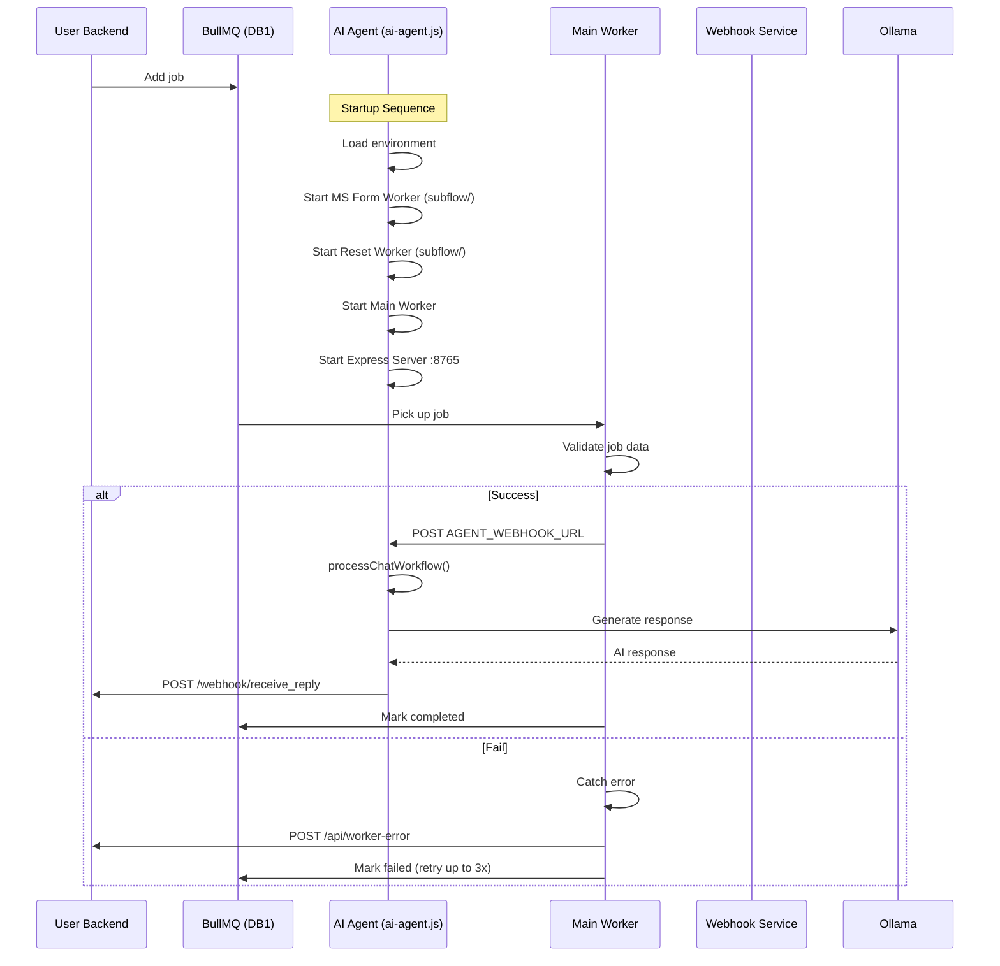

### 5. Feedback Submission Flow

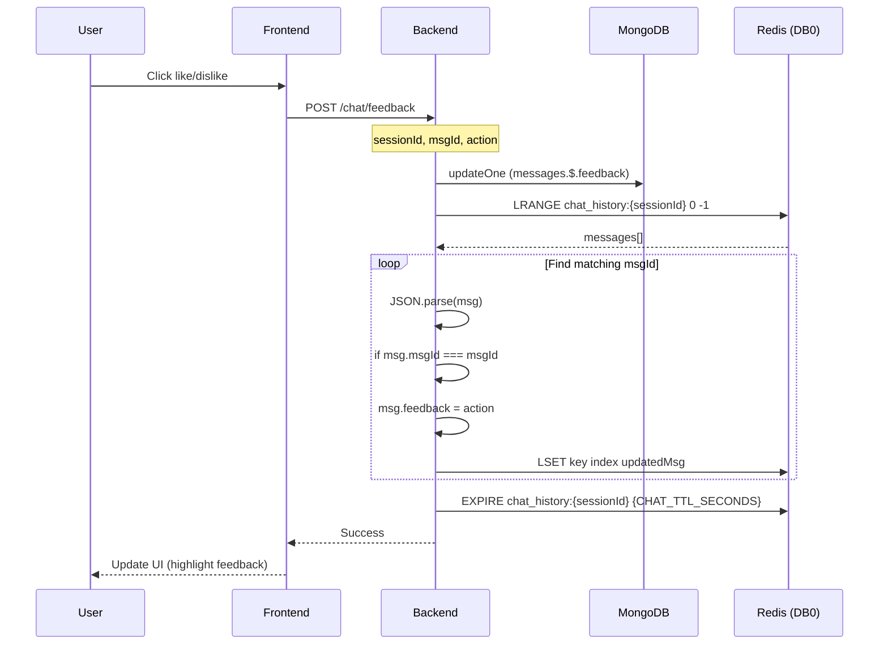

### 6. WebSocket Connection Flow

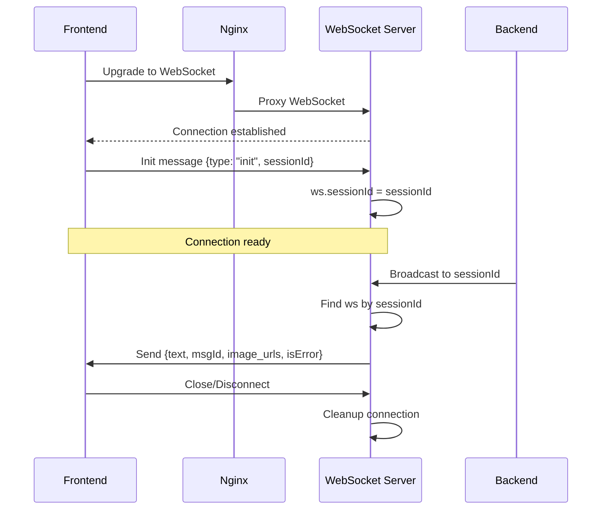

### 7. Graceful Shutdown Flow

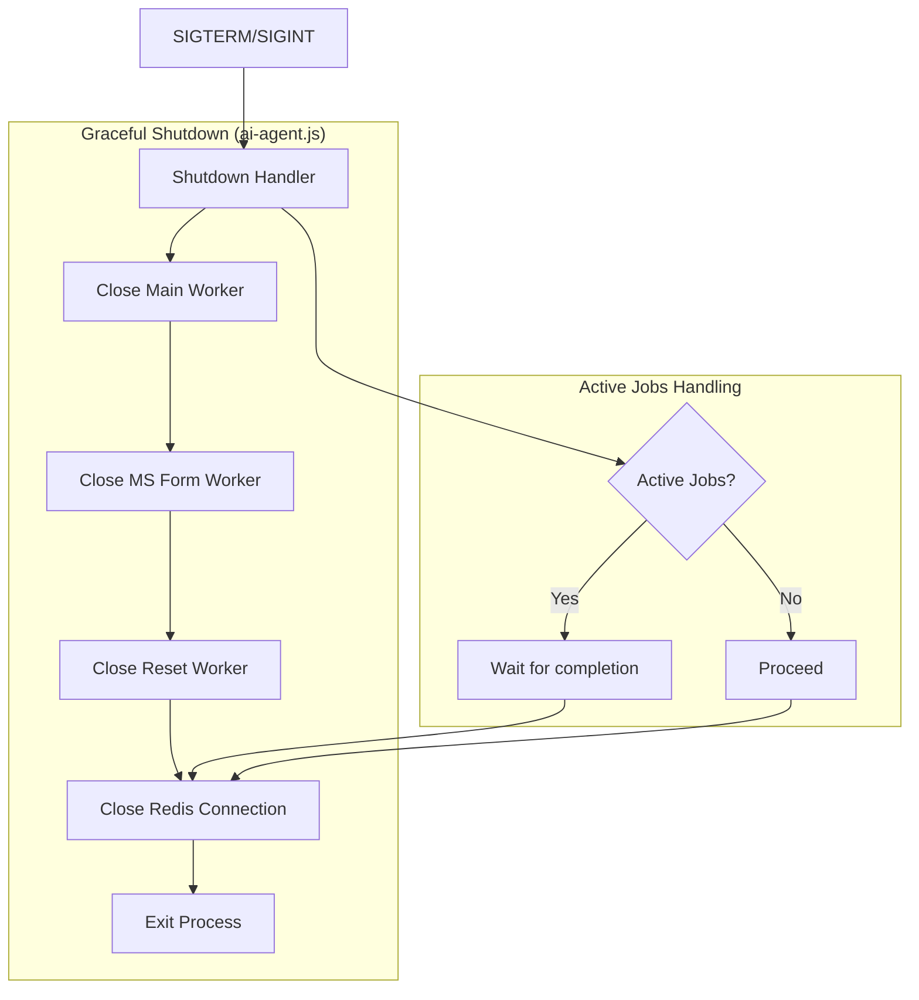

## Data Storage Flow

### Write Path
```
User Message
    ↓
Backend API (chatService.handleUserMessage)
    ↓
├─→ BullMQ Queue (async AI processing)
├─→ MongoDB (persistent, upsert)
└─→ Redis Cache (RPUSH, TTL: CHAT_TTL_SECONDS)
```

### Read Path
```
Chat History Request (chatService.getChatHistory)
    ↓
Check Redis Cache (LRANGE)
    ↓
├─→ Hit: Return from Redis (parsed JSON)
└─→ Miss: Query MongoDB → Return messages
```

## Queue Processing Flow

### Job Lifecycle
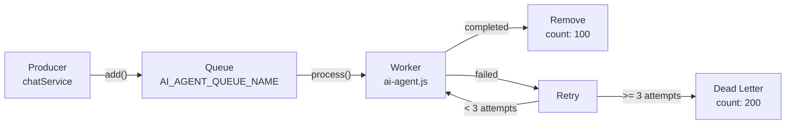

### Sub-Workflow Queue
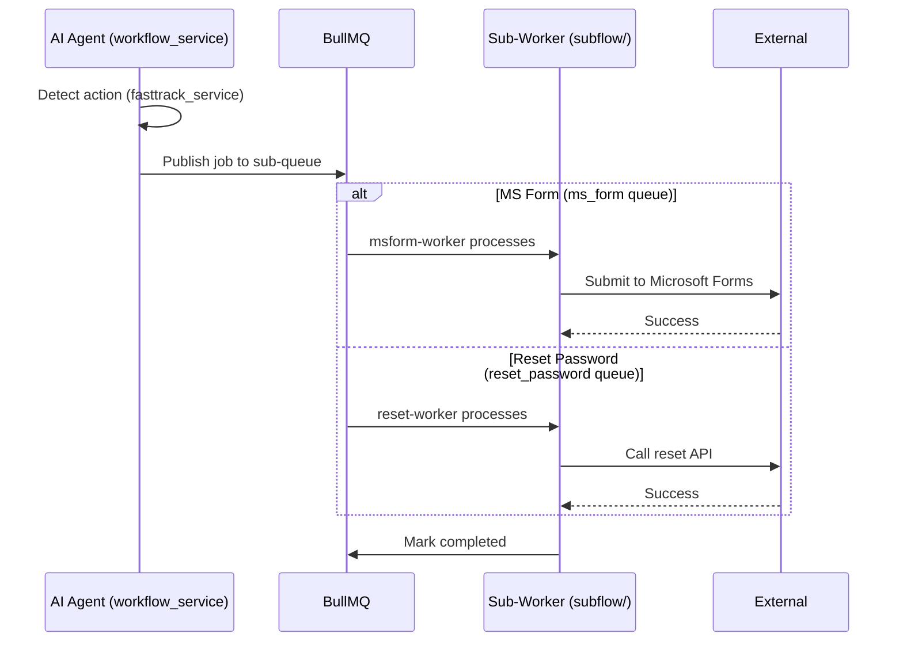

## Error Recovery Flow

### AI Service Failure
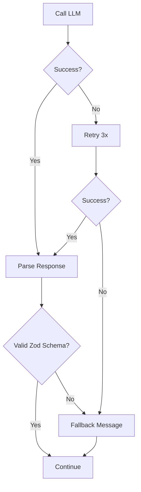

### Worker Error Flow
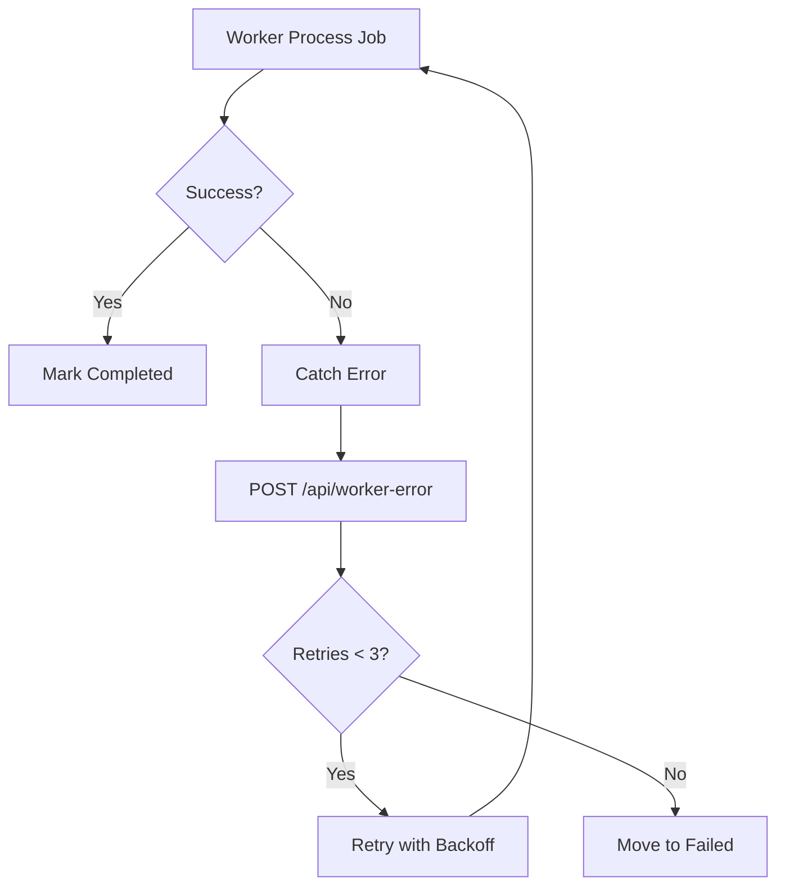

## Data Retention

| Data | Storage | TTL/Retention | Key Pattern | Cleanup |
|------|---------|---------------|-------------|---------|
| Chat messages | MongoDB | Permanent | Collection: chats | Manual archive |
| Chat cache | Redis DB0 | CHAT_TTL_SECONDS | `chat_history:{sessionId}` | TTL auto-expire |
| Auth sessions | Redis DB3 | REDIS_SESSION_TTL | `{sessionId}` hash | TTL auto-expire |
| Queue jobs (success) | Redis DB1 | Auto-remove | BullMQ internal | removeOnComplete: 100 |
| Queue jobs (failed) | Redis DB1 | Auto-remove | BullMQ internal | removeOnFail: 200 |
| AI memory | Redis DB2 | Configurable | Agent memory keys | TTL |
| Cooldown tracking | Redis DB4 | Short-lived | Cooldown keys | TTL |
