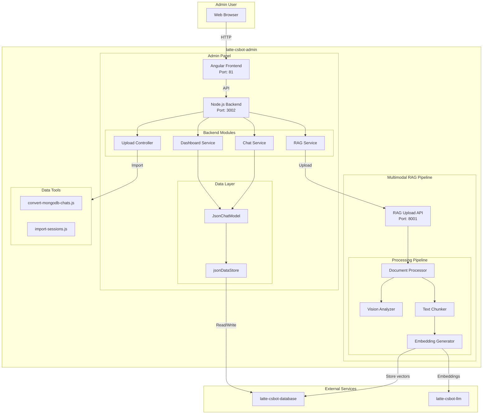

# latte-csbot-admin - System Architecture

## Overview

Admin panel and multimodal RAG (Retrieval-Augmented Generation) pipeline for managing chat data, analytics, and knowledge base.

## Architecture Diagram



## Tech Stack

### Frontend
| Component | Technology | Version | Purpose |
|-----------|------------|---------|---------|
| Framework | Angular | 17+ | UI framework |
| Styling | Tailwind CSS | 3.x | Utility-first CSS |
| Server | Nginx | Latest | Static file serving |
| TypeScript | TypeScript | 5.x | Type safety |

### Backend
| Component | Technology | Version | Purpose |
|-----------|------------|---------|---------|
| Runtime | Node.js | 20.x | JavaScript runtime |
| Framework | Express.js | 4.x | API framework |
| Package Manager | npm | 10.x | Dependency management |
| Data Format | JSON | - | Chat session storage |

### RAG Pipeline
| Component | Technology | Version | Purpose |
|-----------|------------|---------|---------|
| Runtime | Python | 3.11+ | ML pipeline |
| Framework | FastAPI | 0.109+ | Async API server |
| Vision Models | Ollama (Gemma3/Qwen3) | Latest | Image analysis & captioning |
| Embeddings | Ollama | Latest | Vector generation |

### Database & Storage
| Component | Technology | Purpose |
|-----------|------------|---------|
| Primary DB | Supabase (PostgreSQL) | Auth, Vector storage |
| Cache | Redis | Caching layer |
| Object Storage | Supabase Storage | File storage |
| Local Storage | JSON Files | Chat session backup |

### DevOps & Infrastructure
| Component | Technology | Purpose |
|-----------|------------|---------|
| Containerization | Docker | Container runtime |
| Orchestration | Docker Compose | Multi-container setup |
| Reverse Proxy | Nginx | Request routing |

## Service Components

| Component | Technology | Port | Purpose |
|-----------|------------|------|---------|
| Admin Frontend | Angular + Nginx | 81 | Admin UI |
| Admin Backend | Node.js + Express | 3002 | API server |
| RAG Upload | Python + FastAPI | 8001 | Document processing |

## Module Structure

```
latte-csbot-admin/
├── backend/
│   ├── src/
│   │   ├── dashboard_service/    # Analytics & statistics
│   │   │   ├── analytics/         # Analytics calculations
│   │   │   ├── controllers/      # HTTP controllers
│   │   │   ├── models/           # Data models
│   │   │   └── routes/           # API routes
│   │   ├── chat_service/         # Chat management
│   │   │   ├── controllers/      # HTTP controllers
│   │   │   ├── models/           # Data models
│   │   │   └── routes/           # API routes
│   │   ├── rag_service/          # RAG pipeline
│   │   │   ├── upload_file/      # Python API
│   │   │   ├── file_display/     # File listing
│   │   │   └── search/           # Vector search
│   │   └── utils/
│   │       └── jsonDataStore.js  # JSON storage
│   └── tools/                     # Data conversion tools
├── frontend/                      # Angular app
└── docker/
    └── docker-compose.yml
```

## Key Features

### 1. Dashboard
- Real-time chat statistics
- Feedback analytics
- User engagement metrics
- Data export capabilities

### 2. Chat Management
- View all chat sessions
- Import/export chat data (JSON/MongoDB)
- Search and filter conversations
- Session analytics

### 3. RAG Pipeline
- Upload documents (PDF, images, DOCX)
- Text extraction
- Image analysis and captioning
- Vector embedding generation
- Semantic search capabilities

## Network

- **Admin Network**: `latte-admin-network` (bridge driver)
- **External Access**: Connects to `latte-database-network`

## Data Storage

| Type | Location | Format |
|------|----------|--------|
| Chat sessions | `/app/data/chats/sessions/` | JSON files |
| Session index | `/app/data/chats/index/` | sessions_index.json |
| Analytics cache | `/app/cache/` | JSON |
| Import data | `/app/import/` | JSON files |

## External Dependencies

This service requires the following external services to be running:

1. **latte-csbot-database**
   - Supabase (PostgreSQL, Auth, Storage)
   - Redis

2. **latte-csbot-llm** (or external Ollama)
   - LLM inference
   - Embedding generation
   - Vision models

## Environment Variables

### Required
- `SUPABASE_URL` - Supabase API URL
- `SUPABASE_KEY` - Supabase API key
- `OLLAMA_BASE_URL` - Ollama server URL
- `OLLAMA_EMBED_MODEL` - Embedding model name

### Optional
- `ADMIN_PORT` - Backend port (default: 3002)
- `ADMIN_FRONTEND_PORT` - Frontend port (default: 81)
- `RAG_UPLOAD_PORT` - RAG API port (default: 8001)
- `CACHE_UPDATE_INTERVAL` - Cache TTL in ms (default: 86400000)
