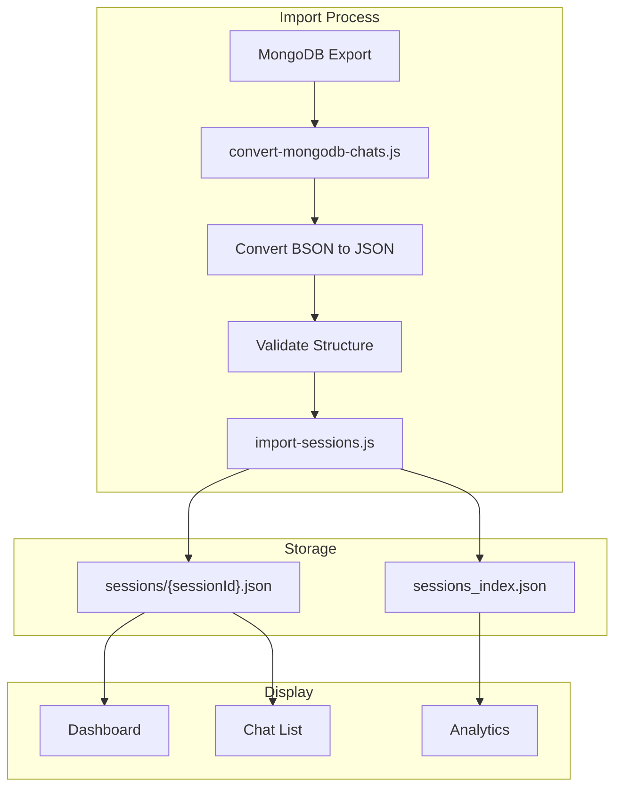
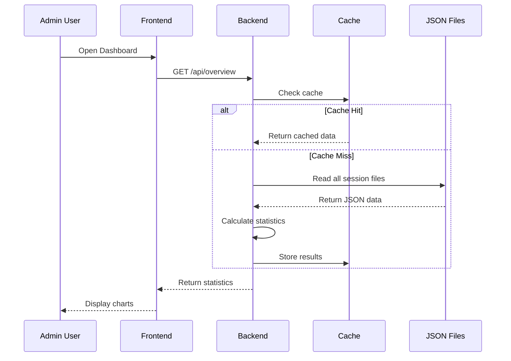
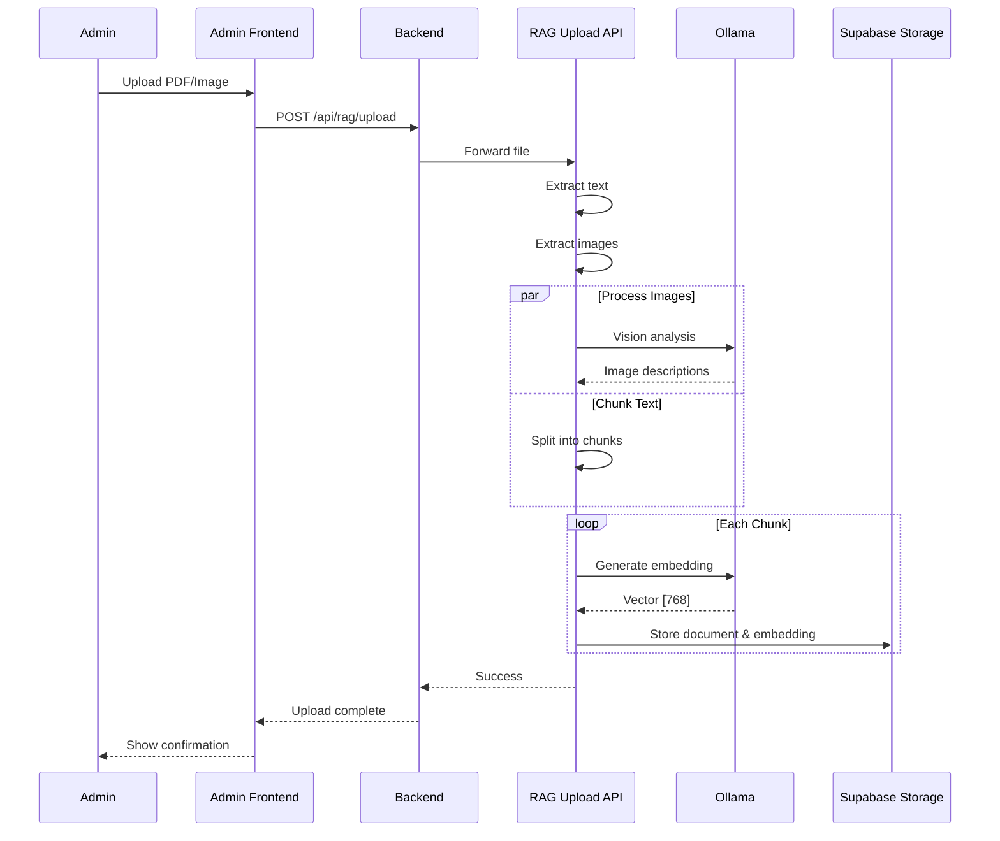
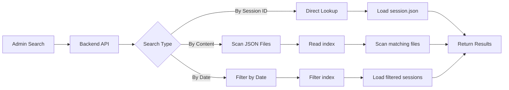

# latte-csbot-admin - Data Flow

## Overview

Data flows for admin operations, chat management, and RAG pipeline.

## Flow Diagrams

### 1. Chat Data Import Flow



### 2. Dashboard Analytics Flow



### 3. RAG Document Upload Flow



### 4. Chat Search Flow



## Data Conversion

### BSON to JSON Conversion

```javascript
// convert-mongodb-chats.js
function convertBSONValue(value) {
    if (value && value.$oid) return value.$oid;
    if (value && value.$date) return new Date(value.$date).toISOString();
    if (value && value.$numberLong) return parseInt(value.$numberLong);
    return value;
}
```

### Import Process

```javascript
// import-sessions.js
for (const chat of convertedData) {
    const sessionFile = path.join(SESSIONS_DIR, `${chat.sessionId}.json`);
    fs.writeFileSync(sessionFile, JSON.stringify(chat, null, 2));
    
    // Update index
    index.sessions[chat.sessionId] = {
        updatedAt: chat.updatedAt,
        messageCount: chat.messages.length
    };
}
```

## File Structure

```
/app/data/chats/
├── sessions/
│   ├── session-001.json
│   ├── session-002.json
│   └── ...
├── index/
│   └── sessions_index.json
└── analytics/
    ├── daily_stats.json
    └── feedback_stats.json
```

## Cache Invalidation

| Event | Action |
|-------|--------|
| New chat imported | Clear overview cache |
| Chat deleted | Clear all caches |
| Feedback updated | Clear feedback cache |
| Daily rollover | Refresh all caches |

## API Data Flow

### Dashboard Endpoints

```
GET  /api/overview          # Overview statistics → Cache → JSON Files
GET  /api/stats/daily       # Daily chat counts → Cache → JSON Files
GET  /api/stats/feedback    # Feedback statistics → Cache → JSON Files
GET  /api/stats/hourly      # Hourly distribution → Cache → JSON Files
```

### Chat Endpoints

```
GET    /api/chats              # List all chats → sessions_index.json
GET    /api/chats/:id          # Get specific chat → sessions/{id}.json
POST   /api/dashboard/upload   # Upload chat JSON → sessions/{id}.json
DELETE /api/chats/:id          # Delete chat → sessions/{id}.json
```

### RAG Endpoints

```
POST /api/rag/upload      # Upload document → RAG API → Supabase
GET  /api/rag/search      # Search knowledge base → Supabase
GET  /api/rag/files       # List uploaded files → Supabase Storage
```

## RAG Pipeline Data Flow

```
1. Document Upload
   Frontend → Backend API → RAG Upload API

2. Document Processing
   RAG Upload API → Text Extraction → Image Extraction

3. Chunking & Embedding
   Text → Text Chunker → Chunks
   Chunks → Ollama Embedding Model → Vectors

4. Storage
   Vectors → Supabase Storage
   Original Files → Supabase Storage
```

## Session Data Flow

```
1. Create Session
   Frontend → Backend API → JSON File (/app/data/chats/sessions/{id}.json)

2. Update Session
   Frontend → Backend API → JSON File

3. Delete Session
   Frontend → Backend API → Delete JSON File

4. Query Sessions
   Frontend → Backend API → sessions_index.json → Filtered Results
```
