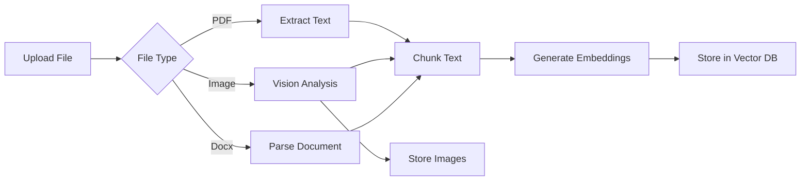

# latte-csbot-admin - System Design

## Design Principles

1. **JSON-First**: Store chat data as JSON files for easy export/import
2. **Modular Services**: Separate dashboard, chat, and RAG services
3. **Real-time Analytics**: Cache statistics for fast dashboard loading
4. **Separation of Concerns**: Frontend (Angular), Backend (Node.js), RAG (Python)
5. **Docker-Native**: All services containerized with Docker Compose

## Architecture

### Frontend Design (Angular)

```
frontend/
├── src/
│   ├── app/
│   │   ├── app.config.ts          # Angular configuration
│   │   ├── app.routes.ts           # Route definitions
│   │   ├── app.ts                  # Main component
│   │   ├── components/
│   │   │   └── sidebar/           # Sidebar navigation
│   │   ├── pages/
│   │   │   ├── dashboard/        # Analytics dashboard
│   │   │   ├── chat-logs/         # Chat session viewer
│   │   │   └── files/             # RAG file management
│   │   └── services/
│   │       ├── api.ts             # API service
│   │       └── data.ts            # Data service
│   ├── styles.css                 # Global styles
│   └── index.html                # Entry HTML
├── angular.json                  # Angular config
└── tailwind.config.js            # Tailwind CSS config
```

### Backend Design (Node.js)

```
backend/
├── src/
│   ├── dashboard_service/         # Analytics dashboard
│   │   ├── analytics/            # Analytics calculations
│   │   │   ├── analyticsService.js
│   │   │   └── cacheManager.js
│   │   ├── controllers/          # HTTP controllers
│   │   │   ├── dashboardController.js
│   │   │   ├── exportController.js
│   │   │   └── uploadController.js
│   │   ├── models/               # Data models
│   │   └── routes/               # Express routes
│   ├── chat_service/             # Chat management
│   │   ├── controllers/          # HTTP controllers
│   │   ├── models/               # Data models
│   │   │   ├── ChatModel.js
│   │   │   └── JsonChatModel.js
│   │   └── routes/               # Express routes
│   ├── rag_service/              # RAG pipeline
│   │   ├── upload_file/          # Python FastAPI
│   │   ├── file_display/         # File listing
│   │   └── search/               # Vector search
│   └── utils/
│       └── jsonDataStore.js      # JSON file storage
└── server_combined.js            # Main Express server
```

### RAG Pipeline Design (Python)

```
backend/src/rag_service/upload_file/
├── Dockerfile                    # Python container
├── requirements.txt             # Python dependencies
├── upload_file_service.py       # FastAPI app
├── controllers/
│   └── upload_controller.py     # Upload endpoints
├── routes/
│   └── upload_file_Routes.py     # API routes
├── pipeline/
│   ├── __init__.py
│   ├── context_stitcher.py       # Context merging
│   ├── embedder.py               # Embedding generation
│   ├── extractor.py              # Text extraction
│   ├── image_filter.py           # Image filtering
│   ├── storage.py                # Supabase storage
│   ├── text_splitter.py          # Text chunking
│   └── vision_analyzer.py       # Vision model integration
└── services/
    └── ingestion_service.py     # Ingestion orchestration
```

## Data Models

### Chat Session (JSON)

```json
{
  "sessionId": "uuid-string",
  "messages": [
    {
      "msgId": "msg-uuid",
      "sender": "user|bot",
      "text": "message content",
      "time": "2026-02-09T10:00:00Z",
      "image_urls": [],
      "feedback": "like|dislike|null"
    }
  ],
  "createdAt": "2026-02-09T10:00:00Z",
  "updatedAt": "2026-02-09T10:05:00Z"
}
```

### Sessions Index

```json
{
  "sessions": {
    "session-id-1": {
      "updatedAt": "...",
      "createdAt": "...",
      "hasFeedback": true,
      "messageCount": 10
    }
  },
  "lastUpdated": "2026-02-09T10:00:00Z"
}
```

### RAG Document

```json
{
  "id": "document-uuid",
  "content": "extracted text...",
  "embedding": [0.1, 0.2, 0.3, ...],
  "metadata": {
    "filename": "document.pdf",
    "chunk_index": 0,
    "total_chunks": 10,
    "page_numbers": [1, 2]
  },
  "created_at": "2026-02-09T10:00:00Z"
}
```

## API Design

### Dashboard Endpoints

```
GET  /api/overview          # Overview statistics
GET  /api/stats/daily       # Daily chat counts
GET  /api/stats/feedback    # Feedback statistics
GET  /api/stats/hourly      # Hourly distribution
GET  /api/stats/export      # Export analytics data
POST /api/dashboard/upload  # Upload chat data
```

### Chat Endpoints

```
GET    /api/chats              # List all chats
GET    /api/chats/:id          # Get specific chat
POST   /api/dashboard/upload   # Upload chat JSON
DELETE /api/chats/:id          # Delete chat
GET    /api/chats/search       # Search chats
```

### RAG Endpoints

```
POST /api/rag/upload      # Upload document (multipart/form-data)
GET  /api/rag/search      # Search knowledge base
GET  /api/rag/files       # List uploaded files
GET  /api/rag/files/:id    # Get file details
DELETE /api/rag/files/:id # Delete file
```

## RAG Pipeline Design

### Document Processing Flow



### Chunking Strategy

| Parameter | Value | Description |
|-----------|-------|-------------|
| CHUNK_SIZE | 2048 (configurable) | Tokens per chunk |
| CHUNK_OVERLAP | 400 (configurable) | Overlap between chunks |
| Method | Semantic | Sentence-boundary aware |

### Embedding Generation

```python
# embedder.py
def generate_embedding(text: str) -> list[float]:
    response = ollama.embeddings(
        model=OLLAMA_EMBED_MODEL,
        prompt=text
    )
    return response['embedding']
```

## Caching Strategy

| Cache | Location | TTL | Purpose |
|-------|----------|-----|---------|
| Overview | Memory/File | 5 min (dev) / 24 hr (prod) | Dashboard stats |
| Chat list | Memory | 1 min | Chat listing |
| Analytics | File | 24 hours | Historical data |
| RAG Search | None | - | Direct to storage |

## Security

### Authentication
- JWT tokens from Supabase
- Role-based access control (RBAC)
- Admin-only access to dashboard

### File Upload
- Size limit: 50MB (configurable)
- Allowed types: PDF, PNG, JPG, DOCX
- Path traversal protection

### API Security
- CORS configuration
- Rate limiting (500 requests/5 min)
- Input validation

## Docker Architecture

### Services

```yaml
services:
  admin-backend:           # Node.js API
    build: docker/admin-backend.Dockerfile
    ports: ["3002:3002"]
    volumes:
      - admin-json-data:/app/data
      - admin-backend-cache:/app/cache
  
  admin-frontend:          # Angular + Nginx
    build: docker/admin-frontend.Dockerfile
    ports: ["81:81"]
  
  multimodal-rag-upload:  # Python FastAPI
    build: ./backend/src/rag_service/upload_file
    ports: ["8001:8001"]
    environment:
      - OLLAMA_BASE_URL=${OLLAMA_BASE_URL}
```

### Networks

```yaml
networks:
  latte-admin-network:    # Internal admin network
    driver: bridge
  latte-database-network: # External database network
    external: true
```

## Scaling Considerations

### Horizontal Scaling
- Stateless backend (data in JSON files)
- Load balancer for multiple instances
- Shared storage for JSON files (NFS/S3)

### RAG Optimization
- Async document processing
- Batch embedding generation
- GPU acceleration for vision models

### Performance
- Caching layer for dashboard
- Index-based chat search
- Paginated API responses
- Connection pooling for Supabase
