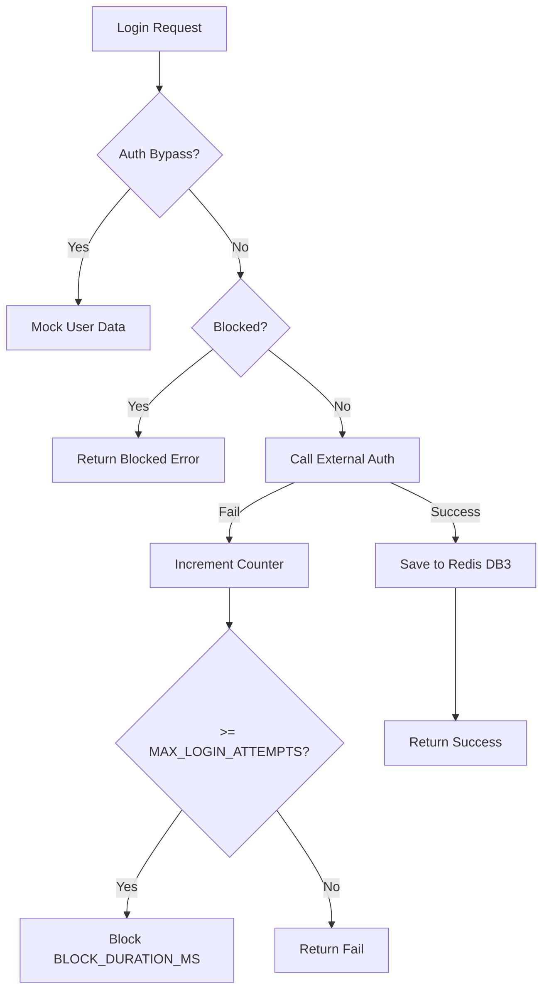
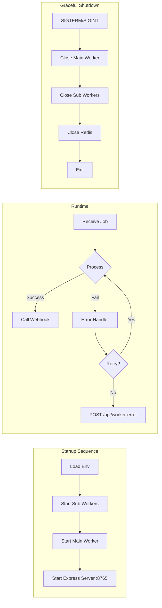
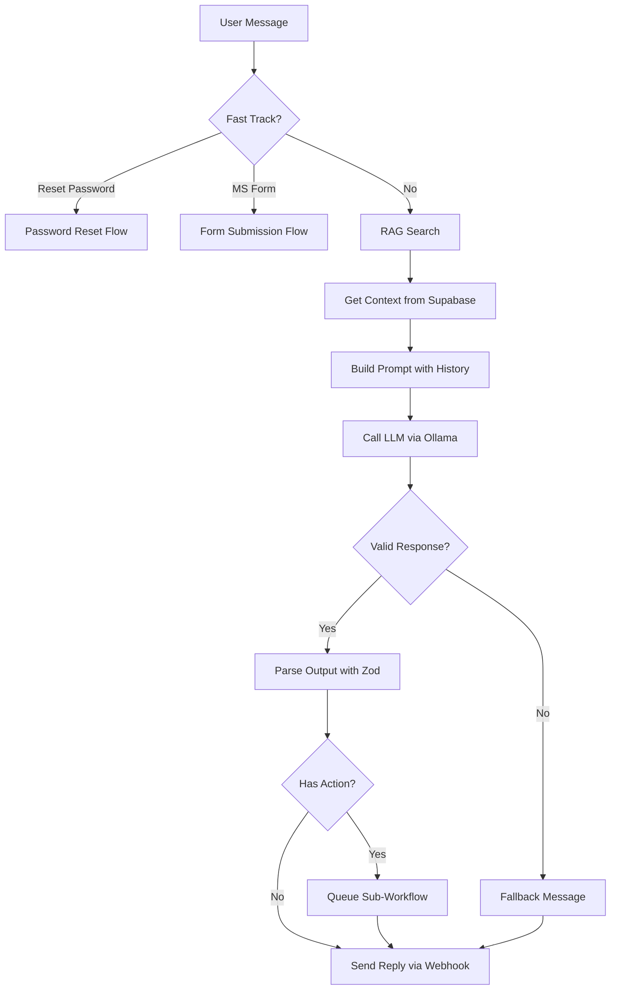

# latte-csbot-user-v1 - System Design

## Design Principles

1. **Simplicity**: Vanilla JavaScript frontend with Bootstrap 5 for fast loading
2. **Real-time**: WebSocket via Nginx proxy for instant message delivery
3. **Reliability**: BullMQ queue-based AI processing with retry and fallback
4. **Security**: OWASP-compliant multi-layer protection (Helmet, CORS, Rate Limiting)
5. **Separation**: Independent containers for frontend, backend, AI agent, and cache

## Frontend Design

### Component Structure
```
frontend/
├── index.html          # Main layout (Bootstrap 5)
├── style.css           # Custom styles
├── script.js           # Application logic (54KB)
│   ├── ChatUI          # Message display + image rendering
│   ├── AuthUI          # Login form (CardID + Email)
│   ├── WebSocketClient # Real-time connection via Nginx
│   ├── AFKDetector     # Inactivity tracking
│   └── FeedbackUI      # Like/dislike buttons
└── lib/
    └── bootstrap/      # Bootstrap 5 assets (local)
```

### State Management
```javascript
// Global state (simple approach)
const appState = {
    sessionId: null,
    isAuthenticated: false,
    messages: [],
    wsConnection: null,
    afkTimer: null
};
```

### AFK Detection
```javascript
// Configurable via /config endpoint
const AFK_TIMEOUT = config.AFK_TIMEOUT_MS;     // Default: 300000 (5 min)
const AFK_WARNING = config.AFK_WARNING_MS;      // Default: 30000 (30 sec)
const BG_TIMEOUT = config.BACKGROUND_TIMEOUT_MS; // Default: 180000 (3 min)

function resetAFKTimer() {
    clearTimeout(appState.afkTimer);
    appState.afkTimer = setTimeout(logout, AFK_TIMEOUT);
}

document.addEventListener('mousemove', resetAFKTimer);
document.addEventListener('keydown', resetAFKTimer);
```

### Frontend Configuration (Dynamic)
```javascript
// Fetched from GET /config on page load
const config = await fetch('/config').then(r => r.json());
// Returns: { API_BASE, WEBHOOK_URL, AFK_TIMEOUT_MS, AFK_WARNING_MS, 
//            BACKGROUND_TIMEOUT_MS, WS_RECONNECT_DELAY_MS }
```

## Backend Design

### Express 5 Middleware Stack
```javascript
// Security middleware (order matters)
app.set('trust proxy', 1);       // Behind Nginx
app.disable('x-powered-by');     // Hide tech stack

// 1. CORS (configurable origins)
app.use(cors({ origin: allowedOriginsCheck }));

// 2. Helmet (CSP, HSTS, X-Content-Type, XSS Filter)
app.use(helmet({ /* ... full CSP config ... */ }));

// 3. Logging
app.use(morgan('combined'));

// 4. Body Parser (10kb limit)
app.use(bodyParser.json({ limit: '10kb' }));

// 5. Rate Limiting (tiered)
app.use(generalLimiter);
app.use('/auth/login', authLimiter);
app.use('/webhook/send', chatLimiter);
app.use('/chat/feedback', chatLimiter);
```

### Authentication Flow


### Chat Message Schema (MongoDB)
```javascript
{
    sessionId: String,          // Unique session identifier
    messages: [{
        msgId: String,          // e.g. "msg-{timestamp}-{random9}"
        sender: String,         // 'user' | 'bot'
        text: String,           // Message content
        time: Date,             // ISO timestamp
        image_urls: [String],   // RAG image references
        feedback: String        // 'like' | 'dislike' | undefined
    }],
    createdAt: Date,
    updatedAt: Date
}
```

### Config Module (db.js)
```javascript
// Manages multiple Redis DB connections
const redisDbChat = new Redis({ db: REDIS_CHAT_DB });     // DB0: Chat cache
const redisDbVerify = new Redis({ db: REDIS_VERIFY_DB }); // DB3: Auth

// MongoDB connection via Mongoose
mongoose.connect(MONGO_URL);

// Exported constants
const CHAT_TTL_SECONDS = process.env.CHAT_TTL_SECONDS || 600;
```

## AI Agent Design

### All-in-One Architecture (ai-agent.js)



### Service Architecture
```
mainflow/app/
├── services/
│   ├── workflow_service.js    # Orchestrates entire AI pipeline
│   ├── ai_service.js          # LLM interaction via Ollama
│   ├── fasttrack_service.js   # Detect fast-track intents
│   ├── prompt.js              # System prompt construction
│   ├── supabase_service.js    # RAG vector search
│   ├── redis_service.js       # Chat history from Redis
│   ├── webhook_service.js     # Reply back to backend
│   └── bullmq_service.js      # Sub-workflow queue publishing
└── models/
    └── models.js              # Zod response schemas
```

### Worker Configuration
```javascript
const mainWorker = new Worker(
    CONFIG.AI_AGENT_QUEUE_NAME,    // 'ai-agent-queue'
    async (job) => {
        const { sessionId, text } = job.data;
        
        // Forward to agent webhook for processing
        const response = await axios.post(
            CONFIG.AGENT_WEBHOOK_URL,  // http://ai-agent:8765/agent
            job.data,
            { timeout: 300000 }        // 5 minutes
        );
        
        return response.data;
    },
    {
        concurrency: 10,
        removeOnComplete: { count: 100 },
        removeOnFail: { count: 200 }
    }
);
```

### Workflow Architecture


### Structured Output Schema (Zod)
```javascript
const AgentResponseSchema = z.object({
    thinking_process: z.string(),
    answers: z.array(z.string()),
    question: z.string().optional(),
    action: z.enum(['none', 'ms-form', 'reset-password']),
    image_urls: z.array(z.string())
});
```

### Prompt Engineering
```javascript
// Built by prompt.js
const systemPrompt = `
You are a helpful customer service assistant.

Context from knowledge base:
${ragContext}

Chat history:
${chatHistory}

Instructions:
1. Answer based on the provided context
2. If unsure, ask clarifying questions
3. Suggest actions when appropriate
4. Respond in Thai or English based on user language
`;
```

## Queue Design

### BullMQ Configuration
```javascript
const chatQueue = new Queue(AI_AGENT_QUEUE_NAME, {
    connection: { host, port, password, db: REDIS_QUEUE_DB },
    defaultJobOptions: {
        removeOnComplete: true,
        removeOnFail: 100,
        attempts: 3,
        backoff: {
            type: 'exponential',
            delay: 1000
        }
    }
});
```

### Queue Names

| Queue | Purpose | Worker |
|-------|---------|--------|
| `ai-agent-queue` | Main chat messages | Main Worker (ai-agent.js) |
| `ms_form` | MS Forms submission | msform-worker.js (subflow/) |
| `reset_password` | Password reset | reset-worker.js (subflow/) |

## Security Design

### Rate Limiting Tiers
| Endpoint | Limit | Window | Middleware |
|----------|-------|--------|-----------|
| General API | 500 | 5 min | `generalLimiter` |
| /auth/login | MAX_LOGIN_ATTEMPTS | 5 min | `authLimiter` |
| /webhook/send | 60 | 1 min | `chatLimiter` |
| /chat/feedback | 60 | 1 min | `chatLimiter` |

### Input Validation
```javascript
// inputValidator.js - Zod schema for webhook
const WebhookSchema = z.object({
    sessionId: z.string().uuid(),
    text: z.string().max(1000),
    sender: z.enum(['user']),
    time: z.string().datetime()
});
```

### OWASP Compliance
| OWASP | Control | Implementation |
|-------|---------|----------------|
| A01 | Broken Access Control | Session-based auth via Redis |
| A03 | Injection | Input validation (Zod), body-parser limits |
| A04 | Insecure Design | Tiered rate limiting |
| A05 | Security Misconfiguration | Helmet (CSP, HSTS, XSS), CORS |
| A07 | Auth Failures | Brute-force protection, account lockout |
| A09 | Logging Failures | Morgan request logging, error logging |

## Nginx Proxy Design

### Reverse Proxy Configuration
```nginx
# docker/nginx.conf
upstream backend_api {
    server backend:3001;
}

server {
    listen 80;
    
    # Static files
    location / {
        root /usr/share/nginx/html;
        try_files $uri $uri/ /index.html;
    }
    
    # API proxy
    location /auth/ { proxy_pass http://backend_api; }
    location /webhook/ { proxy_pass http://backend_api; }
    location /chat/ { proxy_pass http://backend_api; }
    location /config { proxy_pass http://backend_api; }
    
    # WebSocket proxy
    location /ws {
        proxy_pass http://backend_api;
        proxy_http_version 1.1;
        proxy_set_header Upgrade $http_upgrade;
        proxy_set_header Connection "upgrade";
    }
}
```

## Performance Optimization

### Caching Strategy
| Data | Cache | TTL | Config Var |
|------|-------|-----|-----------|
| Chat history | Redis DB0 | Configurable | `CHAT_TTL_SECONDS` |
| Auth session | Redis DB3 | 24 hours | `REDIS_SESSION_TTL` |
| RAG context | None | Real-time | - |

### Database Indexing
```javascript
// MongoDB indexes (ChatModel.js)
ChatModel.index({ sessionId: 1 });
ChatModel.index({ updatedAt: -1 });
ChatModel.index({ "messages.feedback": 1 });
```

## Error Handling

### Retry Strategy
```javascript
// BullMQ automatic retry
{
    attempts: 3,
    backoff: { type: 'exponential', delay: 1000 }
}
// Delays: 1s → 2s → 4s
```

### Fallback Messages
```javascript
const fallbacks = {
    ai_error: "ขออภัยค่ะ ระบบประมวลผลผิดพลาด กรุณาลองใหม่",
    timeout: "ขออภัยค่ะ การเชื่อมต่อล่าช้า กรุณาลองใหม่",
    unknown: "ขออภัยค่ะ เกิดข้อผิดพลาดที่ไม่คาดคิด"
};
```

### Worker Error Notification
```javascript
// ai-agent.js - Notify backend on worker failure
try {
    await axios.post(`${CONFIG.API_BASE}/api/worker-error`, {
        sessionId,
        jobId,
        errorMessage: error.message
    });
} catch (e) {
    console.error(`Failed to notify backend: ${e.message}`);
}
```

## Graceful Shutdown

```javascript
async function shutdown() {
    console.log('Shutting down...');
    
    // Close workers in order
    await mainWorker.close();
    await shutdownMsFormWorker();
    await shutdownResetPasswordWorker();
    
    // Close connections
    await redisQueue.quit();
    
    console.log('Shutdown complete');
    process.exit(0);
}

process.on('SIGTERM', shutdown);
process.on('SIGINT', shutdown);
```

## Docker Deployment

### Container Images
| Service | Base Image | Build Context |
|---------|-----------|---------------|
| Frontend | `nginx:alpine` | `docker/frontend.Dockerfile` |
| Backend | `node:20-alpine` | `docker/backend.Dockerfile` |
| AI Agent | `node:20-alpine` | `docker/ai-agent.Dockerfile` |
| Redis | `redis/redis-stack:latest` | Official image |

### Health Checks
| Service | Endpoint | Interval |
|---------|----------|----------|
| Frontend | `GET /` (Nginx) | 30s |
| Backend | `GET /config` | 10s |
| AI Agent | `GET /health` | 30s |
| Redis | `redis-cli ping` | 30s |
