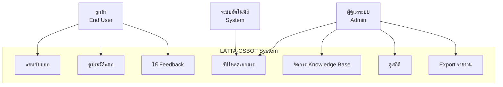
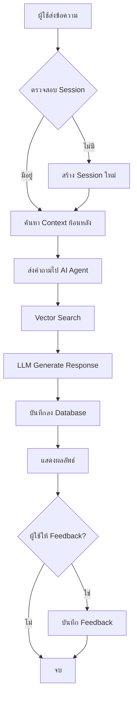
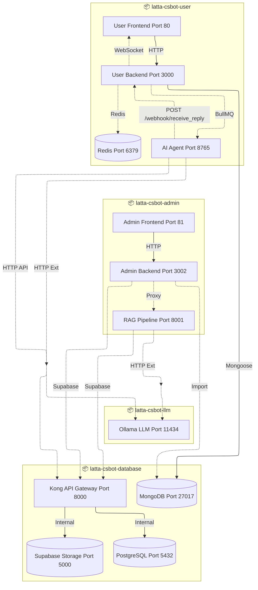
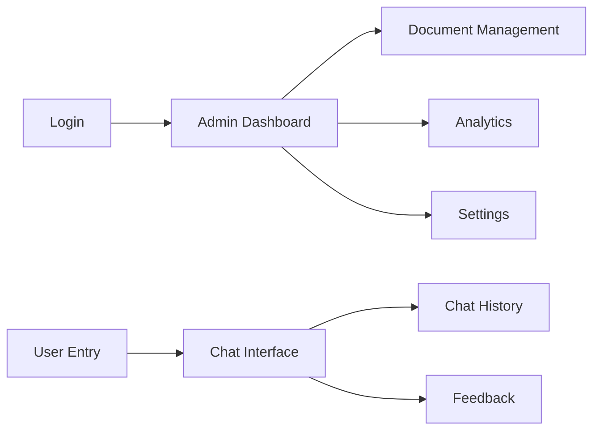

# System Analysis (SA) - LATTA-CSBOT

## เอกสารวิเคราะห์ระบบ / System Analysis Document

---

## 1. Project Overview / ภาพรวมโปรเจค

### 1.1 Purpose / วัตถุประสงค์

LATTA-CSBOT เป็นระบบ **AI-Powered Customer Service Chatbot** ที่พัฒนาขึ้นเพื่อ:

- ให้บริการลูกค้าอัตโนมัติผ่านแชทบอทที่เข้าใจภาษาไทยและอังกฤษ
- ช่วยเหลือลูกค้าในการค้นหาข้อมูลจากเอกสาร (Knowledge Base) ด้วยเทคนิค RAG (Retrieval-Augmented Generation)
- ลดภาระงานของเจ้าหน้าที่ Customer Service โดยตอบคำถามที่พบบ่อยอัตโนมัติ
- จัดการและอัปโหลดเอกสารสำหรับฐานความรู้ผ่าน Admin Panel

**Business Value:**
- ลดต้นทุนการให้บริการลูกค้า 24/7
- ลดเวลาตอบสนอง (Response Time) จากนาทีเหลือวินาที
- เพิ่มความพึงพอใจของลูกค้าด้วยคำตอบที่แม่นยำและตรงประเด็น

### 1.2 Scope / ขอบเขตงาน

#### In-Scope (ขอบเขตที่ทำ)

| โมดูล | รายละเอียด |
|--------|------------|
| **User Chat Interface** | หน้าแชทสำหรับลูกค้า (HTML + JS + Bootstrap 5) |
| **Admin Dashboard** | จัดการเอกสาร, ดูสถิติ, วิเคราะห์การสนทนา (Angular) |
| **AI Agent** | ระบบประมวลผลคำถามด้วย LLM (Large Language Model) |
| **RAG Pipeline** | ระบบอัปโหลดและประมวลผลเอกสาร PDF, DOCX, XLSX, etc. |
| **Vector Search** | การค้นหาข้อมูลที่เกี่ยวข้องจากฐานความรู้ (pgvector) |
| **Authentication** | ระบบยืนยันตัวตนสำหรับ Admin และ User |
| **Session Management** | จัดการเซสชันผู้ใช้งานด้วย Redis |

#### Out-of-Scope (ขอบเขตที่ไม่ทำ)

- ระบบ Call Center หรือ Voice Bot
- การเชื่อมต่อกับ Social Media (LINE, Facebook) ในเวอร์ชันแรก
- ระบบ Live Chat แบบ Real-time กับเจ้าหน้าที่ (Human Handoff)
- การรองรับภาษาอื่นนอกจากไทยและอังกฤษ

### 1.3 Definitions / คำศัพท์เฉพาะ

| คำศัพท์ | คำอธิบาย |
|---------|----------|
| **RAG** | Retrieval-Augmented Generation - เทคนิคการเสริม LLM ด้วยข้อมูลจากฐานความรู้ |
| **Vector DB** | ฐานข้อมูลเวกเตอร์สำหรับเก็บ Embeddings |
| **Embedding** | การแปลงข้อความเป็นเวกเตอร์ตัวเลขเพื่อคำนวณความคล้ายคลึง |
| **OCR** | Optical Character Recognition - การแยกข้อความจากรูปภาพ |
| **Chunk** | ชิ้นส่วนย่อยของเอกสารที่นำไปสร้าง Embedding |
| **LLM** | Large Language Model - โมเดel AI ขนาดใหญ่ เช่น GPT, Gemma |
| **BullMQ** | ระบบ Queue สำหรับจัดการ Background Jobs |

---

## 2. Technology Stack / สแต็คเทคโนโลยี

### 2.1 Core Technologies

| Layer | Technology | Version | Purpose |
|-------|------------|---------|---------|
| **Frontend (User)** | HTML5 + Bootstrap 5 + JavaScript | - | Webchat Interface |
| **Frontend (Admin)** | Angular | 15+ | Admin Dashboard |
| **Backend (User)** | Node.js + Express.js | 20 LTS | API Server |
| **Backend (Admin)** | Node.js + Express.js | 20 LTS | Admin API |
| **AI/ML** | Python + FastAPI | 3.11 | AI Agent & RAG Pipeline |

### 2.2 Database & Storage

| Component | Technology | Version | Purpose |
|-----------|------------|---------|---------|
| **Primary DB** | PostgreSQL + pgvector | 15.8 | Vector Database for RAG |
| **Document DB** | MongoDB | Latest | Chat History & Logs |
| **Cache** | Redis (Redis Stack) | Latest | Session & Queue |
| **File Storage** | Supabase Storage | - | Document uploads |
| **API Gateway** | Kong | 2.8.1 | Route & Auth |

### 2.3 AI/ML Stack

| Component | Technology | Purpose |
|-----------|------------|---------|
| **LLM Server** | Ollama | Local LLM inference |
| **Embedding** | Qwen3-Embedding | Text embeddings |
| **Vision** | Gemma3/Qwen3-VL | Image analysis |
| **RAG Framework** | LangChain + Custom | Document retrieval |
| **OCR** | Docling/PyMuPDF | Document parsing |

### 2.4 Message Queue & Background Jobs

| Component | Technology | Purpose |
|-----------|------------|---------|
| **Queue System** | BullMQ (Redis-based) | Async job processing |
| **Message Broker** | RabbitMQ | Service communication |

### 2.5 DevOps & Infrastructure

| Component | Technology | Purpose |
|-----------|------------|---------|
| **Containerization** | Docker + Docker Compose | Deployment |
| **GPU Support** | NVIDIA Container Toolkit | GPU acceleration |
| **Reverse Proxy** | Nginx | Static files & routing |

---

## 3. Current System Analysis / วิเคราะห์ระบบปัจจุบัน

### 3.1 As-Is Process / ระบบเดิมและปัญหา

#### ระบบเดิม (Manual Process):

```
ลูกค้าโทร/อีเมล ──► เจ้าหน้าที่ CS ──► ค้นหาเอกสาร ──► ตอบกลับลูกค้า
                    (คน)
```

**Pain Points:**

1. **Response Time ช้า** - ลูกค้าต้องรอคิว 5-15 นาทีในชั่วโมงเร่งด่วน
2. **ข้อมูลไม่ Consistent** - เจ้าหน้าที่แต่ละคนตอบไม่เหมือนกัน
3. **พนักงานเหนื่อย** - ต้องตอบคำถามซ้ำๆ 80% เป็นคำถามเดิม
4. **เอกสารกระจัดกระจาย** - ไม่มี Knowledge Base รวมศูนย์
5. **ไม่มีข้อมูลย้อนหลัง** - ไม่สามารถวิเคราะห์พฤติกรรมลูกค้าได้

### 3.2 To-Be Process / ระบบใหม่

```
┌─────────────────────────────────────────────────────────────┐
│                    LATTA-CSBOT System                       │
├─────────────────────────────────────────────────────────────┤
│  ลูกค้า ──► Web Chat ──► AI Agent ──► Vector Search ──► LLM │
│   UI         API         Service       (RAG)                │
└─────────────────────────────────────────────────────────────┘
```

**การปรับปรุง:**

- ✅ Response Time < 3 วินาที
- ✅ ตอบคำถามได้ 24/7 ไม่มีวันหยุด
- ✅ คำตอบ Consistent 100%
- ✅ ค้นหาข้อมูลจากเอกสารได้ทันที
- ✅ มี Dashboard วิเคราะห์ข้อมูลย้อนหลัง

---

## 4. User & Actors / ผู้ใช้งานและบทบาท

### 4.1 Actors / รายชื่อผู้ใช้งาน

| Actor | บทบาท | สิทธิ์การใช้งาน |
|-------|-------|----------------|
| **End User** | ลูกค้าที่เข้ามาใช้บริการ | แชทกับบอท, ดูประวัติการสนทนา |
| **Admin** | ผู้ดูแลระบบ | อัปโหลดเอกสาร, ดูสถิติ, จัดการ Knowledge Base |
| **System** | ระบบอัตโนมัติ | ประมวลผล Background Jobs, สร้าง Embeddings |

### 4.2 User Personas / ลักษณะผู้ใช้งาน

#### Persona 1: ลูกค้าทั่วไป (End User)

- **อายุ:** 25-45 ปี
- **ความรู้ด้านเทคโนโลยี:** ปานกลาง
- **ความต้องการ:** ต้องการคำตอบที่รวดเร็วและแม่นยำ
- **Pain Point:** ไม่อยากรอคิวนาน, ไม่อยากโทรศัพท์

#### Persona 2: เจ้าหน้าที่ Admin

- **อายุ:** 30-50 ปี
- **ความรู้ด้านเทคโนโลยี:** ปานกลางถึงสูง
- **ความต้องการ:** จัดการเอกสารได้ง่าย, มีข้อมูลสถิติ
- **Pain Point:** เอกสารเยอะ ค้นหายาก, ไม่รู้ว่าลูกค้าถามอะไรบ่อย

---

## 5. Functional Requirements / ความต้องการฟังก์ชัน

### 5.1 Module: User Chat System / ระบบแชทสำหรับผู้ใช้

| ID | Requirement | Priority |
|----|-------------|----------|
| UC-01 | ผู้ใช้สามารถแชทกับ AI Bot ผ่านหน้าเว็บได้ | Must |
| UC-02 | ระบบต้องแสดงประวัติการสนทนาย้อนหลังได้ | Must |
| UC-03 | ผู้ใช้สามารถให้ Feedback (Like/Dislike) กับคำตอบได้ | Should |
| UC-04 | ระบบต้องรองรับการส่งรูปภาพและไฟล์แนบได้ | Could |
| UC-05 | ผู้ใช้สามารถขอดูเอกสารที่เกี่ยวข้องได้ | Should |

### 5.2 Module: AI Agent System / ระบบ AI

**AI Agent Service (Port 8765):**
- **Technology:** Node.js + Express.js
- **Entry Point:** `latta-csbot-user-v1/latta-csbot_ai-agent/mainflow/ai-agent-mainflow.js`
- **Endpoints:**
  - `POST /agent` - รับคำถามจาก User Backend และส่งต่อไปประมวลผล
  - `GET /health` - Health Check
- **Communication Pattern:**
  ```
  User Backend ──BullMQ──▶ AI Agent Server ──BullMQ──▶ Worker
                                                           │
                                                           ▼
  User Frontend ◀──WebSocket── User Backend ◀──Webhook── Worker
                       (Real-time)            (/webhook/receive_reply)
  ```
- **Workflow:**
  1. User Backend ส่งคำถามไปยัง AI Agent ผ่าน **BullMQ Queue**
  2. AI Agent Server รับ job และส่งต่อไปยัง Worker (Fire-and-Forget)
  3. Worker ประมวลผลคำถาม (Vector Search + LLM)
  4. Worker ส่งคำตอบกลับไปยัง Backend ผ่าน **Webhook `POST /webhook/receive_reply`**
  5. Backend บันทึกข้อความและส่งต่อให้ Frontend ผ่าน **WebSocket**

**Webhook `/webhook/receive_reply`:**
- **Purpose:** รับคำตอบจาก AI Agent/Sub-workers กลับเข้าสู่ระบบหลัก
- **Method:** POST
- **Request Body:** `{ sessionId, replyText, image_urls? }`
- **Used By:**
  - AI Agent Main Worker (ai-agent-mainflow.js)
  - Reset Password Worker (reset-worker.js)
  - MS Form Worker (msform-worker.js)

| ID | Requirement | Priority |
|----|-------------|----------|
| AI-01 | ระบบต้องเข้าใจภาษาไทยและอังกฤษ | Must |
| AI-02 | ระบบต้องค้นหาข้อมูลจาก Vector DB ก่อนตอบ (RAG) | Must |
| AI-03 | ระบบต้องแสดงแหล่งที่มาของข้อมูล (Source Citation) | Should |
| AI-04 | ระบบต้องสามารถตอบคำถามที่ไม่มีใน Knowledge Base ได้ | Must |
| AI-05 | ระบบต้องมี Fallback เมื่อไม่เข้าใจคำถาม | Must |
| AI-06 | AI Agent Server (Port 8765) ต้องรับ Webhook ได้ | Must |
| AI-07 | AI Agent ต้องทำงานแบบ Async ผ่าน BullMQ Queue | Must |

### 5.3 Module: RAG Document Management / ระบบจัดการเอกสาร

| ID | Requirement | Priority |
|----|-------------|----------|
| RM-01 | Admin สามารถอัปโหลดไฟล์ PDF, DOCX, XLSX ได้ | Must |
| RM-02 | ระบบต้องแยกข้อความ (Extract Text) จากเอกสารอัตโนมัติ | Must |
| RM-03 | ระบบต้องสร้าง Embeddings และบันทึกลง Vector DB | Must |
| RM-04 | Admin สามารถลบหรืออัปเดตเอกสารได้ | Must |
| RM-05 | ระบบต้องรองรับ OCR สำหรับเอกสารสแกน | Should |

### 5.4 Module: Admin Dashboard / แดชบอร์ดผู้ดูแล

| ID | Requirement | Priority |
|----|-------------|----------|
| AD-01 | แสดงสถิติการใช้งาน (จำนวนผู้ใช้, จำนวนข้อความ) | Must |
| AD-02 | แสดงคำถามที่พบบ่อย (Top Questions) | Must |
| AD-03 | แสดง Feedback จากผู้ใช้ | Should |
| AD-04 | สามารถ Export รายงานเป็น Excel/CSV ได้ | Could |
| AD-05 | แสดงสถานะการประมวลผลเอกสาร | Must |

---

## 6. Non-Functional Requirements / ความต้องการเชิงคุณภาพ

### 6.1 Performance / ประสิทธิภาพ

| Metric | Requirement |
|--------|-------------|
| Response Time | < 3 วินาที สำหรับคำถามทั่วไป |
| Throughput | รองรับ 100 concurrent users |
| Document Processing | ประมวลผลเอกสาร 10 หน้า/นาที |
| Availability | 99.5% Uptime |

### 6.2 Security / ความปลอดภัย

| Requirement | Implementation |
|-------------|----------------|
| Authentication | JWT Token with Refresh Token |
| Authorization | Role-Based Access Control (RBAC) |
| Data Encryption | HTTPS/TLS 1.3 for Data in Transit |
| Password Storage | bcrypt with salt rounds 12 |
| Rate Limiting | 60 requests/minute per IP |
| PDPA Compliance | ไม่เก็บข้อมูลส่วนบุคคลที่ละเอียดอ่อน |

### 6.3 Availability / ความพร้อมใช้งาน

- **Backup:** สำรองฐานข้อมูลทุกวัน
- **Recovery:** RTO < 4 ชั่วโมง, RPO < 1 ชั่วโมง
- **Monitoring:** Health checks ทุก 30 วินาที

---

## 7. Logical Modeling / แผนภาพจำลองระบบ

### 7.1 Use Case Diagram



### 7.2 Activity Diagram - User Chat Flow



### 7.3 System Architecture Diagram / แผนภาพสถาปัตยกรรมระบบ



**ความสัมพันธ์หลัก:**
- **Frontend → Backend:** โดยตรงผ่าน nginx (ไม่ผ่าน Kong)
- **Backend → Kong:** สำหรับ PostgreSQL และ Supabase Storage เท่านั้น
- **MongoDB:** เชื่อมต่อโดยตรง (ไม่ผ่าน Kong)
- **AI Agent (Port 8765):** รับงานจาก User Backend ผ่าน BullMQ แล้วส่งคำตอบกลับผ่าน Webhook `/webhook/receive_reply`
- **Backend → Frontend:** ส่งคำตอบแบบ Real-time ผ่าน WebSocket

### 7.4 Data Dictionary / อธิบาย Entity

#### Entity: Chat Session
| Attribute | Type | Description |
|-----------|------|-------------|
| session_id | UUID | Primary Key |
| user_id | String | รหัสผู้ใช้ (ถ้ามี) |
| created_at | Timestamp | เวลาเริ่มต้นเซสชัน |
| updated_at | Timestamp | เวลาอัปเดตล่าสุด |
| messages | Array | รายการข้อความ |

#### Entity: Message
| Attribute | Type | Description |
|-----------|------|-------------|
| message_id | UUID | Primary Key |
| session_id | UUID | Foreign Key |
| role | Enum | user / assistant / system |
| content | Text | เนื้อหาข้อความ |
| timestamp | Timestamp | เวลาส่ง |
| feedback | Enum | like / dislike / null |

#### Entity: Document
| Attribute | Type | Description |
|-----------|------|-------------|
| document_id | UUID | Primary Key |
| filename | String | ชื่อไฟล์ |
| file_path | String | Path ใน Storage |
| file_size | Integer | ขนาดไฟล์ (bytes) |
| mime_type | String | ประเภทไฟล์ |
| status | Enum | processing / done / error |
| uploaded_by | String | ผู้อัปโหลด |
| created_at | Timestamp | เวลาอัปโหลด |

---

## 8. User Interface (UI)

### 8.1 Wireframe Description

#### User Chat Interface
```
┌─────────────────────────────────────┐
│  Logo          [Settings] [History] │ Header
├─────────────────────────────────────┤
│                                     │
│  [Bot] สวัสดีค่ะ มีอะไรให้ช่วย?    │ Chat Area
│                                     │
│           [User] สอบถามเรื่อง...   │
│                                     │
│  [Bot] ตอบ: ... [👍] [👎]          │
│                                     │
├─────────────────────────────────────┤
│ [📎] [พิมพ์ข้อความ...] [ส่ง]       │ Input Area
└─────────────────────────────────────┘
```

#### Admin Dashboard
```
┌─────────────────────────────────────┐
│  LATTA Admin          [User] [🚪]  │
├──────────┬──────────────────────────┤
│ Dashboard│  สถิติสรุป               │
│ Documents│  ┌──────┐ ┌──────┐      │
│ Analytics│  │Users │ │Chats │      │
│ Settings │  └──────┘ └──────┘      │
│          │                          │
│          │  [กราฟแสดงข้อมูล]        │
│          │                          │
│          │  คำถามยอดนิยม            │
│          │  1. ...                  │
└──────────┴──────────────────────────┘
```

### 8.2 Screen Navigation



---

## สรุป

เอกสารนี้ได้กำหนดความต้องการของระบบ LATTA-CSBOT ครอบคลุมทั้ง:
- ฟังก์ชันหลัก (Chat, AI, RAG, Admin)
- คุณภาพระบบ (Performance, Security, Availability)
- โครงสร้างข้อมูลและ Diagram
- UI/UX โดยสังเขป


