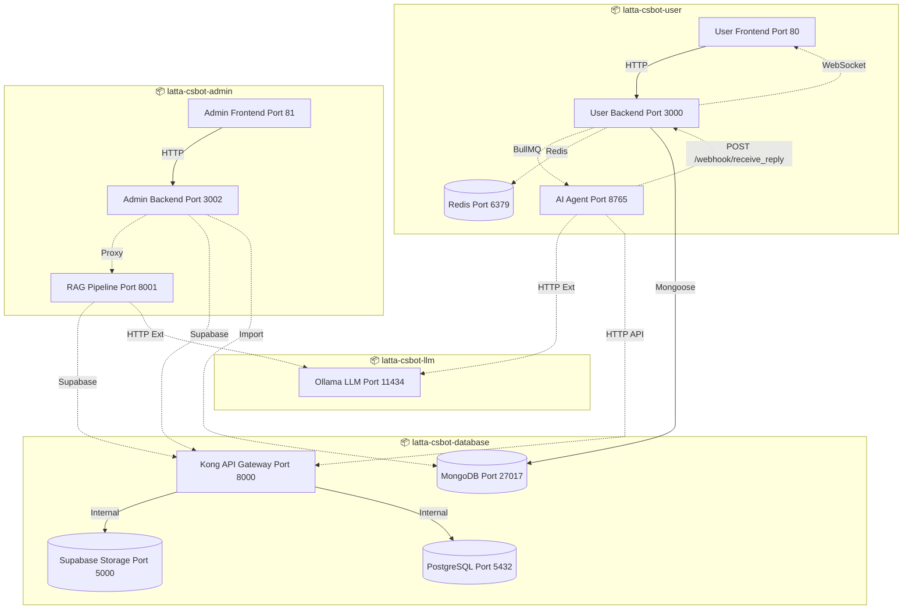

# System Design (SD) - LATTA-CSBOT

## เอกสารออกแบบระบบ / System Design Document

---

## 1. System Architecture / สถาปัตยกรรมระบบ

### 1.1 High-Level Architecture (แยกตาม Docker Project)



**โครงสร้าง Docker Projects (ตาม Diagram):**

```
┌─────────────────────────────────────────────────────────────────────────┐
│  ┌─────────────────────────┐    ┌─────────────────────────┐             │
│  │  📦 latta-csbot-admin   │    │  📦 latta-csbot-user    │             │
│  │  latta-admin-network    │    │  latta-user-network     │             │
│  │                         │    │                         │             │
│  │  • Admin FE (81)        │    │  • User Frontend (80)   │             │
│  │       ↓ HTTP/api        │    │       ↓ HTTP/api        │             │
│  │  • Admin BE (3002)      │    │  • User Backend (3000)  │             │
│  │       ↓ HTTP Proxy      │    │       ↓ BullMQ  ↓ Redis │             │
│  │  • RAG Pipeline (8001)  │    │  • AI Agent   (6379)    │             │
│  │       │                 │    │    (8765)               │             │
│  │       │                 │    │       │                 │             │
│  └───────┼─────────────────┘    └───────┼─────────────────┘             │
│          │                              │                               │
│          │                              │                               │
│          ▼                              ▼                               │
│  ┌─────────────────┐          ┌─────────────────┐                       │
│  │ 📦 latta        │◄─────────│ 📦 latta        │                       │
│  │  -csbot-llm     │ HTTP Ext │  -csbot-db      │                       │
│  │                 │          │                 │                       │
│  │  Ollama (11434) │          │  Kong (8000)    │                       │
│  └─────────────────┘          │       │         │                       │
│                               │       ▼         │                       │
│                               │  PostgreSQL     │                       │
│                               │  MongoDB        │                       │
│                               │  Supabase Strg  │                       │
│                               └─────────────────┘                       │
│                                                                         │
└─────────────────────────────────────────────────────────────────────────┘

หมายเหตุ: AI Agent และ RAG Pipeline เชื่อมต่อ Ollama ผ่าน External URL
        (เช่น http://host.docker.internal:11434)
```

**หมายเหตุสำคัญ:**
| Connection | รูปแบบ |
|------------|--------|
| Frontend → Backend | **ภายใน Project เดียวกัน** (ผ่าน nginx โดยตรง) |
| Admin Backend → Kong | **PostgreSQL + Supabase Storage** (ผ่าน Supabase Client) |
| User Backend → AI Agent | **ภายใน latta-csbot-user** (ผ่าน BullMQ) |
| AI Agent → Backend | **Webhook `POST /webhook/receive_reply`** (ส่งคำตอบกลับ) |
| Backend → Frontend | **WebSocket** (`ws://`) Real-time push |
| AI Agent → Ollama | **ข้ามไป latta-csbot-llm** (HTTP External) |
| RAG → Ollama | **ข้ามไป latta-csbot-llm** (HTTP External) |
| User Backend → MongoDB | **ข้ามไปยัง latta-database-network** (Mongoose โดยตรง) |
| Admin → MongoDB | **Import/Convert เท่านั้น** (ไม่ใช่หลัก) |

> ⚠️ **หมายเหตุเรื่อง Ollama:** Ollama (Port 11434) อยู่ใน **latta-csbot-llm** (แยก project) ทั้ง **AI Agent** (ใน latta-csbot-user) และ **RAG Pipeline** (ใน latta-csbot-admin) ต่างเชื่อมต่อกับ Ollama ผ่าน `host.docker.internal:11434` หรือ external URL

---

## 2. Technology Stack / สแต็คเทคโนโลยี

### 2.1 Technology Stack Overview

```
┌─────────────────────────────────────────────────────────────────────────┐
│  FRONTEND LAYER                                                         │
│  • Angular 15+ (Admin Dashboard)                                       │
│  • HTML5 + Bootstrap 5 + Vanilla JS (User Chat)                        │
├─────────────────────────────────────────────────────────────────────────┤
│  BACKEND LAYER                                                          │
│  • Node.js 20 LTS + Express.js 4                                       │
│  • Python 3.11 + FastAPI (AI/RAG Services)                             │
├─────────────────────────────────────────────────────────────────────────┤
│  AI/ML LAYER                                                            │
│  • Ollama (LLM Inference Server)                                       │
│  • Qwen3-Embedding (Vector Embeddings)                                 │
│  • Gemma3/Qwen3-VL (Vision Models)                                     │
├─────────────────────────────────────────────────────────────────────────┤
│  DATA LAYER                                                             │
│  • PostgreSQL 15 + pgvector (Vector DB)                                │
│  • MongoDB (Document Store)                                            │
│  • Redis (Cache & Queue)                                               │
├─────────────────────────────────────────────────────────────────────────┤
│  INFRASTRUCTURE                                                         │
│  • Docker + Docker Compose                                             │
│  • Kong API Gateway                                                    │
│  • Nginx Reverse Proxy                                                 │
│  • RabbitMQ Message Broker                                             │
└─────────────────────────────────────────────────────────────────────────┘
```

### 2.2 Detailed Tech Stack by Layer

#### Frontend Technologies

| Component | Technology | Version | Purpose |
|-----------|------------|---------|---------|
| **Admin Dashboard** | Angular | 15+ | SPA framework with TypeScript |
| **User Chat UI** | HTML5 + Bootstrap 5 | 5.x | Responsive mobile-first design |
| **State Management** | RxJS | 7+ | Reactive programming |
| **HTTP Client** | Angular HttpClient | - | REST API communication |
| **UI Components** | Bootstrap + Custom | - | Chat bubbles, forms, modals |

#### Backend Technologies

| Component | Technology | Version | Purpose |
|-----------|------------|---------|---------|
| **User API** | Node.js + Express | 20 LTS | Chat operations REST API |
| **Admin API** | Node.js + Express | 20 LTS | Management REST API |
| **AI Service** | Python + FastAPI | 3.11 | High-performance AI endpoints |
| **RAG Pipeline** | Python + FastAPI | 3.11 | Document processing pipeline |
| **Validation** | Zod / Joi | - | Schema validation |
| **Authentication** | JWT | - | JSON Web Tokens |

#### Database & Storage

| Component | Technology | Version | Purpose |
|-----------|------------|---------|---------|
| **Vector Database** | PostgreSQL + pgvector | 15.8 | Store document embeddings |
| **Document Store** | MongoDB | 7.0+ | Chat history, logs |
| **Cache Layer** | Redis (Redis Stack) | 7.x | Sessions, queues |
| **File Storage** | Supabase Storage | - | PDF, DOCX uploads |
| **Search** | pgvector + IVFFlat | - | Similarity search |

#### AI/ML Technologies

| Component | Technology | Model/Details |
|-----------|------------|---------------|
| **LLM Server** | Ollama | Local inference engine |
| **Chat Model** | Qwen3 / Gemma3 | Conversational AI |
| **Embedding** | Qwen3-Embedding | 0.6B params, 1024 dim |
| **Vision** | Qwen3-VL / Gemma3 | Image understanding |
| **OCR** | Docling / PyMuPDF | PDF text extraction |
| **RAG Framework** | Custom | LangChain-inspired |

#### Message Queue & Background Jobs

| Component | Technology | Purpose |
|-----------|------------|---------|
| **Job Queue** | BullMQ | Redis-based task queue |
| **Message Broker** | RabbitMQ | AMQP protocol support |
| **Worker Pattern** | Node.js Worker | Background processing |

#### DevOps & Infrastructure

| Component | Technology | Purpose |
|-----------|------------|---------|
| **Containerization** | Docker | Application isolation |
| **Orchestration** | Docker Compose | Multi-container management |
| **API Gateway** | Kong | Routing, auth, rate limiting |
| **Reverse Proxy** | Nginx | Static files, load balancing |
| **GPU Support** | NVIDIA Container Toolkit | GPU acceleration |

---

### 2.3 Component Details / รายละเอียดคอมโพเนนต์

#### Client Layer → Service Layer (โดยตรง)
| Component | Technology | Port | คุยกับ | Description |
|-----------|------------|------|--------|-------------|
| User Frontend | HTML + JS + Bootstrap 5 | 80 | User Backend (3000) | หน้าแชทสำหรับผู้ใช้งาน |
| Admin Frontend | Angular | 81 | Admin Backend (3002) | แดชบอร์ดสำหรับผู้ดูแลระบบ |

**การเชื่อมต่อ:** `Frontend → nginx → Backend โดยตรง` (ไม่ผ่าน Kong)
- User Frontend: `API_BASE = '/api'` → nginx proxy → `http://backend:3001/`

#### Service Layer (Microservices)
| Component | Technology | Port | คุยกับ | Description |
|-----------|------------|------|--------|-------------|
| User Backend | Node.js + Express | 3000 | **MongoDB (หลัก)**, AI Agent (8765), Redis | API สำหรับการแชท - ใช้ MongoDB เป็นหลัก |
| Admin Backend | Node.js + Express | 3002 | **PostgreSQL (via Kong)**, **Supabase Storage (via Kong)**, **MongoDB (import only)**, **RAG Pipeline (Proxy)** | API สำหรับจัดการระบบ - เรียก PostgreSQL และ Storage ผ่าน Kong, proxy ไปยัง RAG, import จาก MongoDB |
| **AI Agent Service** | **Node.js + Express** | **8765** | **Ollama (11434 external), Vector DB** | **รับคำถามจาก User Backend ผ่าน BullMQ** |
| RAG Pipeline | Python + FastAPI | 8001 | **PostgreSQL pgvector (via Kong)**, **Supabase Storage (via Kong)**, **Ollama (external)** | อัปโหลดและประมวลผลเอกสาร - เรียก PostgreSQL (pgvector) และ Storage ผ่าน Kong |

#### AI Agent → Backend Communication (Webhook)
| Component | Endpoint | Method | Description |
|-----------|----------|--------|-------------|
| AI Agent Service | `/webhook/receive_reply` | POST | AI ส่งคำตอบกลับไปยัง Backend หลังประมวลผลเสร็จ |
| Sub-Workers (Reset Pwd) | `/webhook/receive_reply` | POST | Worker ส่งผลลัพธ์การรีเซ็ตรหัสผ่าน |
| Sub-Workers (MS Form) | `/webhook/receive_reply` | POST | Worker ส่งผลลัพธ์การส่งฟอร์ม |

**Webhook Flow:**
```
┌─────────────┐     ┌─────────────┐     ┌─────────────┐
│  User       │────▶│  Backend    │────▶│  AI Agent   │
│  Frontend   │WS   │  (BullMQ)   │Queue│  (Worker)   │
└──────▲──────┘     └─────────────┘     └──────┬──────┘
       │                                         │
       │         POST /webhook/receive_reply     │
       │         {sessionId, replyText}          │
       └─────────────────────────────────────────┘
```

**รายละเอียด Webhook `/webhook/receive_reply`:**
- **จุดประสงค์:** รับคำตอบจาก AI Agent/Workers กลับเข้าสู่ระบบหลัก
- **กระบวนการ:**
  1. User Backend ส่งคำถามไปยัง AI Agent ผ่าน BullMQ Queue
  2. AI Agent ประมวลผล (เรียก Ollama, ค้นหาข้อมูลจาก Vector DB)
  3. AI Agent ส่งคำตอบกลับมายัง Backend ผ่าน `POST /webhook/receive_reply`
  4. Backend บันทึกข้อความลง MongoDB + Redis
  5. Backend ส่งคำตอบให้ Frontend ผ่าน WebSocket แบบ Real-time
- **ผู้ใช้งาน:** AI Agent (mainflow), Reset Password Worker, MS Form Worker

**ตัวอย่าง Request/Response:**
```http
POST /webhook/receive_reply
Content-Type: application/json

{
  "sessionId": "user-session-123",
  "replyText": "คำตอบจาก AI...",
  "image_urls": []  //  optional
}

Response:
{
  "status": "reply_received"
}
```

---
